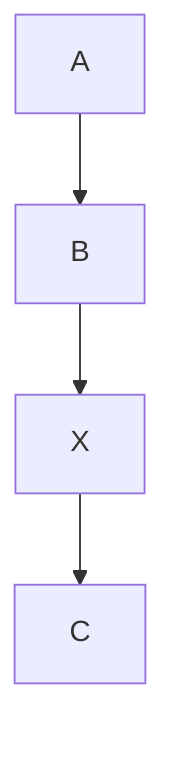
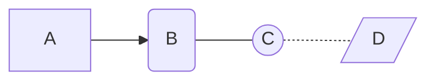

## 标题
语句
 - `#`

几级标题就有几个`#`

测试代码：
`# 这是一级标题`
`## 这是二级标题`
`### 这是三级标题`

测试结果：
# 这是一级标题
## 这是二级标题
### 这是三级标题


## 斜体
语句
 - `* *`

测试代码：
`*这是一个斜体*`

测试结果：
*这是一个斜体*


## 粗体
语句
 - `** **`

测试代码：
`**这是一个粗体**`


测试结果：
**这是一个粗体**

加粗的斜体则用三个`*`进行包围

测试代码：
`***这是加粗的斜体***`

测试结果：
***这是加粗的斜体***


## 公式

我们这里的Hexo博客使用的是`KaTex`插件，语法与`LaTex`基本一致

`$$`实现内嵌式公式，`$$$$`实现公式居中展示

测试代码：

    $\phi = 0$

    $$\alpha (1 - alpha) = 0$$

测试结果：
$\phi = 0$

$$\alpha (1 - alpha) = 0$$

[KaTex说明文档](https://katex.org/docs/supported.html)


## 行内代码
语句
 - 通过```反引号(`)```实现

测试代码：
```
`int a = 0;`
```

测试结果：
`int a = 0;`

## 块代码
语句
 - 通过在代码块首尾分别添加`三个反引号(```)`实现
 - 通过对整个代码块施加`一个缩进符(Tab键)`实现（此方法需要前面空一行）

测试代码：

```
    // 通过缩进符实现代码块
    int main() {
        int a = 0;
        a++;
        return a;
    }
```

或

    ```
    // 通过三个反引号实现代码块
    int main() {
        int b = 10;
        b--;
        return b;
    }
    ```

测试结果：

    // 通过缩进展示代码块
    int main() {
        int a = 0;
        a++;
        return a;
    }

```
// 通过三个反引号实现代码块
int main() {
    int b = 10;
    b--;
    return b;
}
```

## 代码高亮
实现方法：
 - 在三个反引号后面加上key值
 - 常用的几个key值为cpp（对应C++）、java、python、matlab、markdown

测试代码：

    ```cpp
    string s;
    vector<int> nums;
    ```

测试结果：
```cpp
string s = '';
vector<int> nums;
```

另，用缩进符实现的代码块似乎无法实现高亮

[markdown实现代码高亮](https://blog.csdn.net/u012102104/article/details/78950290)

## 链接
语句
 - `[]()`

测试代码:
`[Jianky's blog](https://jiankychen.github.io/)`

测试结果:
[Jianky's blog](https://jiankychen.github.io/)


## 插入图片
语句
 - ``

测试代码:
``

测试结果:


## 注释
语句
 - `[//]: `
 - `[comment]: `
 - `[^_^]: `


测试代码
```
a

[//]: b

[comment]: c

d

[//]: <> (This is also a comment.)

[//]: # (This may be the most platform independent comment)

e

[comment]: <> (This is a comment, it will not be included)

[^_^]: 注意这里要另起一行，整体缩进
    commentted-out contents
    should be shift to right by four spaces (`>>`).

g

```

测试结果

a

[//]: b

[comment]: c

d

[//]: <> (This is also a comment.)

[comment]: <> (This is a comment, it will not be included)

e

[//]: # (This may be the most platform independent comment)

[^_^]: 注意这里要另起一行，整体缩进
    commentted-out contents
    should be shift to right by four spaces (`>>`).

g


## 绘制流程图

安装插件：Markdown Preview Mermaid Support

创建流程图模板 `mermaid`

流程图方向：
 - `TB` ：top bottom - 从上到下
 - `BT` ：bottom top - 从下到上
 - `RL` ：right left - 从右到左
 - `LR` ：left right - 从左到右
 - `TD` ：等同于 TB

流程块形状：
 - `[]` ：方形
 - `()` ：圆角
 - `(())` ：圆形
 - `{}` ：菱形
 - `{{}}` ：六角形
 - `[\\]` ：平行四边形
 - `[//]` ：平行四边形

连接线样式：
 - `-->` ：有向箭头
 - `---` ：无向连接线
 - `-.-` ：虚线
 - `===` ：加粗线条

测试代码 1

    ```mermaid
    graph LR;
        A --> B;
        B --> X;
        X --> C;
    ```

测试结果 1



测试代码 2

    ```mermaid
    graph LR
        1[A] --> 2(B) --- 3((C)) -.- 4[/D/]
    ```

测试结果 2



[利用 Markdown Preview Mermaid Support 插件画流程图](https://blog.csdn.net/ghlfllz/article/details/121360040)

[绘制流程图的语法](https://www.jianshu.com/p/7864c1cf5660)

## 参考资料

[markdown demo](https://markdown-it.github.io/)

[编辑器测评](https://zhuanlan.zhihu.com/p/208791140)

编辑器推荐：**vscode**，Joplin，Typora，sublime，Moeditor

[Create slide deck written in Marp Markdown on VS Code.](https://marketplace.visualstudio.com/items?itemName=marp-team.marp-vscode)

[通过自定义元素的方式画流程图](https://blog.csdn.net/fengliluohua/article/details/121229903)