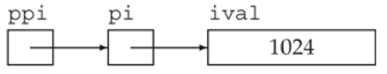

复合类型（compound type）是指基于其他类型定义的类型。例如：引用和指针。


一条声明语句由一个**基本数据类型（base type）**和紧随其后的一个**声明符（declarator）**列表组成。每个声明符命名了一个变量并指定该变量为与基本数据类型有关的某种类型。

# 引用
> “引用（reference）”指的其实是“左值引用（lvalue reference）”。

引用（reference）为对象起了另外一个名字。

通过将声明符写成`&d`的形式来定义引用类型，其中`d`是声明的变量名。如下所示，`refVal`是`ival`的一个引用。
```cpp
int ival = 1024;
int &refVal = ival; //refVal指向ival（是ival的另一个名字）
int &refVal2;       //报错：引用必须被初始化
```

定义引用时，程序把引用和它的初始值绑定（bind）在一起，而不是将初始值拷贝给引用。一旦初始化完成，**引用将和它的初始值对象一直绑定在一起**。因为无法令引用重新绑定到另外一个对象，因此**引用必须初始化**。

## 引用即别名
> 引用并非对象，相反的，它只是为一个已经存在的对象所起的另外一个名字。

定义了一个引用之后，对其进行的所有操作都是在与之绑定的对象上进行的：
> 为引用赋值，实际上是把值赋给了与引用绑定的对象。获取引用的值，实际上是获取了与引用绑定的对象的值。同理，以引用作为初始值，实际上是以与引用绑定的对象作为初始值
```cpp
refVal = 2;               //把2赋给refVal指向的对象，即，赋给ival
int ii = refVal;          //与ii = ival执行结果一样
int &refVal3 = refVal;    //正确：refVal3绑定到了那个与refVal绑定的对象上，这里就是绑定到ival上
int i = refVal;           //正确：i被初始化为ival的值
```

**引用本身不是一个对象，所以不能定义引用的引用。**


## 引用的定义
允许在一条语句中定义多个引用，其中每个引用标识符都必须以符号&开头：
```cpp
int i =1024, i2 = 2048; //i和i2都是int
int &r = i, r2 = i2;    //r是i的引用，r2是int型对象
int i3 = 1024, &ri = i3;//i3是int型对象，ri是i3的引用
int &r3 = i3, &r4 = i2; //r3和r4都是引用
```

除了两种例外情况，其他所有引用的类型都要和与之绑定的对象严格匹配。而且，引用只能绑定在对象上，而不能与字面值或某个表达式的计算结果绑定在一起：
```cpp
int &refVal4 = 10;      //错误：引用类型的初始值必须是一个对象，而不能是字面值
double dval = 3.14;
int &refVal5 = dval;    //错误：此处引用类型的初始值必须是int型对象
```


# 指针
指针（pointer）是“指向（point to）”另外一种类型的复合类型。

与引用类似，指针也实现了对其他对象的间接访问。

> 指针与引用相比又有很多不同点:
> 1. 指针本身就是一个对象，允许对指针赋值和拷贝，而且在指针的生命周期内它可以先后指向几个不同的对象。
> 2. 指针无须在定义时赋初值。

和其他内置类型一样，在块作用域内定义的指针如果没有被初始化，也将拥有一个不确定的值。

定义指针类型的方法将声明符写成`*d`的形式，其中`d`是变量名。如果在一条语句中定义了几个指针变量，每个变量前面都必须有符号`*`：
```cpp
int *ip1, *ip2; //ip1和ip2都是指向int型对象的指针
double dp, *dp2;//dp2是指向double型对象的指针，dp是double型对象
```

## 获取对象的地址
指针存放某个对象的地址。要获取某对象的地址，则使用**取地址符（操作符`&`）**：
```cpp
int ival = 42;
int *p = &ival; //p存放变量ival的地址，或者说，p是指向变量ival的指针。（把p定义为一个指向int的指针，随后初始化p令其指向名为ival的int对象。）
```

> 引用不是对象，没有实际地址，所以不能定义指向引用的指针。

除了2.4.2节（第56页）和15.2.3节（第534页）将要介绍的两种例外情况，其他所有指针的类型都要和它所指向的对象严格匹配：
```cpp
double dval;
double *pd = &dval;     //正确：初始值是double型对象的地址
double *pd2 = pd;       //正确：初始值是double对象的指针

int *pi = pd;           //错误：指针pi的类型和pd的类型不匹配
pi = &dval;             //错误：试图把double型对象的地址赋给int型指针
```
**声明语句中指针的类型实际上用于确定指针所指向对象的类型**，所以二者必须匹配。如果指针指向了一个其他类型的对象，对该对象的操作将发生错误。

## 指针值
指针的值（即地址）应属下列4种状态之一：
1. 指向一个对象。
2. 指向紧邻对象所占空间的下一个位置。
3. 空指针，意味着指针没有指向任何对象。
4. 无效指针，也就是上述情况之外的其他值。

试图拷贝或以其他方式访问无效指针的值都将引发错误。访问无效指针的后果无法预计。

尽管第2种和第3种形式的指针是有效的，但其使用同样受到限制。显然这些指针没有指向任何具体对象，所以试图访问此类指针（假定的）对象的行为不被允许。如果这样做了，后果也无法预计。

## 利用指针访问对象
如果指针指向了一个对象，则允许使用**解引用符（操作符*）**，来访问该对象：
```cpp
int ival = 42;
int *p = &ival; //p是指向变量ival的指针
cout << *p;     //解引用，访问指针所指对象，输出42
```

对指针解引用会得出所指的对象，因此如果给解引用的结果赋值，实际上也就是给指针所指的对象赋值：
```cpp
*p = 0;     //经由指针p为p所指对象（即，ival）赋值
cout << *p; //输出0
```

**解引用操作仅适用于那些确实指向了某个对象的有效指针。**

## 空指针
空指针（null pointer）不指向任何对象，在试图使用一个指针之前代码可以首先检查它是否为空。以下列出几个生成空指针的方法：
```cpp
int *p1 = nullptr;
int *p2 = 0;
int *p3 = NULL;     //需要首先#include cstdlib
```

得到空指针最直接的办法就是用字面值`nullptr`来初始化指针，`nullptr`是一种特殊类型的字面值，它可以被转换成任意其他的指针类型。现在的C++程序最好使用`nullptr`，同时尽量避免使用`NULL`。

**把`int`变量直接赋给指针是错误的操作，即使`int`变量的值恰好等于0也不行。**
```cpp
int zero = 0;
pi = zero;      //错误：不能把int变量直接赋给指针
```

> 尽管C++语法上规定“指针无须在定义时初始化”，但使用未经初始化的指针是引发运行时错误的一大原因，且访问未经初始化的指针所引发的后果也是无法预计的。
> 因此建议初始化所有的指针，并且在可能的情况下，尽量等定义了对象之后再定义指向它的指针。如果实在不清楚指针应该指向何处，就把它初始化为nullptr或者0，这样程序就能检测并知道它没有指向任何具体的对象了。

## 赋值和指针
指针和引用都能提供对其他对象的间接访问。
> 引用本身并非一个对象。一旦定义了引用，就无法令其再绑定到另外的对象，之后每次使用这个引用都是访问它最初绑定的那个对象。
> 指针可以指向新的对象：给指针赋值就是令它存放一个新的地址，从而指向一个新的对象。

赋值永远改变的是等号左侧的对象：
```cpp
pi = &ival; //pi的值被改变，现在pi指向了ival
*pi = 0;    //ival的值被改变，指针pi并没有改变
```

## 其他指针操作
如果指针的值是0，条件取`false`。任何非0指针对应的条件值都是`true`。

对于两个类型相同的合法指针，可以用相等操作符（`==`）或不相等操作符（`!=`）来比较它们，比较的结果是布尔类型。如果两个指针存放的地址值相同，则它们相等；反之它们不相等。
> 两个指针存放的地址值相同（两个指针相等）有三种可能：它们都为空、都指向同一个对象，或者都指向了同一个对象的下一地址。需要注意的是，一个指针指向某对象，同时另一个指针指向另外对象的下一地址，此时也有可能出现这两个指针值相同的情况，即指针相等。

## void * 指针
`void *`是一种特殊的指针类型，可用于存放任意对象的地址。然而，我们对该地址中到底是个什么类型的对象并不了解：
```cpp
double obj = 3.14, *pd = &obj;
void *pv = &obj;    //正确：void *能存放任意类型对象的地址
pv = pd;            //正确
```

`void *`指针的功用：拿它和别的指针比较、作为函数的输入或输出，或者赋给另外一个`void *`指针。

不能直接操作`void *`指针所指的对象，因为我们并不知道这个对象到底是什么类型，也就无法确定能在这个对象上做哪些操作。


> 练习2.23：给定指针`p`，你能知道它是否指向了一个合法的对象吗？如果能，叙述判断的思路；如果不能，说明原因。
> 
> 【出题思路】本题旨在考查指针初始化，读者应该熟悉并掌握C++11的新语法特征`nullptr`。
> 
> 【解答】在C++程序中，应该尽量初始化所有指针，并且尽可能等定义了对象之后再定义指向它的指针。如果实在不清楚指针应该指向何处，就把它初始化为`nullptr`或者`0`，这样程序就能检测并知道它有没有指向一个具体的对象了。其中，`nullptr`是C++11新标准刚刚引入的一个特殊字面值，它可以转换成任意其他的指针类型。在此前提下，判断`p`是否指向合法的对象，只需把`p`作为`if`语句的条件即可，如果`p`的值是`nullptr`，则条件为假；反之，条件为真。如果不注意初始化所有指针而贸然判断指针的值，则有可能引发不可预知的结果。一种处理的办法是把`if(p)`置于`try`结构中，当程序块顺利执行时，表示`p`指向了合法的对象；当程序块出错跳转到`catch`语句时，表示`p`没有指向合法的对象。


# 理解复合类型的声明
变量的定义包括一个基本数据类型（base type）和一组声明符。在同一条定义语句中，虽然基本数据类型只有一个，但是声明符的形式却可以不同。即，一条定义语句可能定义出不同类型的变量：
```cpp
int i = 1024, *p = &i, &r = i;  //i是一个int型对象，p是一个指向int型对象的指针，r是一个int对象的引用
```
其中，`int`是基本数据类型，`*`和`&`是类型修饰符，后者是声明符的一部分。

## 定义多个变量
在定义语句种，类型修饰符（`*`和`&`）仅作用于紧随其后的单个变量，而不是作用于本次定义的全部便了。

涉及指针或引用的声明，一般有两种写法:

1. 第一种把修饰符和变量标识符写在一起：
    ```cpp
    int *p1, *p2;   //p1和p2都是指向int型对象的指针
    ```
这种形式着重强调变量具有的复合类型。

1. 第二种把修饰符和类型名写在一起，并且每条语句只定义一个变量：
    ```cpp
    int* p1;    //p1是指向int型对象的指针
    int* p2;    //p2是指向int型对象的指针
    ```
这种形式着重强调本次声明定义了一种复合类型。

上述两种定义指针或引用的不同方法没有孰对孰错之分，关键是选择并坚持其中的一种写法，不要总是变来变去。

推荐采用第一种写法，将＊（或是&）与变量名连在一起。

## 指向指针的指针
指针是内存中的对象，像其他对象一样也有自己的地址，因此允许把指针的地址再存放到另一个指针当中。

通过`*`的个数可以区分指针的级别。也就是说，`**`表示指向指针的指针，`***`表示指向指针的指针的指针，以此类推：
```cpp
int ival = 1024;
int *pi = &ival;    //pi指向一个int型的数
int **ppi = &pi;    //ppi指向一个int型的指针
```

下图描述了它们之间的关系:


解引用`int`型指针会得到一个`int`型的数，同样，解引用指向指针的指针会得到一个指针。此时为了访问最原始的那个对象，需要对指针的指针做两次解引用:
```cpp
cout << ival;   //direct value
cout << *pi;    //indirect value
cout << **ppi;  //doubly indirect value
```

## 指向指针的引用
引用本身不是一个对象，因此不能定义指向引用的指针。但指针是对象，所以存在对指针的引用：
```cpp
int i = 42;
int *p;         //p是一个指向int型对象的指针
int *&r = p;    //r是一个对指针p的引用，即，r是p的别名

r = &i;         //给r赋值一个地址，即，令p指向i
*r = 0;         //解引用r得到int型对象i（也就是P指向的对象），给i赋值0
```

要理解`r`的类型到底是什么，最简单的办法是从右向左阅读`r`的定义。离变量名最近的符号（此例中是`&r`的符号`&`）对变量的类型有最直接的影响，因此`r`是一个引用。声明符的其余部分用以确定`r`引用的类型是什么，此例中的符号`*`说明`r`引用的是一个指针。最后，声明的基本数据类型部分指出`r`引用的是一个`int`指针。

**面对一条比较复杂的指针或引用的声明语句时，从右向左阅读有助于弄清楚它的真实含义。**