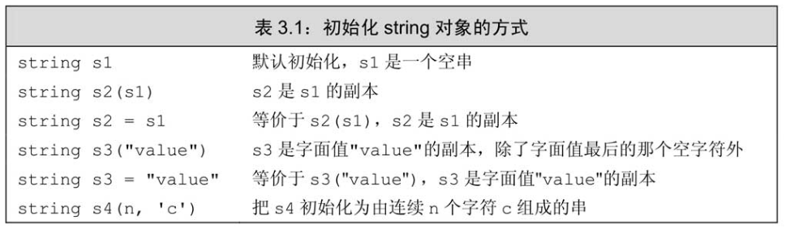
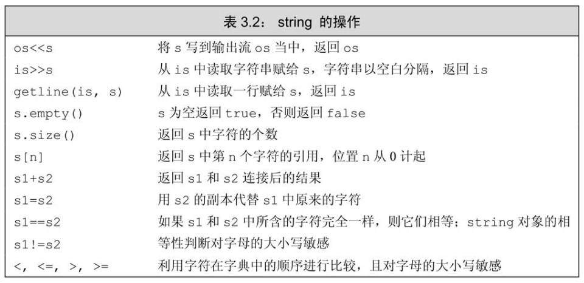
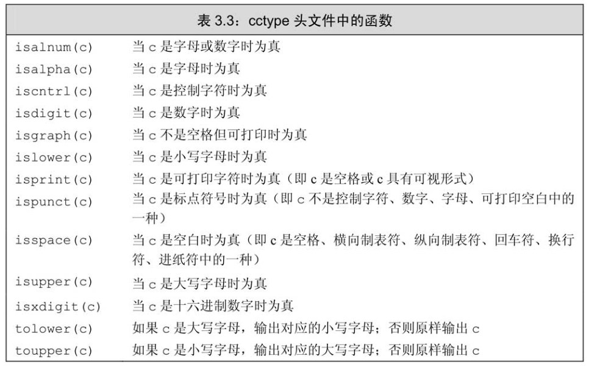
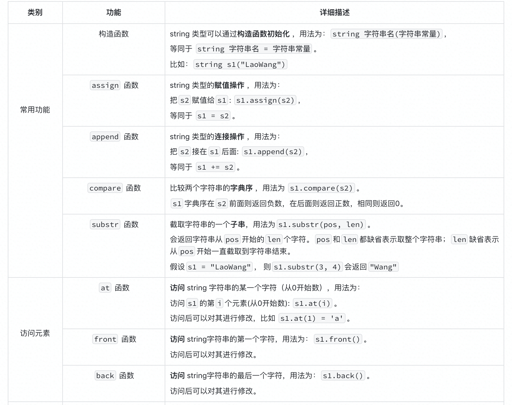
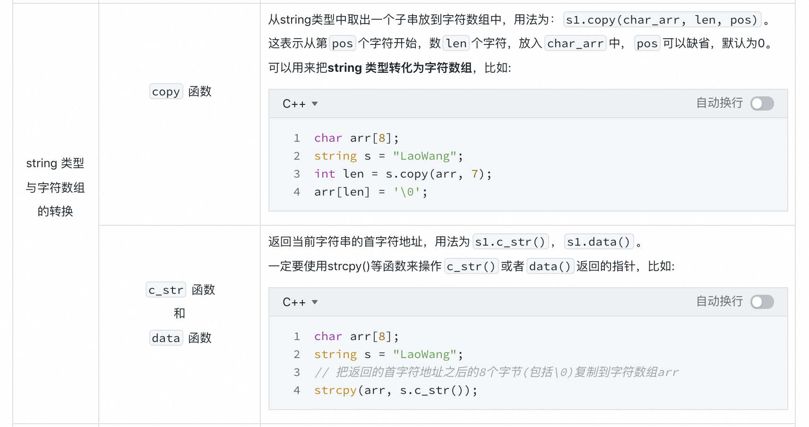
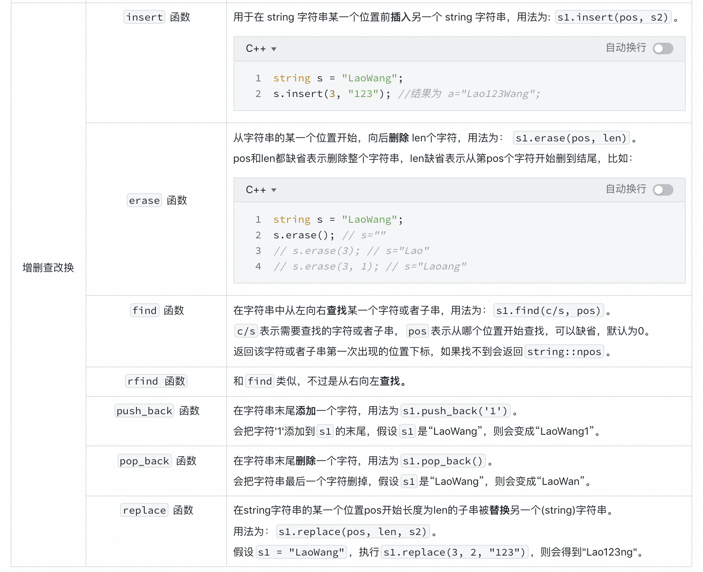

标准库**类型**`string`表示可变长的字符序列，**使用`string`类型必须首先包含`string`头文件**。作为标准库的一部分，**`string`定义在命名空间`std`中**。
```cpp
#include <string>
using std::string;
```


# 定义和初始化string对象


拷贝初始化（copy initialization）: 使用等号（`=`）初始化一个变量，编译器把等号右侧的初始值拷贝到新创建的对象中去。

直接初始化（direct initialization）: 不使用等号。

`string`接受无参数的初始化方式，所以**不论`string`对象定义在函数内还是函数外，默认初始化都是得到空串。**

如果提供了一个**字符串字面值**，则该字面值中**除了最后那个空字符外**的其他所有字符都被拷贝到新创建的`string`对象中去。


# string对象上的操作
`string`对象的大多数操作：


> `is>>s`读取时不包括空格符；`getline(is,s)`读取整行，包含空格符。


## 读写string对象
可以使用IO操作符读写`string`对象：
```cpp
// Note: #include and using declarations must be added to compile this code
int main()
{
    string s;          // empty string
    cin >> s;          // read a whitespace-separated string into s
    cout << s << endl; // write s to the output
    return 0;
}
```

> **在执行读取操作时，string对象会自动忽略开头的空白（即空格符、换行符、制表符等）并从第一个真正的字符开始读起，直到遇见下一处空白为止。**

如上所述，如果程序的输入是“　　Hello World！　　”（注意开头和结尾处的空格），则输出将是“Hello”，输出结果中没有任何空格。

和内置类型的输入输出操作一样，`string`对象的此类操作也是返回运算符左侧的运算对象作为其结果。因此，多个输入或者多个输出可以连写在一起：
```cpp
string s1, s2;
cin >> s1 >> s2; // read first input into s1, second into s2
cout << s1 << s2 << endl; // write both strings
```
假设给上面这段程序输入与之前一样的内容“ Hello World! ”，输出将是“HelloWorld!”。


## 读取未知数量的string对象
```cpp
int main()
{
    string word;
    while (cin >> word)       // read until end-of-file
        cout << word << endl; // write each word followed by a new line
    return 0;
}
```
一旦遇到文件结束标记或非法输入，循环也就结束了。


## 使用getline读取一整行
**`getline`能在最终得到的字符串中保留输入时的空白符。**

`getline`函数的参数是一个输入流和一个`string`对象，函数从给定的输入流中读入内容，直到遇到换行符为止（注意换行符也被读进来了），然后把所读的内容存入到那个`string`对象中去（注意不存换行符）。

**`getline`只要一遇到换行符就结束读取操作并返回结果**，哪怕输入的一开始就是换行符也是如此。如果输入真的一开始就是换行符，那么所得的结果是个空`string`。

和输入运算符一样，`getline`也会返回它的流参数。因此既然输入运算符能作为判断的条件，我们也能用`getline`的结果作为条件。例如：
```cpp
int main()
{
    string line;
    // read input a line at a time until end-of-file
    while (getline(cin, line))
        cout << line << endl;
    return 0;
}
```

> **触发`getline`函数返回的那个换行符实际上被丢弃掉了，得到的`string`对象中并不包含该换行符。**


## string::size_type类型
`size`函数返回`string`对象的长度（即`string`对象中字符的个数），返回的是一个`string::size_type`类型的值。

> `string`类及其他大多数标准库类型都定义了几种配套的类型。这些配套类型体现了标准库类型与机器无关的特性，类型`size_type`即是其中的一种。在具体使用的时候，通过作用域操作符来表明名字`size_type`是在类`string`中定义的。

`string::size_type`类型的对象，是一个无符号类型的值，而且能足够存放下任何`string`对象的大小。**所有用于存放`string`类的`size`函数返回值的变量，都应该是`string::size_type`类型的。**

在C++11新标准中，允许编译器通过`auto`或者`decltype`来推断变量的类型：
```cpp
auto len = line.size(); // len has type string::size_type
```

由于`size`函数返回的是一个无符号整型数，因此切记，如果在表达式中混用了带符号数和无符号数将可能产生意想不到的结果。例如，假设n是一个具有负值的int，则表达式`s.size()<n`的判断结果几乎肯定是`true`。这是因为负值n会自动地转换成一个比较大的无符号值。

> 如果一条表达式中已经有了`size()`函数就不要再使用`int`了，这样可以避免混用`int`和`unsigned`可能带来的问题。


## 比较string对象
`string`类定义了几种用于比较字符串的运算符。这些比较运算符逐一比较`string`对象中的字符，并且对大小写敏感。

相等性运算符（`==`和`！=`）、关系运算符（`<`、`<=`、`>`、`>=`）都依照（大小写敏感的）字典顺序：
1. 如果两个`string`对象的长度不同，而且较短`string`对象的每个字符都与较长`string`对象对应位置上的字符相同，就说较短`string`对象小于较长string对象。
2. 如果两个`string`对象在某些对应的位置上不一致，则`string`对象比较的结果其实是`string`对象中第一对相异字符比较的结果。


## 为string对象赋值
对于string类而言，允许把一个对象的值赋给另外一个对象：
```cpp
string st1(10, 'c'), st2; // st1 is cccccccccc; st2 is an empty string
st1 = st2; // assignment: replace contents of st1 with a copy of st2
        // both st1 and st2 are now the empty string
```


## 两个string对象相加
两个`string`对象相加得到一个新的`string`对象，其内容是把左侧的运算对象与右侧的运算对象串接而成。
```cpp
string s1  = "hello, ", s2 = "world\n";
string s3 = s1 + s2;   // s3 is hello, world\n
s1 += s2;   // equivalent to s1 = s1 + s2
```


## 字面值和string对象相加
标准库允许把字符字面值和字符串字面值转换成`string`对象，所以在需要`string`对象的地方就可以使用这两种字面值来替代。
```cpp
string s1 = "hello", s2 = "world"; // no punctuation in s1 or s2
string s3 = s1 + ", " + s2 + '\n';
```

当把`string`对象和字符字面值及字符串字面值混在一条语句中使用时，**必须确保每个加法运算符（`+`）的两侧的运算对象至少有一个是`string`**：
```cpp
string s4 = s1 + ", ";           // ok: adding a string and a literal
string s5 = "hello" + ", ";      // error: no string operand
string s6 = s1 + ", " + "world"; // ok: each + has a string operand, equivalent to string s6 = (s1 + ", ") + "world";
string s7 = "hello" + ", " + s2; // error: can't add string literals, equivalent to string s7 = ("hello" + ", ") + s2;
```

> 因为某些历史原因，也为了与C兼容，所以C++语言中的字符串字面值并不是标准库类型`string`的对象。切记，字符串字面值与`string`是不同的类型。


# 处理string对象中的字符
我们经常需要单独处理`string`对象中的字符，比如检查一个`string`对象是否包含空白，或者把`string`对象中的字母改成小写，再或者查看某个特定的字符是否出现等。

这类处理的一个关键问题是如何获取字符本身。另一个关键问题是要知道能改变某个字符的特性。

在cctype头文件中定义了一组标准库函数处理这部分工作:


> 建议：使用C++版本的C标准库头文件
> C++标准库中除了定义C++语言特有的功能外，也兼容了C语言的标准库。C语言的头文件形如`name.h`，C++则将这些文件命名为`cname`。也就是去掉了`.h`后缀，而在文件名`name`之前添加了字母`c`，这里的`c`表示这是一个属于C语言标准库的头文件。
> 一般来说，C++程序应该使用名为`cname`的头文件而不使用`name.h`的形式。在名为`cname`的头文件中定义的名字从属于命名空间`std`，而定义在名为`.h`的头文件中的则不然。

## 使用基于范围的for语句处理每个字符
C++11新标准提供的一种语句：`范围for（rangefor）`语句。这种语句遍历给定序列中的每个元素并对序列中的每个值执行某种操作，其语法形式是：
```cpp
for (declaration : expression)
    statement
```
其中，`expression`部分是一个对象，用于表示一个序列。`declaration`部分负责定义一个变量，该变量将被用于访问序列中的基础元素。每次迭代，`declaration`部分的变量会被初始化为`expression`部分的下一个元素值。

一个`string`对象表示一个字符的序列，因此`string`对象可以作为`范围for`语句中的`expression`部分。
```cpp
string str("some string");
// print the characters in str one character to a line
for (auto c : str)      // for every char in str
    cout << c << endl;  // print the current character followed by a newline
```
`for`循环把变量`c`和`str`联系了起来，其中我们定义循环控制变量的方式与定义任意一个普通变量是一样的。此例中，通过使用`auto`关键字让编译器来决定变量`c`的类型，这里`c`的类型是`char`。每次迭代，`str`的下一个字符被拷贝给`c`，因此该循环可以读作“对于字符串`str`中的每个字符`c`，”执行某某操作。此例中的“某某操作”即输出一个字符，然后换行。

举个稍微复杂一点的例子，使用`范围for`语句和`ispunct`函数来统计`string`对象中标点符号的个数：
```cpp
string s("Hello World!!!");
// punct_cnt has the same type that s.size returns; see § 2.5.3 (p. 70)
decltype(s.size()) punct_cnt = 0;
// count the number of punctuation characters in s
for (auto c : s)        // for every char in s
    if (ispunct(c))     // if the character is punctuation
        ++punct_cnt;    // increment the punctuation counter
cout << punct_cnt
    << " punctuation characters in " << s << endl;
```
程序的输出结果将是：`3 punctuation characters in Hello World!!!`
这里我们使用`decltype`关键字声明计数变量`punct_cnt`，它的类型是`s.size`函数返回值的类型，也就是`string：：size_type`。

## 使用范围for语句改变字符串中的字符
如果想要改变`string`对象中字符的值，必须把循环变量定义成引用类型。记住，所谓引用只是给定对象的一个别名，因此当使用引用作为循环控制变量时，这个变量实际上被依次绑定到了序列的每个元素上。使用这个引用，我们就能改变它绑定的字符。

假设我们想要把字符串改写为大写字母的形式。为了做到这一点可以使用标准库函数`toupper`，该函数接收一个字符，然后输出其对应的大写形式。这样，为了把整个`string`对象转换成大写，只要对其中的每个字符调用`toupper`函数并将结果再赋给原字符就可以了：
```cpp
string s("Hello World!!!");
// convert s to uppercase
for (auto &c : s)   // for every char in s (note: c is a reference)
    c = toupper(c); // c is a reference, so the assignment changes the char in s
cout << s << endl;
```
上述代码的输出结果将是：`HELLO WORLD!!!`
每次迭代时，变量`c`引用`string`对象`s`的下一个字符，赋值给`c`也就是在改变`s`中对应字符的值。


## 只处理一部分字符
如果要处理string对象中的每一个字符，使用`范围for`语句是个好主意。然而，有时我们需要访问的只是其中一个字符，或者访问多个字符但遇到某个条件就要停下来。

要想访问`string`对象中的单个字符有两种方式：
   1. 使用下标
   2. 使用迭代器
   
下标运算符（`[ ]`）接收的输入参数是`string::size_type`类型的值，这个参数表示要访问的字符的位置；返回值是该位置上字符的引用。

**`string`对象的下标从0计起。**

> `string`对象的下标必须大于等于0而小于`s.size()`。因为string对象的下标从0计起，最后一个字符的下标应该是`s.size() - 1`。使用超出此范围的下标将引发不可预知的结果，以此推断，使用下标访问空`string`也会引发不可预知的结果。因此，只要对`string`对象使用了下标，都要确认在那个位置上确实有值。

下标的值称作“下标”或“索引”，任何表达式只要它的值是一个整型值就能作为索引。不过，如果某个索引是带符号类型的值将自动转换成由`string::size_type`表达的无符号类型。

```cpp
if (!s.empty())            // make sure there's a character to print
    cout << s[0] << endl;  // print the first character in s
```

只要字符串未被`const`限定符限制为常量，就能利用下标运算符为字符串中指定位置的字符赋新值。

```cpp
string s("some string");
if (!s.empty())             // make sure there's a character in s[0]
    s[0] = toupper(s[0]);   // assign a new value to the first character in s
```
程序的输出结果将是：`Some string`

```cpp
// process characters in s until we run out of characters or we hit a whitespace
for (decltype(s.size()) index = 0;
    index != s.size() && !isspace(s[index]); ++index)
        s[index] = toupper(s[index]); // capitalize the current character
```
程序的输出结果将是：`SOME string`
在上述程序中，`for`循环使用变量`index`作为`s`的下标，`index`的类型是由`decltype`关键字决定的。首先把`index`初始化为`0`，这样第一次迭代就会从`s`的首字符开始；之后每次迭代将`index`加1以得到`s`的下一个字符。循环体负责将当前的字母改写为大写形式。

需要注意的是，上例使用了逻辑与运算符（`&&`）。如果参与运算的两个运算对象都为真，则逻辑与结果为真；否则结果为假。对这个运算符来说最重要的一点是，C++语言规定只有当左侧运算对象为真时才会检查右侧运算对象的情况。如上例所示，这条规定确保了只有当下标取值在合理范围之内时才会真的用此下标去访问字符串。也就是说，只有在`index`达到`s.size()`之前才会执行`s[index]`。

再次强调，注意检查下标的合法性。一种简便易行的方法是，**总是设下标的类型为`string::size_type`**，因为此类型是无符号数，可以确保下标不会小于0。此时，代码只需保证下标小于`size()`的值就可以了。


## 使用下标执行随机访问
直接获取对应位置的字符，而不是从前往后依次访问。

编写一个程序把0到15之间的十进制数转换成对应的十六进制形式：
```cpp
const string hexdigits = "0123456789ABCDEF"; // possible hex digits (Note that it is a const string.)
cout << "Enter a series of numbers between 0 and 15"
        << " separated by spaces. Hit ENTER when finished: "
        << endl;
string result;        // will hold the resulting hexify'd string
string::size_type n;  // hold numbers from the input
while (cin >> n)
    if (n < hexdigits.size())    // ignore invalid input
        result += hexdigits[n];  // fetch the indicated hex digit
cout << "Your hex number is: " << result << endl;
```
假设输入的内容如下：`12 0 5 15 8 15`
程序的输出结果将是：`Your hex number is: C05F8F`


# 成员函数







参考：[https://www.boyuai.com/learn/courses/148/lessons/2481/steps/0?from=qz](https://www.boyuai.com/learn/courses/148/lessons/2481/steps/0?from=qz)