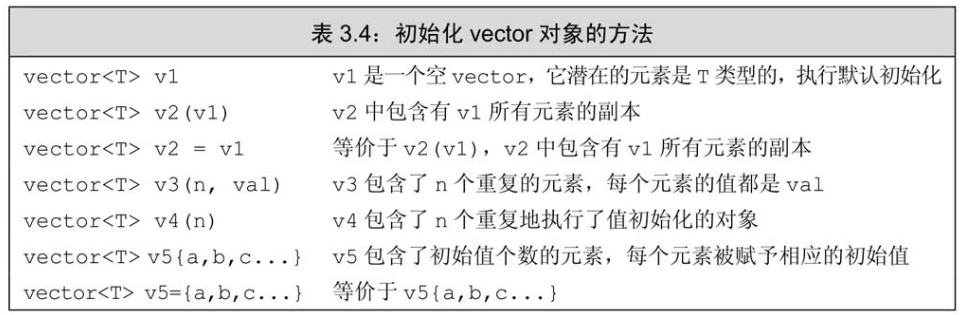
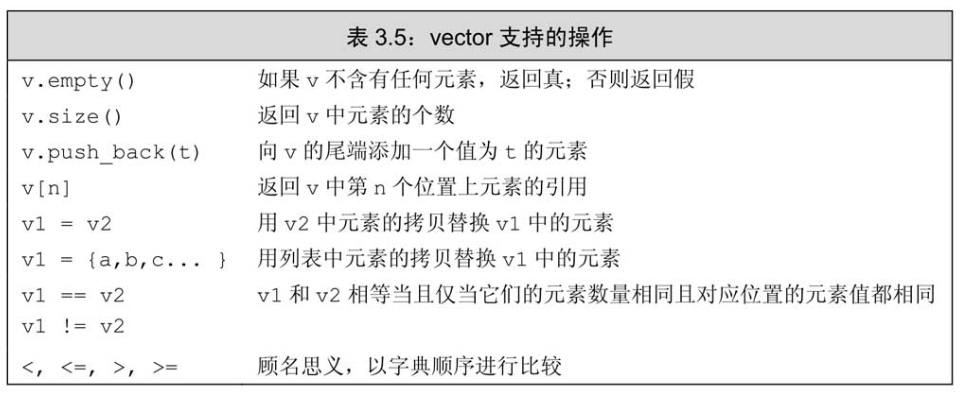

标准库**类型**`vector`表示对象的集合，其中所有对象的类型都相同。集合中的每个对象都有一个与之对应的索引，索引用于访问对象。因为`vector`“容纳着”其他对象，所以它也常被称作`容器（container）`。

要想使用vector，必须包含适当的头文件:
```cpp
#include <vector>
using std::vector;
```

C++语言既有类模板（class template），也有函数模板，其中`vector`是一个类模板。

`vector`是模板而非类型，由`vector`生成的类型必须包含`vector`中元素的类型，例如`vector<int>`, `vector<vector<int>>`。
> 组成`vector`的元素也可以是`vector`。

```cpp
vector<int> ivec;             // ivec holds objects of type int
vector<Sales_item> Sales_vec; // holds Sales_items
vector<vector<string>> file;  // vector whose elements are vectors
```

引用不是对象，所以不存在包含引用的`vector`。

# 定义和初始化vector对象


可以默认初始化`vector`对象，从而创建一个指定类型的空`vector`。

之前已经讲过，C++语言提供了几种不同的初始化方式。在大多数情况下这些初始化方式可以相互等价地使用，不过也并非一直如此。目前已经介绍过的两种例外情况是：其一，使用拷贝初始化时（即使用`=`时），只能提供一个初始值；其二，如果提供的是一个类内初始值，则只能使用拷贝初始化或使用花括号的形式初始化。第三种特殊的要求是，如果提供的是初始元素值的列表，则只能把初始值都放在花括号里进行列表初始化，而不能放在圆括号里：
```cpp
vector<string> v1{"a", "an", "the"};  // list initialization
vector<string> v2("a", "an", "the");  // error

vector<int> v3(10, 1); // v3 has ten elements with value 1
vector<int> v4{10, 1}; // v4 has two elements with values 10 and 1
```

# 向vector对象中添加元素
根据上述初始化`vector`对象的方法可知，`vector`对象直接初始化的方式适用于三种情况：初始值已知且数量较少、初始值是另一个`vector`对象的副本、所有元素的初始值都一样。

对于一般情况，可以先创建一个空`vector`，然后在运行时再利用`vector`的成员函数`push_back`向其中添加元素。`push_back`负责把一个值当成`vector`对象的尾元素“压到（push）”`vector`对象的“尾端（back）”。
```cpp
vector<int> v2;        // empty vector
for (int i = 0; i != 100; ++i)
    v2.push_back(i);    // append sequential integers to v2
// at end of loop v2 has 100 elements, values 0 . . . 99


// read words from the standard input and store them as elements in a vector
string word;
vector<string> text;       // empty vector
while (cin >> word) {
    text.push_back(word);  // append word to text
}
```

C++标准要求`vector`应该能在运行时高效快速地添加元素。因此既然`vector`对象能高效地增长，那么在定义`vector`对象的时候设定其大小也就没什么必要了，事实上如果这么做性能可能更差。只有一种例外情况，就是所有（all）元素的值都一样。一旦元素的值有所不同，更有效的办法是先定义一个空的`vector`对象，再在运行时向其中添加具体值。

特别需要注意一点：如果循环体内部包含有向`vector`对象添加元素的语句，则不能使用`范围for`循环。
> `范围for`语句体内不应改变其所遍历序列的大小。


# 其他vector操作
除了push_back之外，vector还提供了几种其他操作，大多数都和string的相关操作类似:


```cpp
vector<int> v{1,2,3,4,5,6,7,8,9};
for (auto &i : v)     // for each element in v (note: i is a reference)
    i *= i;           // square the element value
for (auto i : v)      // for each element in v
    cout << i << " "; // print the element
cout << endl;
```

`vector`的`empty`和`size`两个成员与`string`的同名成员功能完全一致：`empty`检查`vector`对象是否包含元素然后返回一个布尔值；`size`则返回`vector`对象中元素的个数，返回值的类型是由`vector`定义的`size_type`类型。

要使用`size_type`，需首先指定它是由哪种类型定义的。`vector`对象的类型总是包含着元素的类型:
```cpp
vector<int>::size_type // ok
vector::size_type      // error
```

各个相等性运算符和关系运算符也与`string`的相应运算符功能一致。


使用下标运算符能获取到指定的元素。`vector`对象的下标也是从0开始计起，下标的类型是相应的`size_type`类型。此外，也能通过计算得到`vector`内对象的索引，然后直接获取索引位置上的元素。

假设有一组成绩的集合，其中成绩的取值是从0到100。以10分为一个分数段，要求统计各个分数段各有多少个成绩:
```cpp
// count the number of grades by clusters of ten: 0--9, 10--19, . .. 90--99, 100
vector<unsigned> scores(11, 0); // 11 buckets, all initially 0
unsigned grade;
while (cin >> grade) {      // read the grades
    if (grade <= 100)       // handle only valid grades
        ++scores[grade/10]; // increment the counter for the current cluster
cout << scores << endl;
}
```
如果输入的成绩如下：`42 65 95 100 39 67 95 76 88 76 83 92 76 93`
则输出的结果应该是：`0 0 0 1 1 0 2 3 2 4 1`

> 使用下标的时候必须清楚地知道它是否在合理范围。


不能通过`vector`对象的下标形式来添加元素:
```cpp
vector<int> ivec;   // empty vector
for (decltype(ivec.size()) ix = 0; ix != 10; ++ix)
    ivec[ix] = ix;  // disaster: ivec has no elements
```
这段代码是错误的：`ivec`是一个空`vector`，根本不包含任何元素，当然也就不能通过下标去访问任何元素！如前所述，正确的方法是使用`push_back`：
```cpp
for (decltype(ivec.size()) ix = 0; ix != 10; ++ix)
    ivec.push_back(ix);  // ok: adds a new element with value ix
```
注意，这里不能使用范围for语句，只能使用传统的for循环。因为`vector`序列长度改变

**`vector`对象（以及`string`对象）的`下标运算符`可用于访问已存在的元素，而不能用于添加元素。**


试图用下标的形式去访问一个不存在的元素将引发错误，不过这种错误不会被编译器发现，而是在运行时产生一个不可预知的值。不幸的是，这种通过下标访问不存在的元素的行为非常常见，而且会产生很严重的后果。所谓的缓冲区溢出（buffer overflow）指的就是这类错误，这也是导致PC及其他设备上应用程序出现安全问题的一个重要原因。

因此，**如需要对`vector`对象或`string`对象使用for语句，则尽量使用范围for，以免溢出。**

[原文：标准库类型vector](https://weread.qq.com/web/reader/ff732fe072021a24ff7bb24k341323f021e34173cb3824c)