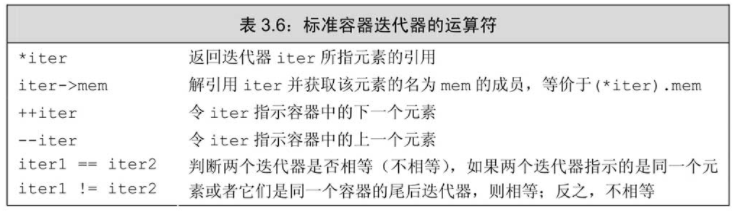
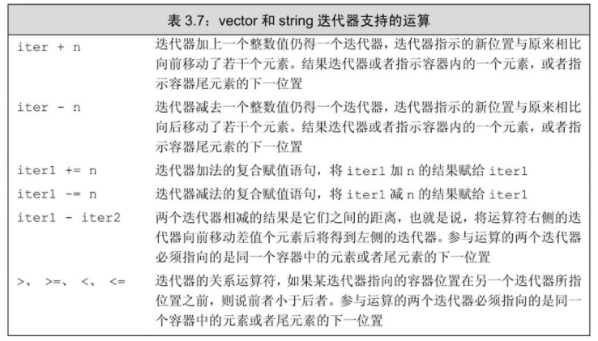

可以使用下标运算符来访问`string`对象的字符或`vector`对象的元素，还有另外一种更通用的机制也可以实现同样的目的，即，`迭代器（iterator）`。

除了`vector`之外，标准库还定义了其他几种容器。所有标准库容器都可以使用迭代器，但是其中只有少数几种才同时支持下标运算符。
> 严格来说，string对象不属于容器类型，但是string支持很多与容器类型类似的操作。vector支持下标运算符，这点和string一样；string支持迭代器，这也和vector是一样的。
> 
> `string`可以理解成`vector<char>`

类似于指针类型，迭代器也提供了对对象的间接访问。就迭代器而言，其对象是容器中的元素或者`string`对象中的字符。使用迭代器可以访问某个元素，迭代器也能从一个元素移动到另外一个元素。

# 使用迭代器
获取迭代器不是使用取地址符，有迭代器的类型同时拥有名为`begin`和`end`的成员。
1. `begin`成员负责返回指向第一个元素（或第一个字符）的迭代器
2. `end`成员则负责返回指向容器（或`string`对象）“尾元素的下一位置”的迭代器。（一个本不存在的元素）。`end`成员返回的迭代器常被称作**尾后迭代器**或者简称为尾迭代器。这样的迭代器没什么实际含义，仅是个标记而已，表示我们已经处理完了容器中的所有元素。

> 试图解引用一个非法迭代器或者尾后迭代器都是未被定义的行为。

```cpp
// the compiler determines the type of b and e
// b denotes the first element and e denotes one past the last element in v
auto b = v.begin(), e = v.end(); // b and e have the same type
```

> 如果容器为空，则`begin`和`end`返回的是同一个迭代器，都是尾后迭代器。

只要我们知道其支持`begin`和`end`，就可以使用`auto`关键字来定义返回值的类型。因为一般来说，我们不清楚（不在意）迭代器准确的类型到底是什么，利用`auto`关键字使编译器自行推断即可。

## 迭代器运算符


注意，`*iter`返回的是迭代器`iter`所指元素的引用。因此可以通过`*iter`修改`iter`所指元素的值。
```cpp
string s("some string");
if (s.begin() != s.end()) { // make sure s is not empty
    auto it = s.begin();    // it denotes the first character in s
    *it = toupper(*it);     // make that character uppercase
}
```
输出结果将是：`Some string`

迭代器使用递增（`++`）运算符来从一个元素移动到下一个元素。

**因为`end`返回的迭代器并不实际指示某个元素，所以不能对其进行递增或解引用的操作。**

例如，利用迭代器及其递增运算符可以把string对象中第一个单词改写为大写形式：
```cpp
// process characters in s until we run out of characters or we hit a whitespace
for (auto it = s.begin(); it != s.end() && !isspace(*it); ++it)
    *it = toupper(*it); // capitalize the current character
```
输出结果将是：`SOME string`

> 关键概念：泛型编程
> 
> 之前已经说过，只有`string`和`vector`等一些标准库类型有下标运算符，而并非全都如此。与之类似，所有标准库容器的迭代器都定义了`==`和`!=`，但是它们中的大多数都没有定义`<`运算符。因此，只要我们养成使用迭代器和`!=`的习惯，就不用太在意用的到底是哪种容器类型。

使用`==`和`!=`来比较两个合法的迭代器是否相等，如果两个迭代器指向的元素相同或者都是同一个容器的尾后迭代器，则它们相等；否则就说这两个迭代器不相等。

## 迭代器类型
拥有迭代器的标准库类型使用iterator和const_iterator来表示迭代器的类型：
```cpp
vector<int>::iterator it; // it can read and write vector<int> elements
string::iterator it2;     // it2 can read and write characters in a string
vector<int>::const_iterator it3; // it3 can read but not write elements
string::const_iterator it4;      // it4 can read but not write characters
```

`const_iterator`和指向常量的指针差不多，能读取但不能修改它所指的元素值。相反，`iterator`的对象可读可写。

如果`vector`对象或`string`对象是一个常量，只能使用`const_iterator`；如果`vector`对象或`string`对象不是常量，那么既能使用`iterator`也能使用`const_iterator`。

> 术语：迭代器和迭代器类型
> 
> 迭代器这个名词有三种不同的含义：可能是迭代器概念本身，也可能是指容器定义的迭代器类型，还可能是指某个迭代器对象。
> 
> 重点是理解存在一组概念上相关的类型，我们认定某个类型是迭代器当且仅当它支持一套操作，这套操作使得我们能访问容器的元素或者从某个元素移动到另外一个元素。
> 
> 每个容器类定义了一个名为iterator的类型，该类型支持迭代器概念所规定的一套操作。


## begin和end运算符
`begin`和`end`返回的具体类型由对象是否是常量决定，如果对象是常量，`begin`和`end`返回`const_iterator`；如果对象不是常量，返回`iterator`：
```cpp
vector<int> v;
const vector<int> cv;
auto it1 = v.begin();  // it1 has type vector<int>::iterator
auto it2 = cv.begin(); // it2 has type vector<int>::const_iterator
```

有时候我们希望即使对象不是常量，我们也想使用`const_iterator`。为了便于专门得到`const_iterator`类型的返回值，C++11新标准引入了两个新函数，分别是`cbegin`和`cend`：
```cpp
auto it3 = v.cbegin(); // it3 has type vector<int>::const_iterator
```
类似于`begin`和`end`，上述两个新函数也分别返回指示容器第一个元素或最后元素下一位置的迭代器。有所不同的是，不论`vector`对象（或`string`对象）本身是否是常量，返回值都是`const_iterator`。

## 结合解引用和成员访问操作

解引用迭代器可获得迭代器所指的对象，如果该对象的类型恰好是类，就有可能希望进一步访问它的成员。

例如，对于一个由字符串组成的`vector`对象来说，要想检查其元素是否为空，令`it`是该`vector`对象的迭代器，只需检查`it`所指字符串是否为空就可以了，其代码如下所示：
```cpp
vector<string> v;
auto it = v.begin();

(*it).empty(); // dereferences it and calls the member empty on the resulting object
```
注意，`(*it).empty()`中的圆括号必不可少，该表达式的含义是先对`it`解引用，然后解引用的结果再执行点运算符。如果不加圆括号，点运算符将由`it`来执行，而非`it`解引用的结果:
```cpp
*it.empty();   // error: attempts to fetch the member named empty from it, but it is an iterator and has no member named empty
```

为了简化形如`(*it).empty()`的表达式，C++语言定义了箭头运算符（`->`）。箭头运算符把解引用和成员访问两个操作结合在一起，也就是说，`it->mem`和`(*it).mem`表达的意思相同。
```cpp
it->empty;     // it->mem is a synonym for (* it).mem.
```

下例程序将输出三行`hello the world!!`
```cpp
// print each line in text up to the first blank line
vector<string> text(3, "hello the world!!");
for (auto it = text.cbegin(); it != text.cend() && !it->empty(); ++it)
    cout << *it << endl;
```
值得注意的是，因为循环从头到尾只是读取`text`的元素而未向其中写值，所以使用了`cbegin`和`cend`来控制整个迭代过程。


## 某些对vector对象的操作会使迭代器失效
虽然`vector`对象可以动态地增长，但是也会有一些副作用。
1. 一个限制是不能在`范围for`循环中向`vector`对象添加元素。
2. 另外一个限制是任何一种可能改变`vector`对象容量的操作，比如`push_back`，都会使该`vector`对象的迭代器失效。

> 谨记，**但凡是使用了迭代器的循环体，都不要向迭代器所属的容器添加元素。**


# 迭代器运算
迭代器的递增运算令迭代器每次移动一个元素，所有的标准库容器都有支持递增运算的迭代器。类似的，也能用`==`和`!=`对任意标准库类型的两个有效迭代器进行比较。

`string`和`vector`的迭代器提供了更多额外的运算符，一方面可使得迭代器的每次移动跨过多个元素，另外也支持迭代器进行关系运算。所有这些运算被称作迭代器运算（iterator arithmetic），其细节由表3.7列出。



只要两个迭代器指向的是同一个容器中的元素或者尾元素的下一位置，就能将其相减，所得结果是两个迭代器的距离。所谓距离指的是右侧的迭代器向前移动多少位置就能追上左侧的迭代器，其类型是名为`difference_type`的带符号整型数。`string`和`vector`都定义了`difference_type`，因为这个距离可正可负，所以`difference_type`是带符号类型的。

> 使用迭代器运算的一个经典算法是二分搜索。二分搜索从有序序列中寻找某个给定的值。二分搜索从序列中间的位置开始搜索，如果中间位置的元素正好就是要找的元素，搜索完成；如果不是，假如该元素小于要找的元素，则在序列的后半部分继续搜素；假如该元素大于要找的元素，则在序列的前半部分继续搜索。在缩小的范围中计算一个新的中间元素并重复之前的过程，直至最终找到目标或者没有元素可供继续搜索。
```cpp
// text must be sorted
// beg and end will denote the range we're searching
auto beg = text.begin(), end = text.end();
auto mid = text.begin() + (end - beg)/2; // original midpoint
// while there are still elements to look at and we haven't yet found sought
while (mid != end && *mid != sought) {
    if (sought < *mid)     // is the element we want in the first half?
        end = mid;         // if so, adjust the range to ignore the second half
    else                   // the element we want is in the second half
        beg = mid + 1;     // start looking with the element just after mid
    mid = beg + (end - beg)/2;  // new midpoint
}
```
程序的一开始定义了三个迭代器：`beg`指向搜索范围内的第一个元素、`end`指向尾元素的下一位置、`mid`指向中间的那个元素。初始状态下，搜索范围是名为`text`的`vector<string>`的全部范围。

循环部分先检查搜索范围是否为空，如果`mid`和`end`的当前值相等，说明已经找遍了所有元素。此时条件不满足，循环终止。当搜索范围不为空时，可知`mid`指向了某个元素，检查该元素是否就是我们所要搜索的，如果是，也终止循环。

当进入到循环体内部后，程序通过某种规则移动`beg`或者`end`来缩小搜索的范围。如果`mid`所指的元素比要找的元素`sought`大，可推测若`text`含有`sought`，则必出现在`mid`所指元素的前面。此时，可以忽略`mid`后面的元素不再查找，并把`mid`赋给`end`即可。另一种情况，如果`*mid`比`sought`小，则要找的元素必出现在`mid`所指元素的后面。此时，通过令`beg`指向`mid`的下一个位置即可改变搜索范围。因为已经验证过`mid`不是我们要找的对象，所以在接下来的搜索中不必考虑它。

循环过程终止时，`mid`或者等于`end`或者指向要找的元素。如果`mid`等于`end`，说明`text`中没有我们要找的元素。