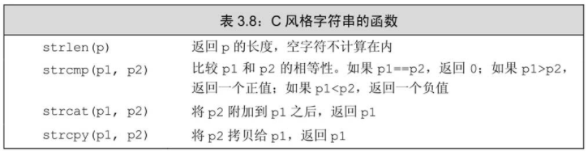

数组是一种类似于标准库类型 `vector` 的**数据结构**（数组不是类类型）。与`vector`相似的地方是，数组也是存放类型相同的对象的容器，这些对象本身没有名字，需要通过其所在位置访问。与`vector`不同的地方是，**数组的大小确定不变，不能随意向数组中增加元素**。因为数组的大小固定，因此对某些特殊的应用来说程序的运行时性能较好，但是相应地也损失了一些灵活性。

> 如果不清楚元素的确切个数，请使用`vector`。

> 数组在内存空间的地址是连续的


数组与`vector`的相似之处是都能存放类型相同的对象，且这些对象本身没有名字，需要通过其所在位置访问。

数组与`vector`的最大不同是，数组的大小固定不变，不能随意向数组中增加额外的元素，虽然在某些情境下运行时性能较好，但是与`vector`相比损失了灵活性。

具体来说，数组的维度在定义时已经确定，如果我们想更改数组的长度，只能创建一个更大的新数组，然后把原数组的所有元素复制到新数组中去。我们也无法像`vector`那样使用`size`函数直接获取数组的维度。如果是字符数组，可以调用`strlen`函数得到字符串的长度；如果是其他数组，只能使用`sizeof(array)/sizeof(array[0])`的方式计算数组的维度。

> 严格来讲，`vector` 是容器，不是数组

> 数组的元素是不能删的，只能覆盖

# 定义和初始化内置数组
数组是一种复合类型。数组的声明形如`a[d]`，其中`a`是数组的名字，`d`是数组的维度。维度说明了数组中元素的个数，因此**必须大于`0`，必须是一个常量表达式**。
```cpp
unsigned cnt = 42;          // not a constant expression
constexpr unsigned sz = 42; // constant expression
                            // constexpr
int arr[10];                // array of ten ints
int *parr[sz];              // array of 42 pointers to int
string bad[cnt];            // error: cnt is not a constant expression
string strs[get_size()];    // ok if get_size is constexpr, error otherwise
```
默认情况下，数组的元素被默认初始化。

> 和内置类型的变量一样，如果在函数内部定义了某种内置类型的数组，那么默认初始化会令数组含有未定义的值。

**定义数组的时候必须指定数组的类型，不允许用`auto`关键字由初始值的列表推断类型。**

和`vector`一样，**数组的元素应为对象，因此不存在引用数组。**

## 显式初始化数组元素
可以对数组的元素进行列表初始化，此时允许忽略数组的维度。如果在声明时没有指明维度，编译器会根据初始值的数量计算并推测出来；相反，如果指明了维度，那么初始值的总数量不应该超出指定的大小。如果维度比提供的初始值数量大，则用提供的初始值初始化靠前的元素，剩下的元素被初始化成默认值。
```cpp
const unsigned sz = 3;        // constant expression
int ia1[sz] = {0,1,2};        // array of three ints with values 0, 1, 2
int a2[] = {0, 1, 2};         // an array of dimension 3
int a3[5] = {0, 1, 2};        // equivalent to a3[] = {0, 1, 2, 0, 0}
string a4[3] = {"hi", "bye"}; // same as a4[] =  {"hi", "bye", ""}
int a5[2] = {0,1,2};          // error: too many initializers
```


## 字符数组的特殊性
可以用字符串字面值对字符数组数组初始化，但一定要注意字符串字面值的结尾处还有一个空字符，这个空字符也会像字符串的其他字符一样被拷贝到字符数组中去。

> 单引号内的是字符字面值，双引号内的是字符串字面值。
```cpp
char a1[] = {'C', '+', '+'};       // list initialization, no null（字符字面值）
char a2[] = {'C', '+', '+', '\0'}; // list initialization, explicit null（字符字面值）
char a3[] = "C++";                 // null terminator added automatically（字符串字面值）
const char a4[6] = "Daniel";       // error: no space for the null!（字符串字面值）
```
`a4`的定义是错误的：尽管字符串字面值`"Daniel"`看起来只有6个字符，但是数组的大小必须至少是7，其中6个位置存放字面值的内容，另外1个存放结尾处的空字符。

## 不允许拷贝和赋值
不能将数组的内容拷贝给其他数组作为其初始值，也不能用数组为其他数组赋值：
```cpp
int a[] = {0, 1, 2}; // array of three ints
int a2[] = a;        // error: cannot initialize one array with another
a2 = a;              // error: cannot assign one array to another
```
> 若需实现数组的拷贝和赋值，需要逐个元素依次拷贝赋值。


## 理解复杂的数组声明
和`vector`一样，数组能存放大多数类型的对象。例如，可以定义一个存放指针的数组。又因为数组本身就是对象，所以允许定义数组的指针及数组的引用。

> 不存在引用的数组（即，数组的元素不能是引用），但存在数组的引用（可以定义一个引用来绑定数组）

```cpp
int *ptrs[10];            //  ptrs是含有10个元素（整型指针）的数组（注：[]优先级高于*）
int &refs[10];            //  数组里边装引用？错误: 引用不是对象，不存在引用的数组（注：[]优先级高于&，首先判断refs是一个维度为10的数组，数组的元素的类型是int &，即，引用。由于引用不是对象，故语法错误）
int (*Parray)[10] = &arr; //  Parray指向一个含有10个整数的数组（注：()优先级高于[]。首先分析(*Parray)，可知Parray是一个指针；然后考虑右边的[10]，可知Parray指向一个维度为10的数组；最后观察左边，知道数组中的元素为int）
int (&arrRef)[10] = arr;  //  arrRef引用一个含有10个整数的数组（()优先级高于[]。arrRef是一个引用，所绑定的对象是一个维度为10的数组，数组中的元素为int）
```

默认情况下，类型修饰符从右向左依次绑定。对于`ptrs`来说，从右向左理解其含义比较简单：首先知道我们定义的是一个大小为10的数组，它的名字是`ptrs`，然后知道数组中存放的是指向`int`的指针。

但是对于`Parray`来说，从右向左理解就不太合理了。就数组而言，由内向外阅读要比从右向左好多了。由内向外的顺序可帮助我们更好地理解`Parray`的含义：首先是圆括号括起来的部分，`*Parray`意味着`Parray`是个指针，接下来观察右边，可知道`Parray`是个指向大小为10的数组的指针，最后观察左边，知道数组中的元素是`int`。这样最终的含义就明白无误了，`Parray`是一个指针，它指向一个`int`数组，数组中包含10个元素。

同理，`(&arrRef)`表示`arrRef`是一个引用，它引用的对象是一个大小为10的数组，数组中元素的类型是`int`。

更复杂的：
```cpp
int *(&arry)[10] = ptrs; // array是数组的引用，该数组包含10个指向int的指针
```
首先，`()`优先级高于`[]`，知道`arry`是一个引用；其次，`[]`优先级高于`*`，结合右边可知，`arry`引用的对象是一个大小为10的数组；最后观察左边知道，数组的元素的类型是指向int的指针。

> 要想理解数组声明的含义，最好的办法是从数组的名字开始按照由内向外的顺序阅读。


# 访问数组元素
**数组的元素也能使用`范围for`语句或`下标运算符`来访问。**

**数组的索引从0开始。**

在使用数组下标的时候，通常将其定义为`size_t`类型。`size_t`是一种机器相关的`无符号类型`，它被设计得足够大以便能表示内存中任意对象的大小。**在`cstddef`头文件中定义了`size_t`类型**，这个文件是C标准库`stddef.h`头文件的C++语言版本。

数组除了大小固定这一特点外，其他用法与`vector`基本类似:
```cpp
// count the number of grades by clusters of ten: 0--9, 10--19, ... 90--99, 100
unsigned scores[11] = {}; // 11 buckets, all value initialized to 0
unsigned grade;
while (cin >> grade) {
    if (grade <= 100)
        ++scores[grade/10]; // increment the counter for the current cluster
}
```
本例所用的下标运算符是由C++语言直接定义的，这个运算符能用在数组类型的运算对象上。`vector`类型所用的下标运算符是库模板`vector`定义的，只能用于`vector`类型的运算对象。

与`vector`和`string`一样，当需要遍历数组的所有元素时，最好的办法也是使用`范围for`语句:
```cpp
for (auto i : scores)      // for each counter in scores
    cout << i << " ";      // print the value of that counter
cout << endl;
```

检查下标的值：数组的下标应该大于等于0而且小于数组的大小。
> 要想防止数组下标越界，除了小心谨慎注意细节以及对代码进行彻底的测试之外，没有其他好办法。对于一个程序来说，即使顺利通过编译并执行，也不能肯定它不包含此类致命的错误。

> 大多数常见的安全问题都源于缓冲区溢出错误。当数组或其他类似数据结构的下标越界并试图访问非法内存区域时，就会产生此类错误。


# 指针和数组
使用数组名字的时候编译器一般都会自动地将其替换为**一个指向数组首元素的指针**。
```cpp
string nums[] = {"one", "two", "three"};  // array of strings
string *p = &nums[0];   // p points to the first element in nums
string *p2 = nums;      // equivalent to p2 = &nums[0]
```

```cpp
int ia[] = {0,1,2,3,4,5,6,7,8,9}; // ia is an array of ten ints
auto ia2(ia); // ia2 is an int* that points to the first element in ia
ia2 = 42;     // error: ia2 is a pointer, and we can't assign an int to a pointer
```
尽管`ia`是由`10`个整数构成的数组，但当使用`ia`作为初始值时，编译器实际执行的初始化过程类似于下面的形式：
```cpp
auto ia2(&ia[0]);  // now it's clear that ia2 has type int*
```
必须指出的是，**当使用decltype关键字时，上述转换不会发生**，decltype（ia）返回的类型是由10个整数构成的数组：
```cpp
// ia3 is an array of ten ints
decltype(ia) ia3 = {0,1,2,3,4,5,6,7,8,9};   // ia is an array of ints, so is ia3
ia3 = p;    // error: can't assign an int* to an array
ia3[4] = i; // ok: assigns the value of i to an element in ia3
```

## 指向数组元素的指针也是迭代器
`vector`和`string`的迭代器支持的运算，数组的指针全都支持。

```cpp
int arr[] = {0,1,2,3,4,5,6,7,8,9};
int *p = arr; // p points to the first element in arr
++p;          // p points to arr[1]
```
使用指针也能遍历数组中的元素。当然，这样做的前提是先得获取到指向数组第一个元素的指针和指向数组尾元素的下一位置的指针。

> 通过数组名字或者数组中首元素的地址都能得到指向首元素的指针；可以设法获取数组尾元素之后的那个并不存在的元素的地址，从而得到指向数组尾元素的下一位置的指针：
```cpp
int *e = &arr[10]; // pointer just past the last element in arr
```
> 这里显然使用下标运算符索引了一个不存在的元素，`arr`有10个元素，尾元素所在位置的索引是9，接下来那个不存在的元素唯一的用处就是提供其地址用于初始化`e`。

尾后指针也不指向具体的元素。因此，**不能对尾后指针执行解引用或递增的操作**。

利用上面得到的指针能重写之前的循环，令其输出arr的全部元素：
```cpp
for (int *b = arr; b != e; ++b)

    cout << *b << endl; // print the elements in arr
```

**尽管能计算得到尾后指针，但这种用法极易出错。**


## 标准库函数begin和end

C++11新标准引入了两个名为`begin`和`end`的函数。这两个函数与容器中的两个同名成员功能类似，但由于数组不是类类型，因此这两个函数不是成员函数。正确的使用形式是将数组作为它们的参数：
```cpp
int ia[] = {0,1,2,3,4,5,6,7,8,9}; // ia is an array of ten ints
int *beg = begin(ia); // pointer to the first element in ia
int *last = end(ia);  // pointer one past the last element in ia
```
`begin`函数返回指向`ia`首元素的指针，`end`函数返回指向`ia`尾元素下一位置的指针。

**`begin`和`end`两个函数定义在`iterator`头文件中**。

```cpp
// pbeg points to the first and pend points just past the last element in arr
int *pbeg = begin(arr),  *pend = end(arr);
// find the first negative element, stopping if we've seen all the elements
while (pbeg != pend && *pbeg >= 0)
    ++pbeg;
```


## 指针运算
指向数组元素的指针可以执行表3.6和表3.7列出的所有迭代器运算。这些运算，包括解引用、递增、比较、与整数相加、两个指针相减等，用在指针和用在迭代器上意义完全一致。

给指针加上一个整数，得到的新指针仍需指向同一数组的其他元素，或者指向同一数组的尾元素的下一位置。
```cpp
constexpr size_t sz = 5;
int arr[sz] = {1,2,3,4,5};
int *ip = arr;     // equivalent to int *ip = &arr[0]
int *ip2 = ip + 4; // ip2 points to arr[4], the last element in arr

// ok: arr is converted to a pointer to its first element; p points one past the end of arr
int *p = arr + sz; // use caution -- do not dereference!
int *p2 = arr + 10; // error: arr has only 5 elements; p2 has undefined value
```

和迭代器一样，两个指针相减的结果是它们之间的距离。参与运算的两个指针必须指向同一个数组当中的元素。

两个指针相减的结果的类型是一种名为`ptrdiff_t`的标准库类型，和`size_t`一样，`ptrdiff_t`也是一种定义在`cstddef`头文件中的机器相关的类型。因为差值可能为负值，所以`ptrdiff_t`是一种带符号类型。
```cpp
auto n = end(arr) - begin(arr); // n is 5, the number of elements in arr
```

只要两个指针指向同一个数组的元素，或者指向该数组的尾元素的下一位置，就能利用关系运算符对其进行比较。
```cpp
int *b = arr, *e = arr + sz;

while (b < e) {
    // use *b
    ++b;
}

int i = 0, sz = 42;
int *p = &i, *e = &sz;
// undefined: p and e are unrelated; comparison is meaningless!
while (p < e)
```
如果两个指针分别指向不相关的对象，则不能比较它们。


## 解引用和指针运算的交互
指针加上一个整数所得的结果还是一个指针。假设结果指针指向了一个元素，则允许解引用该结果指针。
```cpp
int ia[] = {0,2,4,6,8}; // array with 5 elements of type int
int last = *(ia + 4); // ok: initializes last to 8, the value of ia[4]
```
表达式`*(ia+4)`计算ia前进4个元素后的新地址，解引用该结果指针的效果等价于表达式`ia[4]`。

与上一个例子相比，下面这个例子少了一个括号，故而是先解引用ia，然后给解引用的结果再加上4
```cpp
last = *ia + 4;  // ok: last = 4, equivalent to ia[0] + 4
```

## 下标和指针
如前所述，在很多情况下使用数组的名字其实用的是一个指向数组首元素的指针。一个典型的例子是当对数组使用下标运算符时，编译器会自动执行上述转换操作。给定
```cpp
int ia[] = {0,2,4,6,8};  // array with 5 elements of type int
```
此时，`ia[0]`是一个使用了数组名字的表达式，对数组执行下标运算其实是对指向数组元素的指针执行下标运算：
```cpp
int i = ia[2];  // ia is converted to a pointer to the first element in ia
                // ia[2] fetches the element to which (ia + 2) points
int *p = ia;    // p points to the first element in ia
i = *(p + 2);   // equivalent to i = ia[2]
```

只要指针指向的是数组中的元素（或者数组中尾元素的下一位置），都可以执行下标运算：
```cpp
int *p = &ia[2];  // p points to the element indexed by 2
int j = p[1];     // p[1] is equivalent to *(p + 1),
                // p[1] is the same element as ia[3]
int k = p[-2];    // p[-2] is the same element as ia[0]
```
注意，这里的`p`是指向`ia[2]`的指针，对指针`p`执行下标运算时，相当于给指针加上（减去）某整数值，即，对指针进行移动。例如上例的`p[-2]`等价于`*(p-2)`，也就是`ia[0]`。

虽然标准库类型`string`和`vector`也能执行下标运算，但是数组与它们相比还是有所不同。**标准库类型限定使用的下标必须是无符号类型，而内置的下标运算无此要求**，上面的最后一个例子很好地说明了这一点。内置的下标运算符可以处理负值，当然，结果地址必须指向原来的指针所指同一数组中的元素（或是同一数组尾元素的下一位置）。

> 内置的下标运算符所用的索引值不是无符号类型，这一点与`vector`和`string`不一样。


# C风格字符串
字符串字面值是一种通用结构的实例，这种结构即是C++由C继承而来的C风格字符串（C-stylecharacter string）。

> **尽管C++支持C风格字符串，但在C++程序中最好还是不要使用它们**。这是因为C风格字符串不仅使用起来不太方便，而且极易引发程序漏洞，是诸多安全问题的根本原因。

C风格字符串不是一种类型，而是为了表达和使用字符串而形成的一种约定俗成的写法。

## C标准库String函数
表3.8列举了C语言标准库提供的一组函数，这些函数可用于操作C风格字符串，它们定义在`cstring`头文件中，`cstring`是C语言头文件string.h的C++版本。



> 表3.8所列的函数不负责验证其字符串参数。

**传入此类函数的指针必须指向以空字符作为结束的数组**：
```cpp
char ca[] = {'C', '+', '+'};  // not null terminated
cout << strlen(ca) << endl;   // disaster: ca isn't null terminated
```
此例中，`ca`虽然也是一个字符数组但它不是以空字符作为结束的，因此上述程序将产生未定义的结果。`strlen`函数将有可能沿着`ca`在内存中的位置不断向前寻找，直到遇到空字符才停下来。


## 比较字符串
比较两个C风格字符串的方法和之前学习过的比较标准库`string`对象的方法大相径庭。

比较标准库`string`对象的时候，用的是普通的关系运算符和相等性运算符：
```cpp
string s1 = "A string example";
string s2 = "A different string";
if (s1 < s2)  // false: s2 is less than s1
```
如果把这些运算符用在两个C风格字符串上，实际比较的将是指针而非字符串本身：
```cpp
const char ca1[] = "A string example";
const char ca2[] = "A different string";
if (ca1 < ca2)  // undefined: compares two unrelated addresses
```
谨记之前介绍过的，当使用数组的时候其实真正用的是指向数组首元素的指针。因此，上面的`if`条件实际上比较的是两个`const char *`的值。这两个指针指向的并非同一对象，所以将得到未定义的结果。

要想比较两个C风格字符串需要调用`strcmp`函数，此时比较的就不再是指针了。如果两个字符串相等，`strcmp`返回0；如果前面的字符串较大，返回正值；如果后面的字符串较大，返回负值：
```cpp
if (strcmp(ca1, ca2) < 0) // same effect as string comparison s1 < s2
```

## 目标字符串的大小由调用者指定
连接或拷贝C风格字符串也与标准库`string`对象的同类操作差别很大。例如，要想把刚刚定义的那两个`string`对象`s1`和`s2`连接起来，可以直接写成下面的形式：

```cpp
// initialize largeStr as a concatenation of s1, a space, and s2
string largeStr = s1 + " " + s2;
```

同样的操作如果放到`ca1`和`ca2`这两个数组身上就会产生错误了。表达式`ca1 + ca2`试图将两个指针相加，显然这样的操作没什么意义，也肯定是非法的。

正确的方法是使用`strcat`函数和`strcpy`函数。不过要想使用这两个函数，还必须提供一个用于存放结果字符串的数组，该数组必须足够大以便容纳下结果字符串及末尾的空字符。下面的代码虽然很常见，但是充满了安全风险，极易引发严重错误：
```cpp
// disastrous if we miscalculated the size of largeStr
strcpy(largeStr, ca1);     // copies ca1 into largeStr
strcat(largeStr, " ");     // adds a space at the end of largeStr
strcat(largeStr, ca2);     // concatenates ca2 onto largeStr
```
一个潜在的问题是，我们在估算`largeStr`所需的空间时不容易估准，而且`largeStr`所存的内容一旦改变，就必须重新检查其空间是否足够。不幸的是，这样的代码到处都是，程序员根本没法照顾周全。这类代码充满了风险而且经常导致严重的安全泄漏。


> 对大多数应用来说，使用标准库`string`要比使用C风格字符串更安全、更高效。

# 与旧代码的接口
很多C++程序在标准库出现之前就已经写成了，它们肯定没用到`string`和`vector`类型。而且，有一些C++程序实际上是与C语言或其他语言的接口程序，当然也无法使用C++标准库。因此，现代的C++程序不得不与那些充满了数组和/或C风格字符串的代码衔接，为了使这一工作简单易行，C++专门提供了一组功能。

## 混用string对象和C风格字符串
此前介绍过，可以使用字符串字面值来初始化`string`对象：
```cpp
string s("Hello World");  // s holds Hello World
```
更一般的情况是，任何出现字符串字面值的地方都可以用以空字符结束的字符数组来替代：
1. 允许使用以空字符结束的字符数组来初始化`string`对象或为`string`对象赋值。
2. 在`string`对象的加法运算中允许使用以空字符结束的字符数组作为其中一个运算对象（不能两个运算对象都是）；在`string`对象的复合赋值运算中允许使用以空字符结束的字符数组作为右侧的运算对象。

上述性质反过来就不成立了：如果程序的某处需要一个C风格字符串，无法直接用`string`对象来代替它。例如，不能用`string`对象直接初始化指向字符的指针。为了完成该功能，`string`专门提供了一个名为`c_str`的成员函数：
```cpp
char *str = s; // error: can't initialize a char* from a string
const char *str = s.c_str(); // ok
```
`c_str`函数的返回值是一个C风格的字符串。也就是说，函数的返回结果是一个指针，该指针指向一个以空字符结束的字符数组，而这个数组所存的数据恰好与那个`string`对象的一样。结果指针的类型是`const char *`，从而确保我们不会改变字符数组的内容。

我们无法保证`c_str`函数返回的数组一直有效，事实上，如果后续的操作改变了`s`的值就可能让之前返回的数组失去效用。

> 如果执行完`c_str()`函数后程序想一直都能使用其返回的数组，最好将该数组重新拷贝一份。


## 使用数组初始化vector对象
此前介绍过不允许使用一个数组为另一个内置类型的数组赋初值，也不允许使用`vector`对象初始化数组。相反的，允许使用数组来初始化`vector`对象。要实现这一目的，只需**指明要拷贝区域的首元素地址和尾后地址**就可以了：
```cpp
int int_arr[] = {0, 1, 2, 3, 4, 5};
// ivec has six elements; each is a copy of the corresponding element in int_arr
vector<int> ivec(begin(int_arr), end(int_arr));
```
在上述代码中，用于创建`ivec`的两个指针实际上指明了用来初始化的值在数组`int_arr`中的位置，其中第二个指针应指向待拷贝区域尾元素的下一位置。此例中，使用标准库函数`begin`和`end`来分别计算`int_arr`的首指针和尾后指针。在最终的结果中，`ivec`将包含6个元素，它们的次序和值都与数组`int_arr`完全一样。

用于初始化`vector`对象的值也可能仅是数组的一部分：
```cpp
// copies three elements: int_arr[1], int_arr[2], int_arr[3]
vector<int> subVec(int_arr + 1, int_arr + 4);
```
这条初始化语句用3个元素创建了对象`subVec`，3个元素的值分别来自`int_arr[1]`、`int_arr[2]`和`int_arr[3]`。

> **建议：尽量使用标准库类型而非数组**
> 
> 使用指针和数组很容易出错。一部分原因是概念上的问题：指针常用于底层操作，因此容易引发一些与烦琐细节有关的错误。其他问题则源于语法错误，特别是声明指针时的语法错误。
> 
> 现代的C++程序应当尽量使用`vector`和迭代器，避免使用内置数组和指针；应该尽量使用`string`，避免使用C风格的基于数组的字符串。

[原文：数组](https://weread.qq.com/web/reader/ff732fe072021a24ff7bb24k636320102206364d3f0ffdc)