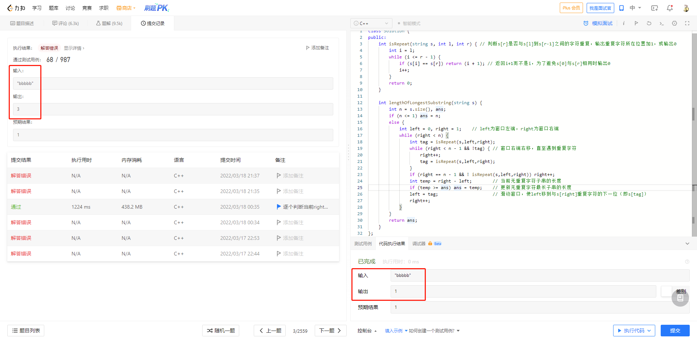
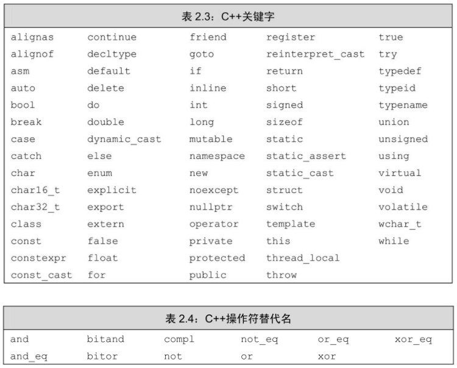

C++中的每个变量都有其数据类型，数据类型决定着变量所占内存空间的大小和布局方式、该空间能存储的值的范围，以及变量能参与的运算。

对C++程序员来说，“变量（variable）”和“对象（object）”一般可以互换使用。通常情况下，对象是指一块能存储数据并具有某种类型的内存空间。

# 变量定义
变量定义的基本形式是：首先是类型说明符（type specifier），随后紧跟由一个或多个变量名组成的列表，其中变量名以逗号分隔，最后以分号结束。
> 列表中每个变量名的类型都由类型说明符指定，定义时还可以为一个或多个变量赋初值。

## 初始值
当对象在创建时获得了一个特定的值，我们说这个对象被初始化（initialized）了。

在同一条定义语句中，可以用先定义的变量值去初始化后定义的其他变量。

**初始化不是赋值**，初始化的含义是创建变量时赋予其一个初始值，而赋值的含义是把对象的当前值擦除，而以一个新值来替代。

## 列表初始化
用花括号来初始化变量: 用花括号来初始化变量
> 当用于内置类型的变量时，这种初始化形式有一个重要特点：如果我们使用列表初始化且初始值存在丢失信息的风险，则编译器将报错

## 默认初始化
如果定义变量时没有指定初值，则变量被默认初始化（default initialized）。

如果是内置类型的变量未被显式初始化，它的值由定义的位置决定。
> **定义于任何函数体之外的变量被初始化为0。定义在函数体内部的内置类型变量将不被初始化（uninitialized）**。一个未被初始化的内置类型变量的值是未定义的，如果试图拷贝或以其他形式访问此类值将引发错误。

下图是在`LeetCode 3. 无重复字符的最长子串`一题中未初始化函数体内变量`ans`出现的问题：hexo-asset-img

每个类各自决定其初始化对象的方式。而且，是否允许不经初始化就定义对象也由类自己决定。
> 绝大多数类都支持无须显式初始化而定义对象，这样的类提供了一个合适的默认值。例如，`string`类规定如果没有指定初值则生成一个空串。一些类要求每个对象都显式初始化，此时如果创建了一个该类的对象而未对其做明确的初始化操作，将引发错误。

**未初始化的变量含有一个不确定的值，使用未初始化的变量将带来无法预计的后果。**

# 变量声明和定义的关系

C++是一种静态类型（statically typed）语言，其含义是在编译阶段检查类型。其中，检查类型的过程称为类型检查（type checking）。
> 前提是编译器必须知道每一个实体对象的类型，这就要求我们在使用某个变量之前必须声明其类型。

为了允许把程序拆分成多个逻辑部分来编写，C++语言支持分离式编译（separatecompilation）机制，该机制允许将程序分割为若干个文件，每个文件可被独立编译。
> 如果将程序分为多个文件，则需要有在文件间共享代码的方法。例如，一个文件的代码可能需要使用另一个文件中定义的变量。

声明（declaration）使得名字为程序所知，一个文件如果想使用别处定义的名字则必须包含对那个名字的声明。而定义（definition）负责创建与名字关联的实体。
> 变量声明规定了变量的类型和名字，在这一点上定义与之相同。但是除此之外，定义还申请存储空间，也可能会为变量赋一个初始值。

如果想声明一个变量而非定义它，就在变量名前添加关键字`extern`，而且不要显式地初始化变量。

任何包含了显式初始化的声明即成为定义: `extern`语句如果包含初始值就不再是声明，而变成定义了。

在函数体内部，如果试图初始化一个由`extern`关键字标记的变量，将引发错误。
> 包含有`extern`标记的定义，例如，`extern double pi=3.14;`，不能放在函数体内部

> 如果要在多个文件中使用同一个变量，就必须将声明和定义分离。此时，变量的定义必须出现在且只能出现在一个文件中，而其他用到该变量的文件必须对其进行声明，却绝对不能重复定义。

**变量能且只能被定义一次，但是可以被多次声明。**

# 标识符
C++的标识符（identifier）由字母、数字和下画线组成，其中**必须以字母或下画线开头**。标识符的长度没有限制，但是**对大小写字母敏感**。

**C++关键字和C++操作符替代名不能被用作标识符**。

用户自定义的标识符中不能连续出现两个下画线，也不能以下画线紧连大写字母开头。此外，定义在函数体外的标识符不能以下画线开头。

> 变量命名规范变量命名有许多约定俗成的规范，下面的这些规范能有效提高程序的可读性：
> 1. 标识符要能体现实际含义。
> 2. 变量名一般用小写字母，如`index`，不要使用`Index`或`INDEX`。
> 3. 用户自定义的类名一般以大写字母开头，如`Sales_item`。
> 4. 如果标识符由多个单词组成，则单词间应有明显区分，如下划线命名法`student_loan`或驼峰命名法`studentLoan`，不要使用`studentloan`。

# 名字的作用域

同一个名字如果出现在程序的不同位置，也可能指向的是不同实体。

作用域（scope）是程序的一部分，在其中名字有其特定的含义。C++语言中大多数作用域都以花括号分隔。
> 同一个名字在不同的作用域中可能指向不同的实体。名字的有效区域始于名字的声明语句，以声明语句所在的作用域末端为结束。

全局作用域（global scope）、块作用域（block scope）。

内层作用域（innerscope）、外层作用域（outer scope）。

> 作用域中一旦声明了某个名字，它所嵌套着的所有作用域中都能访问该名字。同时，允许在内层作用域中重新定义外层作用域已有的名字。

一般来说，在对象第一次被使用的地方附近定义它是一种好的选择。

**如果函数有可能用到某全局变量，则不宜再定义一个同名的局部变量**。(语法上允许，但实际编程使用时容易出错。)