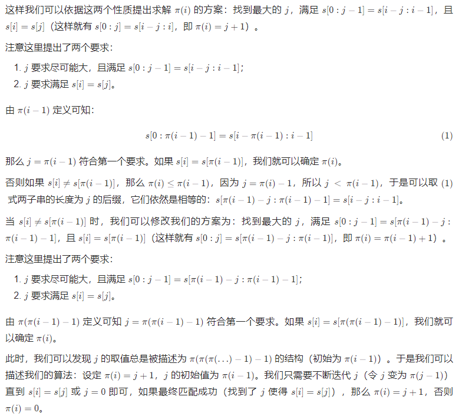

Knuth-Morris-Pratt 算法，简称 KMP 算法，由 Donald Knuth、James H. Morris 和 Vaughan Pratt 三人于 1977 年联合发表

KMP 算法主要应用于 **字符串匹配**

基本思想：当出现字符串不匹配时，可以利用前面已经匹配的那些字符中的信息，避免从头再做匹配

以 在文本串中查找是否出现过一个模式串 为例：

检测文本串 "aabaabaaf" 中是否含有 模式串 "aabaaf"，KMP 算法的查找过程如下所示


[^_^]:

    - 若采用暴力匹配，即，首先检查以第一个字符 'a' 开头的子串是否可以与 "aabaaf" 相匹配，发现子串 "aabaab" 的第二个 'b' 无法与 "aabaaf" 对应位置上的 'f' 匹配，于是，重新检查字符串 "aabaabaaf" 中以第二个字符 'a' 开头的子串是否可以与 "aabaaf" 相匹配，依此类推
    - 若采用 KMP 算法，当发现子串 "aabaab" 的第二个 'b' 无法与 "aabaaf" 对应位置上的 'f' 匹配时，会利用此前已经匹配的子串 "aabaa" 的信息，以确定下一步的匹配起点


<!-- 
可以看出，如果暴力匹配，会当发现不匹配时，需要对模式串从头开始匹配，但如果使用 KMP ，就不会从头匹配，而是从上次已经匹配的内容开始匹配，即，找到模式串中下标为 2 的字符 'b' 继续开始匹配 -->

令 $n$ 表示文本串长度，$m$ 表示模式串长度，暴力匹配的时间复杂度为 $O(n \times m)$，而 KMP 算法的时间复杂度为 $O(n + m)$
 - 计算模式串的前缀表的时间复杂度为 $O(m)$
 - 与文本串进行匹配的时间复杂度为 $O(n)$


## 前缀表

前缀表（prefix table）是用来回退的，它记录了之前已经匹配的文本中的信息，并告诉我们：当文本串中的字符 `x` 与模式串中的字符 `y` 匹配失败时，下一步应该将模式串中的哪个字符与文本串中的字符 `x` 重新进行匹配

[^_^]: 被注释掉了

    例如，文本串字符 `b` 与模式串 `f` 不匹配时，前缀表会告知，应将模式串中的 `b` 与文本串的 `b` 进行匹配
    - 因为模式串字符 `f` 前面的 "aa" 与文本串字符 `b` 前面的 "aa" 是匹配的，而模式串字符 `b` 前面也有一个 "aa" ，因此，模式串字符 `b` 前面的 "aa" 也可以与文本串字符 `b` 前面的 "aa" 相匹配，故而可以将这两个 "aa" 进行匹配，并检查 "aa" 后面的对应字符是否匹配

    对应的，这也就是前缀表的工作原理：匹配失败位置前一位的前缀表元素，记录了匹配成功子串（`"aabaa"`）的最长相同前后缀（`"aa"`）的长度（`2`），该长度对应的位置，即为下一步匹配的起点（将模式串下标为 `2` 的字符与文本串的 `b` 匹配）

<!-- 前缀表中，下标为 `i` 的元素，记录了 “ 在模式串里边，以下标 `i` 结束的子串有多大长度的相同前缀后缀，即，相同前后缀的最大长度 ” -->

对于长度为 $m$ 的字符串 `s` ，前缀表下标为 `i` 的元素记作 $\pi (i)$，$\pi (i)$ 表示 `s` 的子串 `s[0:i]` 的最长的相同前后缀的长度

next 数组就是一个前缀表

### 前缀与后缀

字符串的 **前缀** ：**不包含最后一个字符** 的、**以第一个字符开头** 的连续子串
 - 例如，字符串 "aabaaf" 的前缀有："a"、"aa"、"aab"、"aaba" 和 "aabaa"

字符串的 **后缀** ：**不包含第一个字符** 的、**以最后一个字符结尾** 的连续子串
 - 例如，字符串 "aabaaf" 的后缀有："f"、"af"、"aaf"、"baaf" 和 "abaaf"

### 最长相同前后缀

针对某一字符串，使得 前缀和后缀相同 的前缀/后缀长度的最大值，即为所谓的 相同前后缀的最大长度，对应的前缀/后缀即为 最长相同前后缀

例如，字符串 "aabaa" 的前缀有 "a"、"aa"、"aab"、"aaba"，后缀有 "a"、"aa"、"baa"、"abaa"，其中，相同前后缀的最大长度为 2，最长相同前后缀为 "aa"


### 前缀表元素

以模式串中位置 `i` 为结尾的子串 `s[0:i]`，其相同前后缀最大长度，就是前缀表元素 $\pi (i)$，其中，$0 \le i \le m$

以模式串 "aabaaf" 为例：

 - 子串 "a" 的相同前后缀最大长度为 0（没有前缀，也没有后缀），$\pi (0) = 0$
 - 子串 "aa" 的相同前后缀最大长度为 1（前缀为 "a"，后缀也为 "a"），$\pi (1) = 1$
 - 子串 "aab" 的相同前后缀最大长度为 0（前缀不含 'b'，后缀一定含 'b' ，不存在相同前后缀），$\pi (2) = 0$
 - 子串 "aaba" 的相同前后缀最大长度为 1（最长相同前后缀为 "a"），$\pi (3) = 1$
 - 子串 "aabaa" 的相同前后缀最大长度为 2（最长相同前后缀为 "aa"），$\pi (4) = 1$
 - 子串 "aabaaf" 的相同前后缀最大长度为 0（前缀不含 'f'，后缀一定含 'f' ，不存在相同前后缀），$\pi (5) = 0$

即，

| 下标 | 0 | 1 | 2 | 3 | 4 | 5 |
| :-: | :-: | :-: | :-: | :-: | :-: | :-: |
| 模式串 | a | a | b | a | a | f |
| 前缀表 | 0 | 1 | 0 | 1 | 2 | 0 |

因此，当模式串的 `f` 与文本串匹配失败时，找到 `f` 前一位所对应的前缀表元素 `2` ，模式串下标为 `2` 的字符将与文本串重新匹配
 - 字符 `f` 之前这部分的字符串（也就是字符串 "aabaa" ）的最长相等前后缀字符串是 "aa" ，匹配失败的位置是后缀子串的下一位，那么我们找到相同前缀的下一位重新匹配即可


### 前缀表的性质

1. $\pi (i) \le \pi (i - 1) + 1$
    - 依据 $\pi (i)$ 定义可得：$s[0 : \pi(i) - 1] = s[i - \pi(i) + 1 : i]$，将两区间的右端点同时左移，可得：$s[0: \pi (i) - 2] = s[i - \pi(i) + 1: i - 1]$
    - 依据 $\pi (i - 1)$ 定义，$\pi (i)$ 是相同前后缀的最大长度，因此，与后缀相同的前缀的长度应满足 $\pi (i) - 1 \le \pi (i - 1)$，即，$\pi (i) \le \pi (i - 1) + 1$

2. 若 $s[i] = s[\pi (i - 1)]$ ，则 $\pi (i) = \pi (i - 1) + 1$
     - 依据 $\pi (i - 1)$ 定义可得：$s[0: \pi (i - 1) - 1] = s[i - \pi(i - 1) : i - 1]$
     - 由 $s[i] = s[\pi (i - 1)]$ 可得，$s[0: \pi (i - 1)] = s[i - \pi(i - 1) : i]$
     - 依据 $\pi (i)$ 定义，$\pi (i)$ 是相同前后缀的最大长度，故，$\pi (i)$ 不小于当前相同前后缀的长度，即，$\pi (i) \ge \pi (i - 1) + 1$
     - 结合第一个性质，可得，$\pi (i) = \pi (i - 1) + 1$

<!--  -->

### 前缀表的计算算法

1. 设定 $\pi (i) = j + 1$，$j$ 的初始值为 $\pi(i-1)$

2. 不断迭代 $j$，即，令 $j$ 变为 $\pi (j - 1)$，直到 $s[i]=s[j]$ 或 $j = 0$ 结束
    - 如果最终找到 $j$ 使得 $s[i] = s[j]$），那么 $\pi(i) = j + 1$
    - 如果最终 $j = 0$，则 $\pi (i) = 0$


### next 数组

定义一个函数 `getNext` 来构造 `next` 数组（即，前缀表），函数参数包括：一个指向 `next` 数组的指针，一个字符串 `s`

按照上述前缀表的计算算法，即可完成构造 `next` 数组

代码如下：

```cpp
void getNext(int* next, const string& s) {
    int j = 0;
    next[0] = 0;
    for(int i = 1; i < s.size(); i++) {
        while (j > 0 && s[i] != s[j]) { // j 大于 0 ，因为后续要将 j - 1 作为下标
            j = next[j - 1]; // 寻找前一位的对应回退位置
        }
        if (s[i] == s[j]) {
            j++;
        }
        next[i] = j;
    }
}
```

## 利用前缀表做匹配

这里将介绍如何使用 next 数组，完成模式串 `t` 与文本串 `s` 的匹配

定义 `j` 指向模式串 `t` 的起始位置

    int j = 0;

定义 `i` 指向文本串 `s` 的起始位置，`i` 从 0 开始遍历文本串


 - 若 `s[i] != t[j]` ，需要从 next 数组中寻找下一个位置进行匹配

        while (j > 0 && s[i] != t[j])
            j = next[j - 1];

 - 若 `s[i] == t[j]` ，将 `i` 和 `j` 同时向右移动一位

        if (s[i] == t[j])
            j++;

 - 若 `j` 最终指向模式串 `t` 的尾后，说明，模式串 `t` 完全匹配文本串 `s`

具体实例可见 [LeetCode 28. 实现 strStr()](https://jiankychen.github.io/posts/8f083358)


参考资料：
 - [代码随想录](https://www.programmercarl.com/0028.%E5%AE%9E%E7%8E%B0strStr.html)
 - [力扣官方题解](https://leetcode.cn/problems/implement-strstr/solution/shi-xian-strstr-by-leetcode-solution-ds6y/)