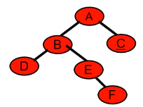

树：用来模拟具有树状结构性质的数据集合

二叉树 （Binary Tree）：每个节点 最多有两个子树 的树结构，通常子树被称作“左子树”和“右子树”

> 注意：二叉树必须严格区分左右子树，即使只有一棵子树，也要说明它是左子树还是右子树

# 二叉树的种类

## 满二叉树

满二叉树：一棵高度为 $k$ 并具有 $2^k - 1$ 个节点的二叉树


## 完全二叉树
完全二叉树：在满二叉树的最底层自右至左依次（注意：不能跳过任何一个节点）去掉若干个节点得到的二叉树


完全二叉树的特点：
   - 所有的叶节点都出现在最低的两层上
   - 对任一节点，如果其右子树的高度为 k ，则其左子树的高度为 $k$ 或 $k + 1$

> 满二叉树一定是完全二叉树，但完全二叉树不一定是满二叉树

优先队列（堆）就是一棵完全二叉树，并保证了父子节点的顺序关系

## 二叉搜索树

二叉搜索树，也叫作 二叉树查找树 或者 二叉排序树

二叉搜索树的性质：
 - 若左子树不空，则左子树上所有结点的值均小于它的根结点的值
 - 若右子树不空，则右子树上所有结点的值均大于它的根结点的值
 - 左、右子树也分别为二叉排序树

即，在二叉搜索树中，左子树都比其根节点小，右子树都比其根节点大，递归定义

二叉搜索树 的 **中序遍历** 一定是 **从小到大排序** 的


二叉搜索树的搜索性能：
 - 最好情况下，二叉搜索树的查找效率比较高，是 $O(\log{n})$ ，其访问性能近似于二分法
 - 最差情况下，例如插入的元素有序时，生成的二叉搜索树将会是一个链表，搜索的时间复杂度为 $O(n)$


## 平衡二叉树

平衡二叉树，又被称为 AVL（Adelson-Velsky and Landis）树，是二叉搜索树的一种实现

平衡二叉树要么是一棵空树，要么保证左右子树的高度差不超过 1，并且左右子树也都必须是一棵平衡二叉树

平衡二叉树的提出就是为了避免二叉搜索树出现极端情况


平衡二叉树的性能：平衡二叉树在添加和删除时需要进行复杂的旋转保持整个树的平衡，最终，插入、查找的时间复杂度都是 $O(\log{n})$

著名的红黑树就是一种平衡二叉树

C++ 中，`map`、`set`、`multimap`、`multiset` 的底层实现都是平衡二叉树


# 二叉树的遍历

二叉树有两类遍历方式：深度优先遍历 与 广度优先遍历

## 深度优先遍历

深度优先遍历 可分为：前序遍历、中序遍历、后序遍历

 - **前序遍历** ：首先访问根节点，然后遍历左子树，最后遍历右子树

 - **中序遍历** ：先遍历左子树，然后访问根节点，然后遍历右子树

 - **后序遍历** ：先遍历左子树，然后遍历右子树，最后访问树的根节点

所谓前中后序只针对于根节点，而左右子节点永远都是先左后右的顺序
 - 前序：根左右
 - 中序：左根右
 - 后序：左右根

以下图为例


其遍历的结果为：

| 遍历方式 | 0 | 1 | 2 | 3 | 4 | 5 | 6 | 7 | 8 |
| :-: | :-: | :-: | :-: | :-: | :-: | :-: | :-: | :-: | :-: |
| 前序遍历 | F | B | A | D | C | E | G | I | H |
| 中序遍历 | A | B | C | D | E | F | G | H | I |
| 后序遍历 | A | C | E | D | B | H | I | G | F |

使用：

 - 中序常用来在二叉搜索树中得到递增的有序序列

 - 删除节点的过程将按照后序遍历的顺序进行

 - 后序可用于数学中的后缀表示法，结合栈处理表达式，每遇到一个操作符，就可以从栈中弹出栈顶的两个元素，计算并将结果返回到栈中


深度优先遍历 通常可以用 **递归法** 和 **迭代法** 实现（如果采用迭代法，则需要借助 **栈** 这一数据结构）

具体实现：

 - [LeetCode 144. 二叉树的前序遍历](https://jiankychen.github.io/posts/1e967892)

 - [LeetCode 94. 二叉树的中序遍历](https://jiankychen.github.io/803071b8)

 - [LeetCode 145. 二叉树的后序遍历](https://jiankychen.github.io/4e96229e)


## 广度优先遍历

二叉树的广度优先遍历是指 层次遍历

即，逐层地、从左到右访问所有节点

上述例子的层序遍历结果为：

| 遍历方式 | 0 | 1 | 2 | 3 | 4 | 5 | 6 | 7 | 8 |
| :-: | :-: | :-: | :-: | :-: | :-: | :-: | :-: | :-: | :-: |
| 层序遍历 | F | B | G | A | D | I | C | E | H |


广度优先遍历 一般借助 **队列** 这一数据结构、采用 **迭代法** 实现

具体实现：[LeetCode 102. 二叉树的层序遍历](https://jiankychen.github.io/c7ba20f5)

# 二叉树的定义

已知二叉树的前序遍历序列和中序遍历序列，可以确定一棵二叉树

 - 根据前序遍历序列找出根节点，再根据中序遍历序列区分左右子树
 - 分别找出左右子树的前序、中序遍历序列
 - 分别对左右子树重复这个过程

例：

前序序列：A B D E F C
中序序列：D B E F A C

根据前序序列确定二叉树的根节点为 A ，在中序序列中找到 A ，此时，中序序列中 A 左边的 D B E F 即为 A 的左子树，A 右边的 C 为 A 的右子树
 - 针对 A 的左子树，一共包含 D B E F 四个节点，其对应的前序遍历为 B D E F ，中序遍历为 D B E F 。因此， A 的左子树的根节点为 B ，节点 B 的左子树为 D ，右子树为 E F
   - 针对 B 的右子树，一共包含 E F 两个节点，其前序遍历为 E F ，中序遍历为 E F
     - 根节点为 E ，右子树为 F
 - 针对 B 的右子树，前序遍历和中序遍历均为 C，故 C 为叶节点



已知二叉树的中序遍历序列和后序遍历序列，可以确定一棵二叉树
 - 根据后序遍历确定根节点，根据中序遍历确定其左右子树

已知二叉树的前序遍历序列和后序遍历序列，无法唯一确定一棵二叉树
 - 可以根据前序遍历序列确定根节点，但无法分清其左子树和右子树


# 二叉树的性质

1. 一棵非空二叉树的第 $i$ 层上最多有 $2^{i - 1}$ 个节点 $(i \ge 1)$

2. 一棵高度为 $k$ 的二叉树，最多具有 $2^k - 1$ 个节点

3. 一棵非空二叉树，如果叶节点数为 $n_0$ ，度数为 2 的节点数为 $n_2$ ，则有 $n_0 = n_2 + 1$ 成立
    - 二叉树所有节点的度数均小于或等于2，所以有 $n = n_0 + n_1 + n_2$
    - 除根节点外，每个节点都有唯一的一个树枝（父节点与子节点之间的线段）进入本节点，则二叉树的树枝总数 $B = n - 1$
    - 度为 1 的节点发出一个树枝，度为 2 的节点发出两个树枝，所以 $B = n_1 + 2 n_2$
    - 联立以上三式，得 $n_0 = n_2 + 1$


4. 具有 $n$ 个节点的完全二叉树的高度 $ k = \lfloor \log_2{n} \rfloor + 1$
    - 高度为 $k$ 的完全二叉树，其节点总数满足 $2^{k-1} - 1 < n \le 2^k - 1$ ，化简得 $k - 1 \le \log_2{n} < k$ ，由于 $k$ 是整数，所以有 $k = \lfloor \log_2{n} \rfloor + 1$

5. **完全二叉树的按层编号**：对一棵有 $n$ 个节点的完全二叉树中的节点按层自上而下（从第 1 层到第 $\lfloor \log_2{n} \rfloor + 1$ 层）、每一层层按自左至右依次编号，若设根节点的编号为 $1$ ，则对任一编号为 $i$ 的节点，有：
     - 若 $i = 1$ ，则节点为二叉树的根节点；若 $i > 1$ ，则其父节点的编号为 $\lfloor i/2 \rfloor$
     - 若 $2 i > n$，则编号为 $i$ 的节点为叶节点，没有子节点；否则，其左子节点编号为 $2 i$
     - 若 $2 i + 1 > n$，则编号为 $i$ 的节点无右子节点；否则，其右子节点编号为 $2 i + 1$


# 二叉树的存储

## 顺序存储

### 完全二叉树的顺序存储

按层编号，把节点的层次关系映射到线性关系

并且，根据 完全二叉树的按层编号 性质，可以得知各节点的父节点和子节点

例如：


### 非完全二叉树的顺序存储

将非完全二叉树修补成完全二叉树
 - 用特殊标记 （对应于类定义中的 `flag` ）表示虚拟节点

然后按层编号

例如：


非完全二叉树顺序存储的特点：浪费空间（极端情况：只有右子节点的高为 3 的二叉树，其需要 7 个节点的存储空间，但是有效的节点只有 3 个）

一般只用于一些特殊的场合，如静态的并且节点个数已知的完全二叉树或接近完全二叉树的二叉树

## 链接存储

### 二叉链表

指明子节点，类似于单链表

每个节点存储 数据元素、指向左子节点的指针、指向右子节点的指针

例如：


### 三叉链表：

同时指明父节点和子节点，类似于双链表

每个节点存储 数据元素、指向左子节点的指针、指向右子节点的指针、指向父节点的指针


由于在二叉树中很少通过子节点找父节点，因此，我们**常使用二叉链表进行存储**，二叉链表也被称作二叉树的标准存储方式


# 二叉树节点的定义

使用二叉链表来定义二叉树

```cpp

struct TreeNode {
    int val;
    TreeNode *left;
    TreeNode *right;
    TreeNode() : val(0), left(nullptr), right(nullptr) {}
    TreeNode(int x) : val(x), left(nullptr), right(nullptr) {}
    TreeNode(int x, TreeNode *left, TreeNode *right) : val(x), left(left), right(right) {}
};
```


注意，在 Leetcode 中，数据结构都是定义了的，而在笔试/面试时可能需要自行定义数据结构，例如，链表、二叉树等

因此，一定要掌握数据结构的定义

[^_^]: 被注释掉了


    # 二叉链表类设计


    ## 数据成员设计

    由两个类组成

    节点类：
    - 数据成员：数据、左右子节点的指针
    - 成员函数：构造和析构

    二叉树类：
    - 数据成员：指向根节点的指针

    二叉链表类的用户无需知道该类的存在，因此，节点类是树类的私有内嵌类


    ## 成员函数设计

    须实现抽象类规定的所有函数

    二叉树是递归定义，操作可用递归实现
    - 递归函数必须有一个控制递归终止的参数
    - 每个需要递归实现的公有成员函数对应一个私有的、带递归参数的成员函数
    - 公有函数调用私有函数完成相应的功能

    有些操作需要先找到某个节点的地址
    - 增设一个私有成员函数 `find`


    ## 类定义

    ```cpp
    template<class T>
    class binaryTree : public bTree<T> {
        friend void printTree(const binaryTree &t, T flag);

    // 数据成员
    private:
        struct Node { //二叉树的节点类
            Node  *left, *right ;               
            T data;                         
            Node() : left(NULL), right(NULL) { }
            Node(T item, Node *L = NULL, Node * R =NULL ) : data(item), left(L), right(R) { }
            ~Node() {} 
        };
        Node *root;

    // 公有成员函数
    public:
        binaryTree() : root(NULL) {}
        binaryTree(T x) { root = new Node(x); }
        ~binaryTree()  { clear() ; }
        void clear() ;
        bool isEmpty() const{return root == NULL;}
        int size() const;
        T Root(T flag) const;
        T lchild(T x, T flag) const;
        T rchild(T x, T flag) const; 
        void delLeft(T x) ;
        void delRight(T x);
        void preOrder() const;
        void midOrder() const;
        void postOrder() const;
        void levelOrder() const;
        void createTree(T flag);

    // 私有成员函数
    private:
        Node *find(T x, Node *t ) const; // find 函数（返回以 t 为根节点的二叉树中 值为 x 的节点指针
        void clear(Node *&t) ;
        int size(Node *t) const ; 
        void preOrder(Node *t)  const;   // 前序遍历，递归实现
        void midOrder(Node *t) const;    // 中序遍历，递归实现
        void postOrder(Node *t)  const;  // 后序遍历，递归实现

    }; 
    ```

    ## 成员函数的实现

    ### `root` 函数
    - 返回 `root` 指向的节点的数据部分。如果二叉树是空树，则返回一个特殊的标记

    ```cpp
    template <class T>
    T binaryTree<T>::Root(T flag) const
    {
        if (root == NULL)
            return flag;
        else
            return root->data;
    }
    ```


    ### `size` 函数
    - 树的节点数 = 左子树节点数 + 右子树节点数 + 1
    - 计算左右子树的节点数需要递归调用本函数

    ```cpp
    // 私有成员函数
    template<class T>
    int binaryTree<T>::size(binaryTree<T>::Node *t) const
    {
        if (t == NULL)
            return  0;
        else
            return size(t->left)  + size(t->right) + 1;
    }

    // 公有成员函数
    template<class T>
    int binaryTree<T>::size() const
    {
        return size(root);
    } 
    ```


    ### `clear` 函数
    -  删除一棵树 = 删除左子树 + 删除右子树 + 删除根节点
    -  删除左右子树需要递归调用本函数

    ```cpp
    // 私有成员函数
    template<class T>
    void binaryTree<T>::clear(binaryTree<T>::Node *&t) // 引用传递
    {
        if (t == NULL)
            return;
        clear(t->left);
        clear(t->right);
        delete t;
        t = NULL;
    }

    // 公有成员函数
    template<class T>
    void binaryTree<T>::clear()
    {
        clear(root);
    } 
    ```


    ### 前序遍历
    ```cpp
    template<class T>
    void binaryTree<T>::preOrder(binaryTree<T>::Node *t)  const
    { 
        if (t == NULL) return;
        cout << t->data << ' ';
        preOrder(t->left);
        preOrder(t->right);
    }
    
    template<class T>
    void binaryTree<T>::preOrder()  const
    { 
        cout << "\n前序遍历：";
        preOrder(root);
    }
    ```

    ### 中序遍历
    ```cpp
    template<class T>
    void binaryTree<T>::midOrder (binaryTree<T>::Node *t) const
    {
        if (t == NULL) return;
        midOrder(t->left);
        cout << t->data << ‘ ’;
        midOrder(t->right);
    }


    template<class T>
    void binaryTree<T>::midOrder() const
    {  
        cout << "\n中序遍历：";
        midOrder(root);
    } 
    ```

    ### 后序遍历
    ```cpp
    template<class T>
    void binaryTree<T>::postOrder (binaryTree<T>::Node *t)  const
    {
        if (t == NULL) return;
        postOrder(t->left);	
        postOrder(t->right);
        cout << t->data << ' ';
    }

    template<class T>
    void binaryTree<T>::postOrder()  const
    {  
        cout << "\n后序遍历：";
        postOrder(root);	
    }
    ```

    ### 层序遍历
    - 使用队列存储可以访问的节点（广义优先搜索）
    - 工作过程：根节点入队，`while`（队列非空） { 出队并访问，将子节点入队 }
    ```cpp
    template<class T>
    void binaryTree<T>::levelOrder() const
    {
        linkQueue< Node * > que;
        Node *tmp;
        
        cout << “\n层次遍历：”;
        que.enQueue(root);	
        while (!que.isEmpty()) {
            tmp = que.deQueue();
            cout << tmp->data << ' ';
            if (tmp->left)
                que.enQueue(tmp->left);
            if (tmp->right)
                que.enQueue(tmp->right);
        }
    }
    ```

    ### 函数 `lchild` , `rchild` , `delLeft` , `delRight`
    - `lchild(x)` ：返回节点 `x` 的 `left` 值
    - `rchild(x)` ：返回节点 `x` 的 `right` 值
    - `delLeft(x)` ：对左子树调用 `clear` 函数删除左子树，然后将节点 `x` 的 `left` 置为 `NULL`
    - `delRight(x)` ：对右子树调用 `clear` 函数删除右子树，然后将节点 `x` 的 `right` 置为 `NULL`

    这 4 个函数都必须先找到存储 `x` 的节点，这是由私有函数 `find` 完成

    私有函数 `find`
    - 遍历，寻找节点 `x` （以前序遍历为例）

    ```cpp
    binaryTree<T>::Node *binaryTree<T>::
        find(T x, binaryTree<T>::Node *t) const
    {
            Node *tmp;
            if (t == NULL) return NULL;
            if (t->data == x) return t;   
            if (tmp = find(x, t->left) ) return tmp;
            else return find(x, t->right);
    }
    ```

    `lchild` 函数
    ```cpp
    template <class T>
    T binaryTree<T>::lchild(T x, T flag) const
    {
        Node * tmp = find(x, root);

        if (tmp == NULL || tmp->left == NULL)
            return flag;
        
        return tmp->left->data;
    }
    ```

    `rchild` 函数
    ```cpp
    template <class T>
    T binaryTree<T>::rchild(T x, T flag) const
    {
        Node * tmp = find(x, root);

        if (tmp == NULL || tmp->right == NULL)
            return flag;

        return tmp->right->data;
    }
    ```

    `delLeft` 函数
    ```cpp
    template <class T>
    void binaryTree<T>::delLeft(T x)
    {
        Node *tmp = find(x, root);

        if (tmp == NULL) return;
        clear(tmp->left);
    }
    ```

    `delRight` 函数
    ```cpp
    template <class T>
    void binaryTree<T>::delLeft(T x)
    {
        Node *tmp = find(x, root);

        if (tmp == NULL) return;
        clear(tmp->left);
    }
    ```

    ### `createTree` 函数

    创建一棵树

    创建过程

    - 按层次遍历输入节点（以广义优先搜索为例）
    - 先输入根节点；对已输入的每个节点，依次输入它的两个子节点的值。如果没有子节点，则输入一个特定值

    ```cpp
    template <class Type>
    void BinaryTree<Type>::createTree(Type flag)
    { 
        linkQueue< Node * > que;
        Node *tmp;
        Type x, ldata, rdata;

        cout << "\n输入根节点：";
        cin >> x;
        root = new Node(x);
        que.enQueue(root);
        while (!que.isEmpty()) {
            tmp = que.deQueue();
            cout << "\n输入" << tmp->data   << "的两个子节点(" << flag   << "表示空节点)：";
            cin >> ldata >> rdata;
            if (ldata != flag)
                que.enQueue(tmp->left = new Node(ldata));
            if (rdata != flag)   
                que.enQueue(tmp->right = new Node(rdata));
        }
        cout << "create completed!\n";
    } 
    ```


    ## 友元函数 `printTree`

    以层次遍历的顺序输出每个节点和它的左右子节点

    ```cpp
    template <class T>
    void printTree(const binaryTree<T> &t, T flag)
    {
        linkQueue<T> q;

        q.enQueue(t.root->data);
        cout << endl;
        while (!q.isEmpty()) {
                char p, l, r;
                    p = q.deQueue();
                    l = t.lchild(p,  flag);
                    r = t.rchild(p,  flag);
                    cout << p << "  " << l  << "  " << r << endl;
                    if (l != flag) q.enQueue(l);
                    if (r != flag) q.enQueue(r);
            }
    } 
    ```


参考：
 - [青州智学](https://www.boyuai.com/learn/courses/152/lessons/2363/steps/0?from=qz)
 - [代码随想录](https://www.programmercarl.com/%E4%BA%8C%E5%8F%89%E6%A0%91%E7%90%86%E8%AE%BA%E5%9F%BA%E7%A1%80.html)
 - [图解算法数据结构](https://leetcode.cn/leetbook/read/illustration-of-algorithm/50e446/)