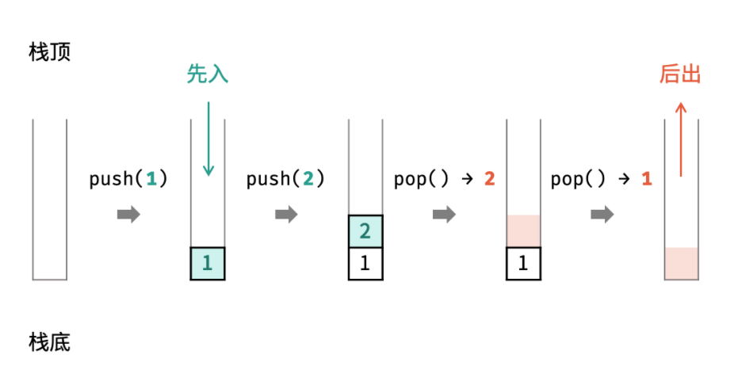

数据结构是为实现对计算机数据有效使用的各种数据组织形式，旨在降低各种算法计算的时间与空间复杂度

常见的数据结构可分为 *线性数据结构* 与 *非线性数据结构* ，具体包括： **数组** 、 **链表** 、 **栈** 、 **队列** 、 **树** 、 **图** 、 **散列表** 、 **堆** 


> 不要对数据结构的使用浅尝辄止，而要深挖起内部原理


## 数组
数组是将相同类型的元素存储于 **连续内存空间** 的数据结构，其长度不可变。构建数组时需要在初始化时给定长度，例如：

```cpp
int array[5];

int array[] = {2, 3, 1, 0, 2};
```

详情可见 [C++：数组](https://jiankychen.github.io/2022/03/05/19-shu-zu/)


**可变数组** （**标准库类型 `vector`** ）是经常使用的数据结构，其基于数组和扩容机制实现，相比普通数组更加灵活。常用操作有：**访问元素**（下标运算符、范围 `for`、迭代器）、**添加元素**（成员函数 `push_back`）、**删除元素**（成员函数 `erase` 和 `remove`），例如：

```cpp
vector<int> array = {2，3，1，0，2};

array.push_back(2);         // 添加元素 2 到末尾

vector<int>::iterator it;   // 迭代器
it = array.begin() + 4;     // it 指向第 5 个元素
array.erase(it);            // 删除 it 指向的元素
```

详情可见于
[C++：标准库类型 vector](https://jiankychen.github.io/2022/03/04/17-biao-zhun-ku-lei-xing-vector/)
[vector 删除元素的方法](https://blog.csdn.net/JIAN_ZANG1125/article/details/120642243?spm=1001.2101.3001.6650.1&utm_medium=distribute.pc_relevant.none-task-blog-2%7Edefault%7ECTRLIST%7ERate-1.pc_relevant_aa&depth_1-utm_source=distribute.pc_relevant.none-task-blog-2%7Edefault%7ECTRLIST%7ERate-1.pc_relevant_aa&utm_relevant_index=2)


## 链表
链表以节点为单位，每个元素都是一个独立对象，在内存空间的存储是 **非连续** 的

每一个节点由两部分组成，一个是数据域，另一个是指针域

链表的入口节点称为头节点，即，`head`

### 链表的类型

#### 单链表

单链表中，每个节点的指针域存放的是指向下一个节点的指针，最后一个节点的指针域指向 `null`


单链表的节点对象具有两个成员变量：**值** `val` 、 **后继节点指针** `next`

单链表中的节点只能指向节点的下一个节点

#### 双链表

双链表：每一个节点有两个指针域，一个指向下一个节点，一个指向上一个节点


双链表既可以向前查询，又可以向后查询

#### 循环链表
链表首尾相连


循环链表可以用来解决约瑟夫环问题


### 链表的存储方式
链表在内存空间中的分布并不是连续的，而是散乱分布在内存中的某地址上，分配机制取决于操作系统的内存管理

链表通过指针域的指针来链接在内存中的各个节点

### 链表的定义

以单链表为例，定义链表的节点：

```cpp
// 单链表
struct ListNode {
    int val;        // 节点值
    ListNode *next; // 后继节点指针
    ListNode(int x) : val(x), next(NULL) {} // 节点的构造函数
};


// // Definition for singly-linked list.
// struct ListNode {
//     int val;
//     ListNode *next;
//     ListNode() : val(0), next(nullptr) {}
//     ListNode(int x) : val(x), next(nullptr) {}
//     ListNode(int x, ListNode *next) : val(x), next(next) {}
// };
```

C++ 默认会生成一个构造函数，但是这个构造函数不会初始化任何成员变量


如果不自行定义构造函数，而仅仅使用默认构造函数，那么在初始化的时候就不能直接给变量赋值

```cpp
// 自行定义构造函数时节点的初始化操作
ListNode* head = new ListNode(5);

// 使用默认构造函数时节点的初始化操作
ListNode* head = new ListNode();
head->val = 5;
```

建立链表需要实例化每个节点，并构建各节点的引用指向

注：需要用箭头运算符（`->`），其含义为 解引用 + 成员访问


### 链表的操作

#### 删除节点
以删除 D 节点为例：只要将 C 节点的 `next` 指针 指向 E 节点即可


注意，D 节点依然留在内存中，只不过是没有在这个链表里而已。可以再手动释放这个 D 节点的这块内存

#### 插入节点
以插入 F 节点为例：将 C 节点的 `next` 指针指向 F 节点，并将 F 节点的 `next` 指针指向 D 节点


可以看出链表的增添和删除都是 $O(1)$ 操作，也不会影响到其他节点

但是要注意，若要删除第五个节点，需要从头节点查找到第四个节点通过 `next` 指针进行删除操作，查找的时间复杂度是 $O(n)$


### 性能分析

链表与数组的特性对比：

|  | 插入/删除操作的时间复杂度 | 查询操作的时间复杂度 | 适用场景
| :-: | :-: | :-: | :-: |
| 数组 | $O(1)$ | $O(1)$ | 数据量固定，频繁查询，较少增删 |
| 链表 | $O(1)$ | $O(n)$ | 数据量不固定，频繁增删，较少查询 |


数组在定义的时候，长度就是固定的，如果想改动数组的长度，就需要重新定义一个新的数组

链表的长度可以是不固定的，并且可以动态增删， 适合数据量不固定，频繁增删，较少查询的场景

[代码随想录：链表理论基础](https://www.programmercarl.com/%E9%93%BE%E8%A1%A8%E7%90%86%E8%AE%BA%E5%9F%BA%E7%A1%80.html#%E5%8D%95%E9%93%BE%E8%A1%A8)


## STL

STL 是 Standard Template Library 的简称，即，标准模板库

STL 可分为容器（containers）、迭代器（iterators）、空间配置器（allocator）、配接器（adapters）、算法（algorithms）、仿函数（functors）六个部分

在 C++ 标准中，STL 被组织为下面的13个头文件: `<algorithm>` 、`<deque>` 、`<functional>` 、`<iterator>` 、`<vector>` 、`<list>` 、`<map>` 、`<memory>` 、`<numeric>` 、`<queue>` 、`<set>` 、`<stack>` 和 `<utility>`

STL 的版本很多，其中，三个最为普遍的 STL 版本：

 - HP STL 是 C++ STL 的第一个实现版本，而且开放源代码。其他版本的 C++ STL 一般是以 HP STL 为蓝本实现出来的。不过，现在已经很少直接使用此版本的 STL 了

 - PJ STL（全称为 P.J. Plauger STL）由 P.J.Plauger 参照HP STL实现出来的，是 HP STL 的一个继承版本。PJ STL 被 Visual C++ 编译器所采用，但不是开源的

 - SGI STL 也是 HP STL 的一个继承版本，和 HP STL 一样，SGI STL 也是开源的，其源代码的可读性可非常好。被 Linux 下的 C++ 编译器 GCC 所采用


接下来介绍的 栈 和 队列 也是 SGI STL 里面的数据结构


## 栈

栈是一种具有 **先入后出** 特点的抽象数据结构，使用前需要引入 `stack` 头文件

栈不提供迭代器，也不允许遍历

栈依赖于底层容器完成所有工作，对外提供统一的接口。其中，底层容器是可插拔的，即，我们可以控制使用何种容器来实现栈的功能

因此，在 STL 中，栈往往不被归类为 容器 ，而被归类为 容器适配器（container adapter）

栈的底层实现可以是 `vector` ，`deque` ，`list` ，主要使用 数组 和 链表 的底层实现。**对于 SGI STL ，如果不指定，则默认使用 `deque` 作为底层容器**
> `deque` 是一个双向队列，，只要封住一端、开通另一端，即可实现栈的逻辑


我们可以指定 vector 为栈的底层实现，其初始化语句为：

    std::stack<int, std::vector<int>> stk; // 使用 vector 为底层容器的栈

栈常用的成员函数：

 - `push()` ：在最顶层加入数据

 - `pop()` ：返回并移除最顶层的数据

 - `top()` ：返回最顶层数据的值，但不移除它

 - `empty()` ：判断栈是否为空

 - `size()` ：返回栈的大小


如下图所示，通过常用操作 **入栈** `push()` ，**出栈** `pop()` ，展示了栈的先入后出特性
```cpp
stack<int> stk;
stk.push(1); // 元素 1 入栈
stk.push(2); // 元素 2 入栈
stk.pop();   // 元素 2 出栈
stk.pop();   // 元素 1 出栈
```



## 队列

队列（queue）是一种具有 **先入先出** 特点的抽象数据结构，使用前需先引入 `queue` 头文件

队列不提供迭代器，不允许有遍历行为

STL 队列 也不被归类为 容器 ，而被归类为 容器适配器（container adapter）

队列的底层实现可以是 `deque` 和 `list` 。**对于 SGI STL ，如果不指定，则默认使用 `deque` 作为底层容器**

可以指定 `list` 为栈的底层实现，其初始化语句为：

    std::queue<int, std::list<int>> que; // 使用 list 为底层容器


队列常用的成员函数：

 - `push()` ：在队尾插入元素

 - `pop()` ：弹出队首元素

 - `front()` ：返回队首元素

 - `back()` ：返回队尾元素

 - `empty()` ：判断队列是否为空

 - `size()` ：返回队列中元素的数量


如下图所示，通过常用操作 **入队** `push()` ，**出队** `pop()` ，展示了队列的先入先出特性
```cpp
queue<int> que;
que.push(1); // 元素 1 入队
que.push(2); // 元素 2 入队
que.pop();   // 出队 -> 元素 1
que.pop();   // 出队 -> 元素 2
```


此外，`queue` 还提供了一些运算符。较为常用的是： 使用赋值运算符 `=` 为 `queue` 赋值

例如
```cpp
queue<int> q1, q2;
q1.push(1);
q2 = q1;
cout << q2.front() << endl;
```

### 双端队列

### 循环队列

可参考 [OI Wiki：队列](https://oi-wiki.org/ds/queue/)

## 树
树是一种非线性数据结构，根据子节点数量可分为 **二叉树** 和 **多叉树** ，最顶层的节点称为 **根节点** `root`

以二叉树为例，每个节点包含三个成员变量：**值** `val` 、**左子节点** `left` 、**右子节点** `right`

```cpp
struct TreeNode {
    int val;         // 节点值
    TreeNode *left;  // 左子节点
    TreeNode *right; // 右子节点
    TreeNode(int x) : val(x), left(NULL), right(NULL) {}
};
```

> 注：需要用箭头运算符（`->`），其含义为 解引用 + 成员访问

如下图所示，建立二叉树需要实例化每个节点，并构建各节点的子节点指针
```cpp
// 初始化节点
TreeNode *n1 = new TreeNode(3); // 根节点 root
TreeNode *n2 = new TreeNode(4);
TreeNode *n3 = new TreeNode(5);
TreeNode *n4 = new TreeNode(1);
TreeNode *n5 = new TreeNode(2);

// 构建子节点指针
n1->left = n2;
n1->right = n3;
n2->left = n4;
n2->right = n5;
```


## 堆
堆是一种基于 **完全二叉树** 的数据结构，可使用数组实现

以堆为原理的排序算法称为 **堆排序** ，基于堆实现的数据结构为 **优先级队列**

**优先级队列** ：结点之间的关系是由结点的优先级决定的，而不是由入队的先后次序决定。优先级高的先出队，优先级低的后出队

堆分为 **最小化堆** 和 **最大化堆**
 - 最大化堆 ：任意节点的值小于等于其父节点的值（根节点最大）
 - 最小化堆 ：任意节点的值大于等于其父节点的值（根节点最小）

通过使用 **优先级队列** 的 **压入** `push()` 和 **弹出** `pop()` 操作，即可完成 **堆排序**
```cpp

// 初始化最小化堆
priority_queue<int, vector<int>, greater<int>> heap;

// 元素入堆
heap.push(1);
heap.push(4);
heap.push(2);
heap.push(6);
heap.push(8);

// 元素出堆（从小到大）
heap.pop(); // -> 1
heap.pop(); // -> 2
heap.pop(); // -> 4
heap.pop(); // -> 6
heap.pop(); // -> 8
```


## 哈希表

哈希表（Hash table ，也被称为散列表）是根据关键码的值而直接进行访问的数据结构

哈希表可以近似理解成数组，哈希表中的关键码就是数组的索引下标，通过下标可以直接访问数组的元素

**一般哈希表都是用来快速判断一个元素是否出现集合当中**

### 哈希函数

哈希函数（hash function）以关键码的值为参数，将关键码映射为哈希表的索引，即，函数的值即为存储元素的下标

### 哈希碰撞

哈希碰撞是指：不同的关键码映射到同一个地址

两种解决方案：

 - 线性探测法：当散列发生冲突时，探测下一个单元，直到发现一个空单元，于是元素将存储在该空单元
 - 拉链法：将碰撞的节点组成一个链表

### 常见的哈希结构

三种哈希结构
 - 数组
 - set （集合）
 - map （映射）


## 图
图是一种非线性结构，由 **顶点** `vertex` 和 **边** `edge` 组成

根据边是否区分方向，图可分为 **有向图** 和 **无向图** ， 这里以无向图为例进行介绍

如下图所示，此无向图的 顶点 和 边 集合分别为
 - 顶点集合：`vertices = {1, 2, 3, 4, 5}`

 - 边集合：`edges = {(1, 2), (1, 3), (1, 4), (1, 5), (2, 4), (3, 5), (4, 5)}`


表示图的方法通常有两种：

1. 邻接矩阵 ：使用数组 `vertices` 存储顶点，邻接矩阵 `edges` 存储边。其中，`edges[i][j]` 表示节点 `vertices[i]` 和节点 `vertices[j]` 之间是否有边

    ```cpp
    int vertices[5] = {1, 2, 3, 4, 5};
    int edges[5][5] = {{0, 1, 1, 1, 1},
                    {1, 0, 0, 1, 0},
                    {1, 0, 0, 0, 1},
                    {1, 1, 0, 0, 1},
                    {1, 0, 1, 1, 0}};
    ```


2. 邻接表 ：使用数组 `vertices` 存储顶点，邻接表 `edges` 存储边。其中，`edges` 是一个二维容器，第一维的 i 代表顶点 `vertices[i]` ，第二维 `edges[i]` 存储顶点 `vertices[i]` 对应的边集合，例如，`edges[0] = [1,2,3,4]` 表示 `vertices[0]` 的边集合为 `[1,2,3,4]`

    ```cpp
    int vertices[5] = {1, 2, 3, 4, 5};
    vector<vector<int>> edges;

    vector<int> edge_1 = {1, 2, 3, 4};
    vector<int> edge_2 = {0, 3};
    vector<int> edge_3 = {0, 4};
    vector<int> edge_4 = {0, 1, 4};
    vector<int> edge_5 = {0, 2, 3};
    edges.push_back(edge_1);
    edges.push_back(edge_2);
    edges.push_back(edge_3);
    edges.push_back(edge_4);
    edges.push_back(edge_5);
    ```

> 邻接矩阵的大小只与节点数量有关，即 $N^2$ ，其中 $N$ 为节点数量
> 
> 当边数量明显少于节点数量时，使用邻接矩阵存储图会造成较大的内存浪费（此时邻接矩阵为稀疏矩阵）
> 
> 因此，**邻接表** 适合存储 **顶点较多、边较少** 的 稀疏图 ，**邻接矩阵** 适合存储 **顶点较少、边较多** 的 稠密图


以上内容来自于 [https://leetcode-cn.com/leetbook/read/illustration-of-algorithm/50e446/](https://leetcode-cn.com/leetbook/read/illustration-of-algorithm/50e446/)