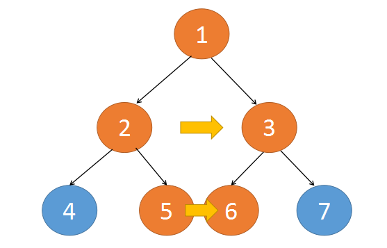
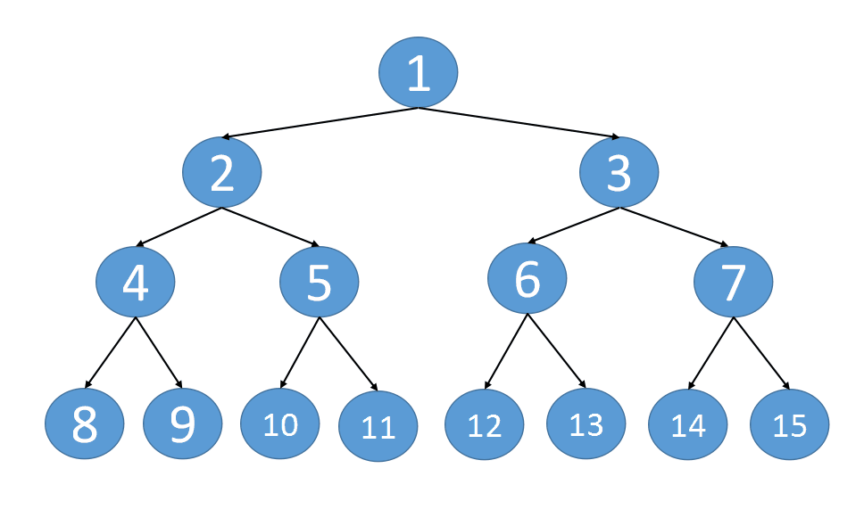

[LeetCode 116](https://leetcode-cn.com/problems/populating-next-right-pointers-in-each-node/)

You are given a **perfect binary tree** where all leaves are on the same level, and every parent has two children. The binary tree has the following definition:

    struct Node {
    int val;
    Node *left;
    Node *right;
    Node *next;
    }

Populate each next pointer to point to its next right node. If there is no next right node, the next pointer should be set to `NULL`.

Initially, all next pointers are set to `NULL`.


**Example 1:**


    Input: root = [1,2,3,4,5,6,7]
    Output: [1,#,2,3,#,4,5,6,7,#]
    Explanation: Given the above perfect binary tree (Figure A), your function should populate each next pointer to point to its next right node, just like in Figure B. The serialized output is in level order as connected by the next pointers, with '#' signifying the end of each level.


**Example 2:**

    Input: root = []
    Output: []

**Constraints:**
 - The number of nodes in the tree is in the range `[0, 212 - 1]`.
 - $- 1000 \le$ `Node.val` $\le 1000$

**Follow-up:**
 - You may only use `constant extra space`.
 - The **recursive approach** is fine. You may assume implicit stack space does not count as extra space for this problem.

## Method 1: 递归
以从上往下的方向看，`1`，`2`，`3`，`5`，`6`这几个节点在位置上都是紧挨着的，同时这几个节点都是左右串联的。



我们以当前 `root` 节点为起始，左右节点不断的深入下面，`left` 节点不断往右走，`right` 节点不断往左走，当这两个节点走到底之后，整个纵深这段就完成了串联。如 `1`，`2 3`，`5 6`，`11 12`，两两之间实现了连接

递归函数实现如下：
 - 终止条件：当前节点为空时
 - 函数体内：以当前节点为起始，完成从上往下的纵深串联，再递归的调用当前节点 `left` 和 `right`



```cpp
void dfs(Node* root){
    if(root==nullptr) return;
    Node *left=root->left;
    Node *right=root->right;
    //将整个一段纵深里边的左右邻居节点串联起来 如1# 2 3# 5 6# 11 12#
    while(left!=nullptr){
        left->next=right;   // 将当前层次的左右节点串联
        left=left->right;   // left节点更新为它的右子节点
        right=right->left;  // right节点更新为它的左子节点
    }
    //结束当前这一深度，转而去进行左子节点和右子节点的纵深串联
    dfs(root->left);
    dfs(root->right);
}
Node* connect(Node* root) {
    dfs(root);
    return root;
}
```

时间复杂度：`O(n)`

空间复杂度：`O(h)`，`h` 是树的高度

\^_^ 太牛了这个解法。。