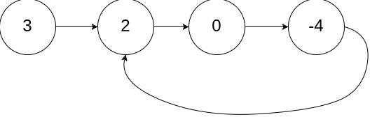
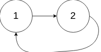
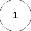

[LeetCode 142. Linked List Cycle II](https://leetcode-cn.com/problems/linked-list-cycle-ii/)

Given the `head` of a linked list, return *the node where the cycle begins*. If there is no cycle, return `null`.

There is a cycle in a linked list if there is some node in the list that can be reached again by continuously following the `next` pointer. Internally, `pos` is used to denote the index of the node that tail's `next` pointer is connected to (**0-indexed**). It is `-1` if there is no cycle. Note that `pos` is **not passed as a parameter**.

**Do not modify** the linked list.

 
**Example 1:**



    Input: head = [3,2,0,-4], pos = 1
    Output: tail connects to node index 1
    Explanation: There is a cycle in the linked list, where tail connects to the second node.


**Example 2:**



    Input: head = [1,2], pos = 0
    Output: tail connects to node index 0
    Explanation: There is a cycle in the linked list, where tail connects to the first node.

**Example 3:**



    Input: head = [1], pos = -1
    Output: no cycle
    Explanation: There is no cycle in the linked list.
 

**Constraints:**

 - The number of the nodes in the list is in the range `[0, 104]`.
 - -10^5^ <= `Node.val` <= 10^5^
 - `pos` is `-1` or a valid index in the linked-list.
 

**Follow up:** Can you solve it using `O(1)` (i.e. constant) memory?


## 思路

### 判断是否有环

定义 `fast` 和 `slow` 指针，从头结点出发，`fast` 指针每次移动两个节点，`slow` 指针每次移动一个节点，如果 `fast` 和 `slow` 指针在途中相遇 ，说明这个链表有环

 - 若 `fast` 与 `slow` 相遇，则一定有环：因为 `fast` 超前 `slow` ，相遇时二者一定都在环内

 - 若链表有环，则 `fast` 与 `slow` 一定相遇：当 `slow` 步入到环内时，由于 `fast` 指针每次移动相对于 `slow` 指针而言都是移动一位，故而一定会相遇


### 确定环的入口


> `slow` 指针在第一次遍历链表环时，就一定会与 `fast` 指针相遇。具体证明过程见 [环形链表：补充](https://www.programmercarl.com/0142.%E7%8E%AF%E5%BD%A2%E9%93%BE%E8%A1%A8II.html#%E6%80%9D%E8%B7%AF)

假设从 头结点 到 环形入口节点 的节点数为 `x` ，从 环形入口节点 到 `fast` 指针与 `slow` 指针相遇节点 的节点数为 y ，从 相遇节点 再到 环形入口节点 的节点数为 `z`


相遇时 `slow` 指针走过的节点数为 `x + y` ，`fast` 指针走过的节点数为 `x + y + n (y + z)`，其中 `n` 为 `fast` 指针在环内走过的圈数

由于 `fast` 指针一步两节点，`slow` 指针一步一节点，则 `fast` 走过节点数为 `slow` 指针走过节点数的 `2` 倍，即：`2 (x + y) = x + y + n (y + z)`

故而，环形的入口节点 `x` 应满足 **`x = (n - 1) (y + z) + z`** ，注意 `n` 一定大于等于 `1`

这意味着，**指针 `index1` 从头结点出发，与此同时，指针 `index2` 从相遇节点出发，两指针每次均只走一个节点，这两个指针相遇的节点就是环形入口的节点**


参考：[代码随想录：环形链表 II](https://www.programmercarl.com/0142.%E7%8E%AF%E5%BD%A2%E9%93%BE%E8%A1%A8II.html#%E6%80%9D%E8%B7%AF)


## 快慢指针

```cpp
ListNode *detectCycle(ListNode *head) {
    ListNode *fast = head, *slow = head;
    while (fast != nullptr && fast->next != nullptr) { // fast 到达链表最后一个节点时，循环结束
        // fast 指针每步走两节点，slow 指针每步走一节点
        fast = fast->next->next;
        slow = slow->next;
        if (fast == slow) { // fast 与 slow 相遇
            // index1 指针从 head 出发，index2 指针从 fast 与 slow 相遇点出发，找出 index1 与 index2 的相遇位置
            ListNode *index1 = head, *index2 = fast;
            while (index1 != index2) {
                index1 = index1->next;
                index2 = index2->next;
            }
            return index1;  // index1 与 index2 的相遇点即为环形入口
        }
    }
    // 不存在环形
    return NULL;
}
```

时间复杂度：$O(n)$ ，指针 `slow` 与指针 `index1` 走过的长度均不超过链表节点数目 $n$

空间复杂度：$O(1)$ ，仅使用指针