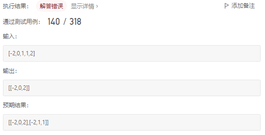

[LeetCode 15. 3Sum](https://leetcode-cn.com/problems/3sum/)

Given an integer array nums, return all the triplets `[nums[i], nums[j], nums[k]]` such that **`i != j`, `i != k`, and `j != k`**, and `nums[i] + nums[j] + nums[k] == 0`.

Notice that the solution set must **not** contain **duplicate** triplets.

 

**Example 1:**

    Input: nums = [-1,0,1,2,-1,-4]
    Output: [[-1,-1,2],[-1,0,1]]

**Example 2:**

    Input: nums = []
    Output: []

**Example 3:**

    Input: nums = [0]
    Output: []
 

**Constraints:**

 - $0 \le$ `nums.length` $\le 3000$
 - $- 10^5 \le$ `nums[i]` $\le 10^5$


## Method 1: 排序 + 哈希

基本思路：两层 `for` 循环遍历 `nums[i]` 和 `nums[j]` ，然后使用哈希法来确定 `- nums[i] - nums[j]` 是否在数组中出现

然而，由于题目要求 “ `i != j`, `i != k`, `j != k` ” 并且 “ 任意两个三元组不能相同 ” ，需要在查找时进行剪枝以避免重复，或是查找结束后剔除 `(i, j, k)` 存在重复的情况

可以首先对数组进行排序，将重复的元素值集中，便于去重

```cpp
vector<vector<int>> threeSum(vector<int>& nums) {
    vector<vector<int>> ans;            // 存放结果
    sort(nums.begin(), nums.end());     // 排序
    // 寻找满足条件的三元组
    for (int i = 0; i < nums.size(); i++) { // 判断 i 右侧元素是否能与 nums[i] 组成三元组
        if (nums[i] > 0) // 最小值大于 0， 不存在可行的三元组
            break;
        if (i > 0 && nums[i] == nums[i - 1]) // nums[i] 与 nums[i - 1] 重复，应跳过（似乎这里也存在某些坑）
            continue;
        unordered_set<int> set;
        for (int j = i + 1; j < nums.size(); j++) { // 判断 i 与 j 之间是否有元素能够与 nums[i] , nums[j] 形成三元组
            if (j > i + 2 && nums[j] == nums[j - 1] && nums[j - 1] == nums[j - 2]) // nums[j] 与 nums[j - 1] , nums[j - 2] 重复，跳过
                continue;
            int temp = 0 - nums[i] - nums[j];
            if (set.find(temp) != set.end()) {
                ans.push_back({nums[i], temp, nums[j]});
                set.erase(temp);
            }
            else
                set.insert(nums[j]);
        }
    }
    return ans;
}
```

时间复杂度：$O(n^2)$

空间复杂度：$O(\log{n})$，这里仅考虑了排序的空间复杂度 $O(\log{n})$ ，忽略了储存结果的空间

参考：[代码随想录：三数之和](https://www.programmercarl.com/0015.%E4%B8%89%E6%95%B0%E4%B9%8B%E5%92%8C.html#%E5%93%88%E5%B8%8C%E8%A7%A3%E6%B3%95)

以上代码中，有几个地方没弄明白：

第一个地方：

    if (j > i + 2 && nums[j] == nums[j - 2])
        continue;
    // nums[j] == nums[j - 2] 等价于 nums[j] == nums[j - 1] && nums[j - 1] == nums[j - 2]

第二个地方：

    if (set.find(temp) != set.end()) {
        ans.push_back({nums[i], temp, nums[j]});
        set.erase(temp);
    }
    else
        set.insert(nums[j]);

将第一个地方改为 `if(j > i + 2 && nums[j] == nums[j - 1]) continue;`  时，出现以下结果：



这是因为，当 `j = 3` 时 `nums[j] == nums[j - 1]` ，执行 `continue` ，跳过了对 `(x, 1, 1)` 的查找

第二个地方，做以下考虑：
 - 当 `if` 条件满足时，已经确定 `nums[i]` , `temp` 可以和 `nums[j]` 组成三元组，因此  `nums[i]` , `temp` 不可能再跟 `j` 右侧元素组成满足条件的三元组（最终结果不能包含重复的三元组），故而将 `temp` 从 `set` 中剔除
 - 当 `if` 条件不满足时，未找到能与 `nums[i]` , `nums[j]` 组成三元组的 `temp` ，为了能在 `j` 右侧继续寻找满足条件的 `temp` ，需要将 `nums[j]` 插入到 `set` 当中，以使得当前的 `nums[j]` 能被容纳在 `j` 右移之后的查找范围内（即，将当前 `nums[j]` 作为后续的 `j` 所能够查找到的 `temp` 的一个可能值） 

将第二个地方的 `set.erase(temp);` 删除以后，出现以下情况：


这是因为，当 `j = 3` 时找到了第一个三元组 `[-2,0,2]` 但未将 `0` 从 `set` 中剔除，而当 `j` 右移一位后，条件 `nums[j] == nums[j - 2]` 不满足，`j = 4` 时也重新在 `set` 中查找到了 `0` （刚好与第一个地方联系上了）

这里边的细节也太细了吧。。弃了弃了。。

## Method 2: 排序 + 双指针