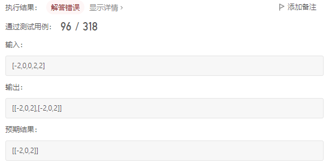

[LeetCode 15. 3Sum](https://leetcode-cn.com/problems/3sum/)

Given an integer array nums, return all the triplets `[nums[i], nums[j], nums[k]]` such that **`i != j`, `i != k`, and `j != k`**, and `nums[i] + nums[j] + nums[k] == 0`.

Notice that the solution set must **not** contain **duplicate** triplets.

 

**Example 1:**

    Input: nums = [-1,0,1,2,-1,-4]
    Output: [[-1,-1,2],[-1,0,1]]

**Example 2:**

    Input: nums = []
    Output: []

**Example 3:**

    Input: nums = [0]
    Output: []
 

**Constraints:**

 - $0 \le$ `nums.length` $\le 3000$
 - $- 10^5 \le$ `nums[i]` $\le 10^5$


## 思路

暴力法查找的时间复杂度为 $O(n^3)$ ，考虑用低复杂度算法

注意：题目要求 “ `i != j`, `i != k`, `j != k` ” 并且 “ 任意两个三元组不能相同 ” ，故而需要在查找时进行剪枝以避免重复，或是查找结束后剔除重复三元组

本题的难点也在于如何去除重复解

首先，可以对数组进行排序（最终只需要输出元素值即可，无需输出元素索引，故而可以打乱原数组顺序），将重复的元素值集中，便于去重

于是，有以下两种方法可以用于查找：

1. 哈希法：采用两层 `for` 循环分别遍历 `i` 和 `j` （按照从左往右的顺序），并采用哈希法检查 `[i, j]` 区间范围内是否有元素能与 `nums[i]` ，`nums[j]` 组成三元组

2. 双指针法：采用一个 `for` 循环遍历 `i` ，并采用双指针法在 `[i + 1, nums.size() - 1]` 区间内查找所有能与 `nums[i]` 组成三元组的元素 `nums[left]` 和 `nums[right]` ，其中，指针 `left` 从 `i + 1` 位置开始向右遍历，指针 `right` 从 `nums.size() - 1` 位置开始向左遍历

两种方法都能实现 $O(n^2)$ 的时间复杂度，但哈希法不便进行去重操作，因此，建议使用排序与双指针法解题


## Method 1: 排序 + 哈希法

两层 `for` 循环遍历 `nums[i]` 和 `nums[j]` ，并使用哈希法来确定 `[i, j]` 区间内是否存在值为 `- nums[i] - nums[j]` 的元素

注意去重

```cpp
vector<vector<int>> threeSum(vector<int>& nums) {
    vector<vector<int>> ans;            // 存放结果
    sort(nums.begin(), nums.end());     // 排序
    // 寻找满足条件的三元组
    for (int i = 0; i < nums.size(); i++) { // 判断 i 右侧元素是否能与 nums[i] 组成三元组
        if (nums[i] > 0) // 最小值大于 0， 不存在可行的三元组
            break;
        if (i > 0 && nums[i] == nums[i - 1]) // nums[i] 与 nums[i - 1] 重复，应跳过（似乎这里也存在某些坑）
            continue;
        unordered_set<int> set;
        for (int j = i + 1; j < nums.size(); j++) { // 判断 i 与 j 之间是否有元素能够与 nums[i] , nums[j] 形成三元组
            if (j > i + 2 && nums[j] == nums[j - 1] && nums[j - 1] == nums[j - 2]) // nums[j] 与 nums[j - 1] , nums[j - 2] 重复，跳过
                continue;
            int temp = 0 - nums[i] - nums[j];
            if (set.find(temp) != set.end()) {
                ans.push_back({nums[i], temp, nums[j]});
                set.erase(temp);
            }
            else
                set.insert(nums[j]);
        }
    }
    return ans;
}
```

有几个地方没弄明白

第一个地方：

    if (j > i + 2 && nums[j] == nums[j - 2])
        continue;
    // nums[j] == nums[j - 2] 等价于 nums[j] == nums[j - 1] && nums[j - 1] == nums[j - 2]

第二个地方：

    if (set.find(temp) != set.end()) {
        ans.push_back({nums[i], temp, nums[j]});
        set.erase(temp);
    }
    else
        set.insert(nums[j]);

将第一个地方改为 `if(j > i + 2 && nums[j] == nums[j - 1]) continue;`  时，出现以下结果：


这是因为，当 `j = 3` 时 `nums[j] == nums[j - 1]` ，执行 `continue` ，跳过了对 `(x, 1, 1)` 的查找

第二个地方，做以下考虑：
 - 当 `if` 条件满足时，已经确定 `nums[i]` , `temp` 可以和 `nums[j]` 组成三元组，因此  `nums[i]` , `temp` 不可能再跟 `j` 右侧元素组成满足条件的三元组（最终结果不能包含重复的三元组），故而将 `temp` 从 `set` 中剔除
 - 当 `if` 条件不满足时，未找到能与 `nums[i]` , `nums[j]` 组成三元组的 `temp` ，为了能在 `j` 右侧继续寻找满足条件的 `temp` ，需要将 `nums[j]` 插入到 `set` 当中，以使得当前的 `nums[j]` 能被容纳在 `j` 右移之后的查找范围内（即，将当前 `nums[j]` 作为后续的 `j` 所能够查找到的 `temp` 的一个可能值） 

将第二个地方的 `set.erase(temp);` 删除以后，出现以下情况：



这是因为，当 `j = 3` 时找到了第一个三元组 `[-2,0,2]` 但未将 `0` 从 `set` 中剔除，而当 `j` 右移一位后，条件 `nums[j] == nums[j - 2]` 不满足，`j = 4` 时也重新在 `set` 中查找到了 `0` （刚好与第一个地方联系上了）

这里边的细节也太细了吧。。弃了弃了。。

时间复杂度：$O(n^2)$

空间复杂度：$O(\log{n})$，这里仅考虑了排序的空间复杂度 $O(\log{n})$ ，忽略了储存结果的空间

## Method 2: 排序 + 双指针

解题步骤：

1. 对数组进行排序（从小到大排序）

2. 遍历数组下标 `i`

     - 若 `nums[i] > 0` ，则 `i` 右侧不存在能与 `nums[i]` 组成三元组的元素，直接返回结果

     - 若 `i > 0 && nums[i] == nums[i - 1]` ，当前 `i` 能找到的三元组与 `i - 1` 时找到的完全相同，为避免产生重复解，跳过当前 `i`

     - 定义指针 `left` 指向 `i + 1` 位置，指针 `right` 指向 `nums.size() - 1` 位置，当 `left < right` 时，执行循环：
       - 计算 `sum = nums[i] + nums[left] + nums[right]`
       - 若 `sum > 0` ，则 `nums[right]` 偏大，将 `right` 左移
       - 若 `sum < 0` ，则 `nums[left]` 偏小，将 `left` 右移
       - 若 `sum == 0` ，记录结果，并将 `left` 右移、将 `right` 左移，以跳过重复的 `nums[left]` 和 `nums[right]`


注意：同一个 `i` 可以与不同的元素组成多个不同的三元组，因此，在找到一对可行的 `nums[left]` 和 `nums[right]` 后仍需继续查找，直到 `left < right` 不满足

代码实现：

```cpp
vector<vector<int>> threeSum(vector<int>& nums) {
    sort(nums.begin(), nums.end()); // 排序
    vector<vector<int>> res;        // 存储结果
    for (int i = 0; i < nums.size(); i++) {
        if (nums[i] > 0) break;
        if (i > 0 && nums[i] == nums[i - 1]) continue;
        int left = i + 1, right = nums.size() - 1;
        int sum = 0;
        while (left < right) {
            sum = nums[i] + nums[left] + nums[right];
            if (sum > 0) right--;
            if (sum < 0) left++;
            if (sum == 0) {
                res.push_back(vector<int>{nums[i], nums[left], nums[right]});
                // 将 left 右移（注意，++left 至少执行一次）
                while (left < right && nums[left] == nums[++left]);
                // 将 right 左移（注意，--right 至少执行一次）
                while (left < right && nums[right] == nums[--right]);
            }
        }
    }
    return res;
}
```

需要注意的第一个地方：

    if (i > 0 && nums[i] == nums[i - 1]) continue;

这里不能改成 `if (nums[i] == nums[i + 1]) continue;` ，否则，以数组 `nums = [-1, 0, 1, 2, -1, -4]` 为例（排序后，`nums = [-4, -1, -1, 0, 1, 2]` ），查找时将会遗漏 `[-1, -1, 2]` 这一个三元组。因为当 `i = 1` 时 `nums[1] == nums[2]` 条件成立，因此不会进行双指针查找；而当 `i = 2` 时，只会查找 `i` 右侧的元素，故而遗失了对 `[-1, -1, x]` 这几种情况的查找，`x` 为第二个 `-1` 右侧的任意值

上述的 Method 1 也是类似道理

需要注意的第二个地方：

    if (sum == 0) {
        res.push_back(vector<int>{nums[i], nums[left], nums[right]});
        while (left < right && nums[left] == nums[++left]);
        while (left < right && nums[right] == nums[--right]);
    }

这里的 `++left` 和 `--right` 都至少执行一次：执行一次是因为找到了一个三元组，需要同时移动双指针，以进行下一次的查找；执行多次则是为了跳过重复的 `nums[left]` 和 `nums[right]`

并且，注意这里的 `nums[left] == nums[++left]` 语句，将当前 `left` 对应元素值与 `left` 右移之后对应元素值进行比较，不能将其改成 `nums[++left] == nums[left]` ，也不能改成 `nums[left] == nums[left++]` 。语句 `nums[right] == nums[--right]` 同理

第二个地方可以改写成

    if (sum == 0) {
        res.push_back(vector<int>{nums[i], nums[left], nums[right]});
        // 先将 left 移到最靠右的一个 nums[left]
        while (left < right && nums[left] == nums[left + 1]) left++;
        // 先将 right 移到最靠左的一个 nums[right]
        while (left < right && nums[right] == nums[right - 1]) right--;
        // 再分别移动一次 left 和 right ，以进行下一次查找
        left++;
        right--;
    }

这个地方似乎还有其他坑。。暂未理清，等待后续。。


时间复杂度：$O(n^2)$
 - 遍历 `i` ： $O(n)$
 - 双指针查找： $O(n)$

空间复杂度：$O(\log{n})$
 - 不考虑存储结果的数组
 - 仅考虑排序所需栈空间

参考：
 - [代码随想录：三数之和](https://www.programmercarl.com/0015.%E4%B8%89%E6%95%B0%E4%B9%8B%E5%92%8C.html#%E5%93%88%E5%B8%8C%E8%A7%A3%E6%B3%95)
 - [Krahets：三数之和（排序+双指针，易懂图解）](https://leetcode-cn.com/problems/3sum/solution/3sumpai-xu-shuang-zhi-zhen-yi-dong-by-jyd/)