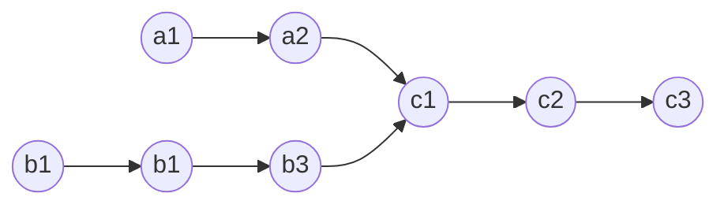
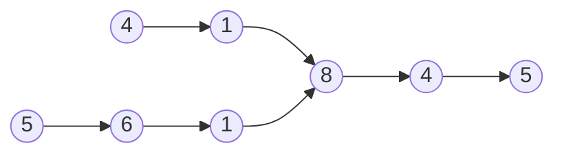
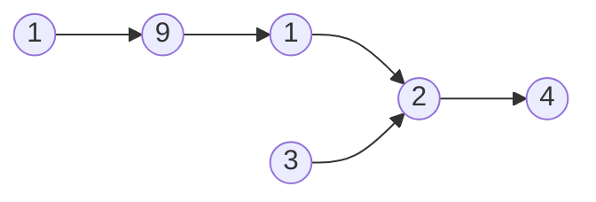
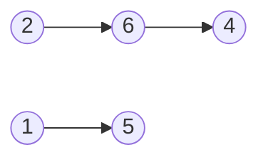
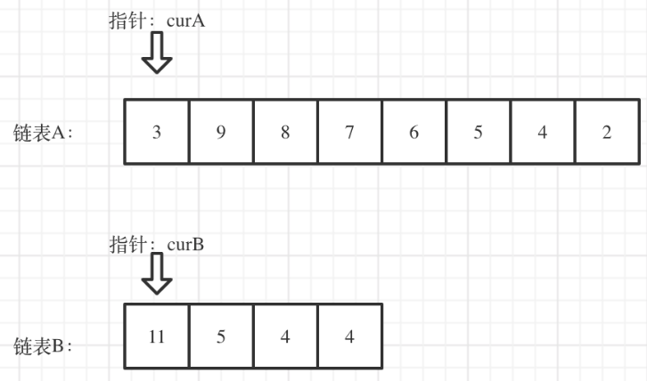
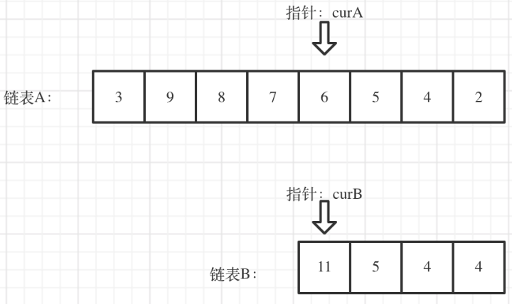

[LeetCode 160. Intersection of Two Linked Lists](https://leetcode-cn.com/problems/intersection-of-two-linked-lists/)

Given the heads of two singly linked-lists `headA` and `headB`, return *the node at which the two lists intersect*. If the two linked lists have no intersection at all, return `null`.

For example, the following two linked lists begin to intersect at node `c1`:



The test cases are generated such that there are no cycles anywhere in the entire linked structure.

**Note** that the linked lists must **retain their original structure** after the function returns.

**Custom Judge:**

The inputs to the **judge** are given as follows (your program is **not** given these inputs):

 - `intersectVal` - The value of the node where the intersection occurs. This is `0` if there is no intersected node.
 - `listA` - The first linked list.
 - `listB` - The second linked list.
 - `skipA` - The number of nodes to skip ahead in listA (starting from the head) to get to the intersected node.
 - `skipB` - The number of nodes to skip ahead in listB (starting from the head) to get to the intersected node.

The judge will then create the linked structure based on these inputs and pass the two heads, `headA` and `headB` to your program. If you correctly return the intersected node, then your solution will be **accepted**.


**Example 1:**



    Input: intersectVal = 8, listA = [4,1,8,4,5], listB = [5,6,1,8,4,5], skipA = 2, skipB = 3

    Output: Intersected at '8'

    Explanation: The intersected node's value is 8 (note that this must not be 0 if the two lists intersect).
    From the head of A, it reads as [4,1,8,4,5]. From the head of B, it reads as [5,6,1,8,4,5]. There are 2 nodes before the intersected node in A; There are 3 nodes before the intersected node in B.


**Example 2:**



    Input: intersectVal = 2, listA = [1,9,1,2,4], listB = [3,2,4], skipA = 3, skipB = 1

    Output: Intersected at '2'

    Explanation: The intersected node's value is 2 (note that this must not be 0 if the two lists intersect).
    From the head of A, it reads as [1,9,1,2,4]. From the head of B, it reads as [3,2,4]. There are 3 nodes before the intersected node in A; There are 1 node before the intersected node in B.


**Example 3:**



    Input: intersectVal = 0, listA = [2,6,4], listB = [1,5], skipA = 3, skipB = 2

    Output: No intersection

    Explanation: From the head of A, it reads as [2,6,4]. From the head of B, it reads as [1,5]. Since the two lists do not intersect, intersectVal must be 0, while skipA and skipB can be arbitrary values.
    Explanation: The two lists do not intersect, so return null.
 

**Constraints:**

 - The number of nodes of `listA` is in the `m`.
 - The number of nodes of `listB` is in the `n`.
 - $1 \le$ `m`, `n` $\le 3 \times 10^4$
 - $1 \le$ `Node.val` $\le 10^5$
 - $0 \le$ `skipA` $< m$
 - $0 \le$ `skipB` $< n$
 - `intersectVal` is `0` if `listA` and `listB` do not intersect.
 - `intersectVal == listA[skipA] == listB[skipB]` if `listA` and `listB` intersect.
 

**Follow up:** Could you write a solution that runs in $O(m + n)$ time and use only $O(1)$ memory?


## 思路

两链表的交点是指两链表对应 **节点的指针相等** （而不是数值相等），因此，需要找出两个链表相交节点的指针

**若两链表相交，则两链表的交点及以后节点均对应相等**

可将两链表 “尾端对齐” ，从较短链表的头节点开始检查，比较两链表对应节点是否相等

## Method: 双指针

算法流程：

1. 求出两个链表的长度 `m` 和 `n`


2. 定义指针 `curA` 指向长链表的头节点，指针 `curB` 指向短链表的头节点

    

3. 将指针 `curA` 移动到第 `m - n + 1` 个节点，使得两个指针后续可移动步数相同（类似于两链表尾端对齐）

    

4. 比较 `curA` 是否与 `curB` 相同
    - 若相同，则找到交点
    - 若不相同，则同时将 `curA` 和 `curB` 向后移动，直到 `curA` 和 `curB` 到达链表末尾

5. 若未找到交点，返回空指针

代码实现：

```cpp
int getSize(ListNode *head) { // 计算链表的长度
    int num = 0;
    ListNode *cur = head;
    while (cur != nullptr) {
        num++;
        cur = cur->next;
    }
    return num;
}

ListNode *getIntersectionNode(ListNode *headA, ListNode *headB) {
    int m = getSize(headA);
    int n = getSize(headB);
    ListNode *curA = headA, *curB = headB;
    if (m < n) {              // curA 指向长链，curB 指向短链
        swap(m, n);
        swap(curA, curB);
    }
    for (int i = 0; i < m - n; i++) // 令 curA 和 curB 的起点一致
        curA = curA->next;
    while (curA != nullptr) { // 遍历 curA 和 curB ，看两者是否相等
        if (curA == curB)
            return curA;
        curA = curA->next;
        curB = curB->next;
    }
    return NULL;    // curA 已经移动到尾后，此时仍未找到交点
}
```

时间复杂度：$O(m + n)$，其中 $m$ 和 $n$ 为两链表长度

空间复杂度：$O(1)$

参考：[代码随想录：相交链表](https://www.programmercarl.com/%E9%9D%A2%E8%AF%95%E9%A2%9802.07.%E9%93%BE%E8%A1%A8%E7%9B%B8%E4%BA%A4.html#%E6%80%9D%E8%B7%AF)