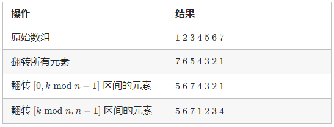

[LeetCode 189](https://leetcode-cn.com/problems/rotate-array/)

Given an array, rotate the array to the right by `k` steps, where `k` is non-negative.

 

Example 1:

    Input: nums = [1,2,3,4,5,6,7], k = 3
    Output: [5,6,7,1,2,3,4]
    Explanation:
    rotate 1 steps to the right: [7,1,2,3,4,5,6]
    rotate 2 steps to the right: [6,7,1,2,3,4,5]
    rotate 3 steps to the right: [5,6,7,1,2,3,4]


Example 2:

    Input: nums = [-1,-100,3,99], k = 2
    Output: [3,99,-1,-100]
    Explanation: 
    rotate 1 steps to the right: [99,-1,-100,3]
    rotate 2 steps to the right: [3,99,-1,-100]


## Method 1: 使用额外的数组
> 当我们将数组的元素向右移动`k`次后，尾部`k mod n`个元素会移动至数组头部，其余元素向后移动`k mod n`个位置。

使用额外的数组来将每个元素放至正确的位置。用`n`表示数组的长度，我们遍历原数组，将原数组下标为`i`的元素放至新数组下标为`(i + k) mod n`的位置，最后将新数组拷贝至原数组即可
```cpp
void rotate(vector<int>& nums, int k) {
    int n = nums.size();
    vector<int> temp(n);
    for (int i = 0; i <= n - 1; i++)
        temp[(i + k) % n] = nums[i];
    nums.assign(temp.begin(), temp.end());
}
```

## Method 2: 数组翻转
先将所有元素翻转，这样尾部的`k mod n`个元素就被移至数组头部，然后我们再翻转`[0, k mod n − 1]`区间的元素和`[k mod n, n − 1]`区间的元素即能得到最后的答案


```cpp
// 水平翻转nums中left到right之间的元素
void reverse(vector<int>& nums, int left, int right) {
    while (left < right)
    {
        swap(nums[left], nums[right]);
        left++;
        right--;
    };
}
```

```cpp
void rotate(vector<int>& nums, int k) {
    int n = nums.size() - 1;
    reverse(nums, 0, n);                      // 翻转第0至nums.size()-1个元素
    reverse(nums, 0, (k % nums.size()) - 1);  // 翻转第0至k%nums.size()-1个元素
    reverse(nums, (k % nums.size()), n);      // 翻转第k%nums.size()至nums.size()-1个元素
}
```