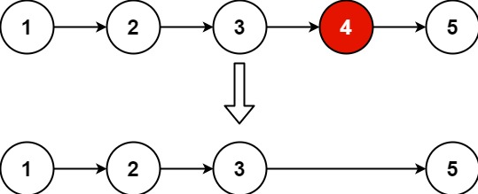

[LeetCode](https://leetcode-cn.com/problems/remove-nth-node-from-end-of-list/)

Given the `head` of a linked list, remove the `n`-th node **from the end** of the list and return its `head`.

 

**Example 1:**



    Input: head = [1,2,3,4,5], n = 2
    Output: [1,2,3,5]


**Example 2:**

    Input: head = [1], n = 1
    Output: []


**Example 3:**

    Input: head = [1,2], n = 1
    Output: [1]

**Constraints:**

 - The number of nodes in the list is `sz`.
 - $1 \le$ `sz` $\le 30$
 - $0 \le$ `Node.val` $\le 100$
 - $1 \le$ `n` $\le$ `sz`


## Method: 双指针

解题思路如下：

1. 添加一个**哑节点**（dummy node），即，虚拟头节点，它的 `next` 指针指向链表的头节点

2. 定义快慢指针 `fast` 和 `slow` ，初始值为哑结点，然后让 `fast` 指针移动 `n` 步，使得 `fast` 比 `slow` 超前 `n` 个节点

3. 同时移动 `fast` 和 `slow` 指针，当 `fast` 遍历到链表的最后一个节点时（`fast != nullptr && fast->next == nullptr`），`slow` 的下一个节点就是需要删除的节点

4. 修改指针，即，`slow->next = slow->next->next` ，完成删除操作

> 因为添加了哑结点，如果需要删除的是头节点，同样可以采用上述步骤进行

代码实现：

```cpp
ListNode* removeNthFromEnd(ListNode* head, int n) {
    ListNode* dummyHead = new ListNode(0, head);   // 创建哑结点
    ListNode *fast = dummyHead, *slow = dummyHead; // 初始化 fast 指针和 slow 指针
    for (int i = 0; i < n; i++)
        fast = fast->next;      // fast 指针前进 n 步，即，比 slow 超前 n 步
    while (fast != nullptr && fast->next != nullptr) { // 两指针同时移动，直到 fast 走到最后一个节点时
        fast = fast->next;
        slow = slow->next;
    }
    ListNode* node = slow->next; // 暂存待删除节点
    slow->next = slow->next->next;  // 在链表中删除节点
    delete node;                 // 清除已删除节点的内存
    return dummyHead->next;
}
```


时间复杂度：$O(n)$，其中 $n$ 是链表的长度

空间复杂度：$O(1)$


另，也可以令 `fast` 指针先走 `n + 1` 步，然后才同时移动两个指针，当 `fast` 指针到达链表的尾后，即 `fast == nullptr` 时，`slow` 指针也是指向待删除节点的上一个节点