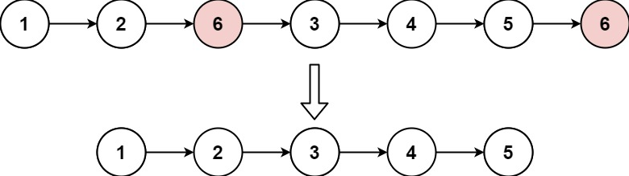
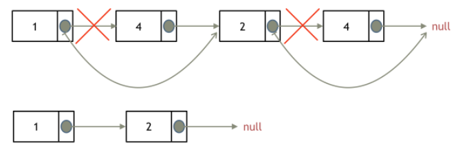
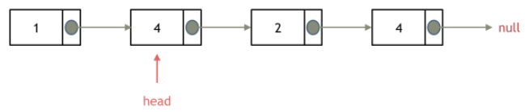
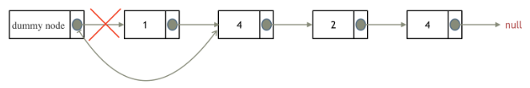

[LeetCode 203. Remove Linked List Elements](https://leetcode-cn.com/problems/remove-linked-list-elements/)

Given the `head` of a linked list and an integer `val`, remove all the nodes of the linked list that has `Node.val == val`, and return the *new* `head`.

**Example 1:**



    Input: head = [1,2,6,3,4,5,6], val = 6
    Output: [1,2,3,4,5]

**Example 2:**

    Input: head = [], val = 1
    Output: []

**Example 3:**

    Input: head = [7,7,7,7], val = 7
    Output: []

**Constraints:**

 - The number of nodes in the list is in the range [0, 10^4^].
 - 1 <= `Node.val` <= 50
 - 0 <= `val` <= 50


## 思路
用 `cur` 表示当前节点：如果 `cur` 的下一个节点不为空 且 下一个节点的值等于给定的 `val` ，即，`cur->next != NULL && cur->next->val == val` ，则需要移除 `cur` 的下一个节点，即：`cur->next = cur->next->next`



但如果要移除的节点是头节点（它没有上个节点）怎么办？
 - Method 1：直接将头节点向后移动
 - Method 2：在头节点前添加一个虚拟节点，使得原链表的所有节点均可按照常规的方式进行移除

## Method 1: 直接使用原链表来进行删除操作
1. 若要移除头节点，只需将头节点向后移动一位

    

2. 考虑到新的头节点也可能是值为 `val` ，需要用循环来对头节点进行处理，直到头节点值不为 `val`

3. 对头节点以后的其他节点进行遍历，若需移除则按常规方式处理即可

代码实现：
```cpp
struct ListNode {
    int val;
    ListNode *next;
    ListNode() : val(0), next(nullptr) {}
    ListNode(int x) : val(x), next(nullptr) {}
    ListNode(int x, ListNode *next) : val(x), next(next) {}
};

ListNode* removeElements(ListNode* head, int val) {
    // 删除值为 val 的头节点
    while (head != nullptr && head->val == val) {
        ListNode* tmp = head;
        head = head->next;
        delete tmp;
    }

    // 删除值为 val 的非头节点
    ListNode* cur = head;   // 遍历 cur 节点
    while(cur != nullptr && cur->next != nullptr) { // cur 非空且 cur 的下一个节点非空
        if (cur->next->val == val) {    // 当 cur 的下一个节点的值为 val 时，删除 cur 的下一个节点
            ListNode* tmp = cur->next;
            cur->next = cur->next->next;
            delete tmp;
        }
        else
            cur = cur->next;  // cur 向后移动
    }

    // 返回新的头节点
    return head;
}
```

> 注意要从内存中删除移除的节点，清理节点内存


## Method 2: 设置虚拟头节点再进行删除操作
设置一个虚拟头结点，原链表的所有节点便都可按照统一的方式进行移除

例如，给链表添加一个虚拟头结点为新的头结点，若要移除这个旧的头结点元素 1 时，只需将虚拟头节点的 `next` 指向旧的头节点的下一个节点，然后从内存中删除旧的头节点即可：


注意，在 `return` 头节点 时，`return` 的应该是虚拟头节点的下一个节点，即，`return dummyHead->next;`

最后也需要将添加的虚拟头节点 `dummyHead` 从内存中删掉

代码实现：

```cpp
struct ListNode {
    int val;
    ListNode *next;
    ListNode() : val(0), next(nullptr) {}
    ListNode(int x) : val(x), next(nullptr) {}
    ListNode(int x, ListNode *next) : val(x), next(next) {}
};

ListNode* removeElements(ListNode* head, int val) {
    // 设置虚拟头节点
    ListNode* dummyHead = new ListNode(0);  // 创建虚拟头节点
    dummyHead->next = head;                 // 令虚拟头节点指向 head

    // 移除操作
    ListNode* cur = dummyHead;
    while (cur->next != nullptr) {
        if (cur->next->val == val) {
            ListNode* tmp = cur->next;
            cur->next = cur->next->next;
            delete tmp;
        }
        else
            cur = cur->next;
    }

    // 返回虚拟头节点的下个节点，并删除虚拟头节点
    head = dummyHead->next;
    delete dummyHead;
    return head;
}
```

时间复杂度：$O(n)$，其中，$n$ 是链表的长度

空间复杂度：$O(1)$