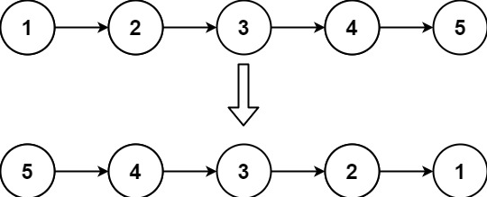
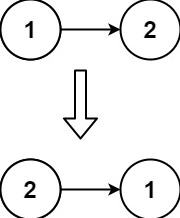

[LeetCode 206. Reverse Linked List](https://leetcode-cn.com/problems/reverse-linked-list/)

Given the `head` of a singly linked list, reverse the list, and return the *reversed* list.

**Example 1**:



    Input: head = [1,2,3,4,5]
    Output: [5,4,3,2,1]


**Example 2**:



    Input: head = [1,2]
    Output: [2,1]

**Example 3**:

    Input: head = []
    Output: []
 

**Constraints**:
 - The number of nodes in the list is the range `[0, 5000]`.
 - `-5000 <= Node.val <= 5000`
 

**Follow up**: A linked list can be reversed either iteratively or recursively. Could you implement both?

## 思路

实现链表元素的反转，只需改变链表节点 `next` 指针的指向


## Method 1: 双指针

1. 定义 `cur` 指向当前处理节点，初始指向头节点；定义 `pre` 指向 `cur` 的上一个节点，初始化为 `NULL`
2. 遍历 `cur`，直到 `cur`为空
    - 存储 `cur` 的下一个节点指针，记作 `tmp` ，即，`tmp = cur->next` 
    - 修改 `cur` 的 `next` 指针的指向，即，`cur->next = pre` ，令其指向上一个节点 `pre` ，实现反转
    - `pre` 和 `cur` 同时向后移动：执行 `pre = cur` , `cur = tmp`
3. 遍历结束时，`pre` 指向的是原链表的最后一个节点，同时也是反转之和新链表的头节点，因此，返回 `pre` 即可


代码实现：
```cpp
ListNode* reverseList(ListNode* head) {
    ListNode* temp; // 保存 cur 的下一个节点
    ListNode* cur = head;
    ListNode* pre = NULL;
    while(cur) {
        temp = cur->next;  // 保存 cur 的下一个节点，因为接下来要改变 cur->next
        cur->next = pre;   // 反转
        pre = cur;         // 更新 pre 指针
        cur = temp;        // 更新 cur 指针
    }
    return pre;
}
```

时间复杂度：$O(n)$，其中 $n$ 为链表长度

空间复杂度：$O(1)$


## Method 2: 递归

可以利用递归算法实现上述双指针算法的逻辑，代码如下：
```cpp
ListNode* reverse(ListNode* pre,ListNode* cur){
    if(cur == NULL) return pre;
    ListNode* temp = cur->next;
    cur->next = pre;
    // 可以和双指针法的代码进行对比，如下递归的写法，其实就是做了这两步
    // pre = cur;
    // cur = temp;
    return reverse(cur,temp);
}
ListNode* reverseList(ListNode* head) {
    // 和双指针法初始化是一样的逻辑
    // ListNode* cur = head;
    // ListNode* pre = NULL;
    return reverse(NULL, head);
}
```

上述算法实质上都是沿着链表的方向 **从前往后** 翻转指针指向

也可以 **从后往前** 翻转指针指向

代码实现：

```cpp
ListNode* reverseList(ListNode* head) { // 翻转 head->next 的 next 指针，使其指向 head
    // 迭代终止条件
    if (head == NULL || head->next == NULL)
        return head;
    
    // 递归调用，使 head->next->next 的下一个节点是 head->next
    ListNode *last = reverseList(head->next);

    // 使 head->next 的下一个节点是 head
    head->next->next = head;

    // 此时的 head 节点为反转链表的尾节点，next 指针应指向 NULL
    head->next = NULL;

    return last;
}
```

时间复杂度：$O(n)$，其中 $n$ 为链表长度

空间复杂度：$O(n)$，递归调用的栈空间