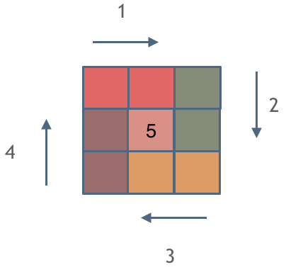

[LeetCode 59. Spiral Matrix II](https://leetcode-cn.com/problems/spiral-matrix-ii/)

Given a positive integer `n`, generate an $n \times n$ matrix filled with elements from $1$ to $n^2$ in **spiral order**.


**Example 1:**


    Input: n = 3
    Output: [[1,2,3],[8,9,4],[7,6,5]]


**Example 2:**

    Input: n = 1
    Output: [[1]]
 

**Constraints:**

 - $1 \le$ `n` $\le 20$


## Method: 模拟

思路：**模拟** 顺时针画矩阵的过程，即

 - 填充上行从左到右

 - 填充右列从上到下

 - 填充下行从右到左

 - 填充左列从下到上

由外向内一圈一圈这么画下去

注意：每画一条边都要坚持一致的 **左闭右开** ，或者 **左开又闭** 的原则，这样这一圈才能按照统一的规则画下来

> 坚持 **循环不变量** 原则

下图以左闭右开原则为例：每一种颜色，代表一条边，注意每一个拐角处的处理规则，拐角处让给新的一条边来继续画（即，每条边都遵循左闭右开原则）




代码实现：

```cpp
vector<vector<int>> generateMatrix(int n) {
    vector<vector<int>> res(n, vector<int>(n, 0));  // 二维数组，作为输出结果
    int startx = 0, starty = 0; // 每循环一次的起点
    int loop = n / 2;           // 循环的圈数，例如 n = 3 时，循环一圈（最中间的元素单独处理）
    int offset = 1;             // 用来控制每一圈的填充边长
    int count = 1;              // 用来给二维数组赋值
    
    while (loop--) {
        int i = startx, j = starty; // 当前填充位置为 (i, j)

        // 按照从左到右的顺序，填充每一圈的上边一行（左闭右开）
        for (; j < starty + n - offset; j++)
            res[i][j] = count++;
        
        // 按照从上到下的顺序，填充每一圈的右边一列（左闭右开）
        for (; i < startx + n - offset; i++)
            res[i][j] = count++;
        
        // 按照从右到左的顺序，填充每一圈的下边一行（左闭右开）
        for (; j > starty; j--)
            res[i][j] = count++;

        // 按照从下到上的顺序，填充每一圈的左边一列（左闭右开）
        for (; i > startx; i--)
            res[i][j] = count++;

        // 更新下一圈填充的起点
        startx++;
        starty++;

        // 更新下一圈填充边长控制参数
        offset += 2;
    }

    if (n % 2) {    // 若 n 为奇数，二维数组最中间的位置需要单独处理
        int mid = n / 2;
        res[mid][mid] = count;
    }

    return res;
}
```

[代码随想录：螺旋矩阵II](https://www.programmercarl.com/0059.%E8%9E%BA%E6%97%8B%E7%9F%A9%E9%98%B5II.html#%E6%80%9D%E8%B7%AF)


时间复杂度：$O(n^2)$，需要填充 $n^2$ 个元素

空间复杂度：$O(n^2)$