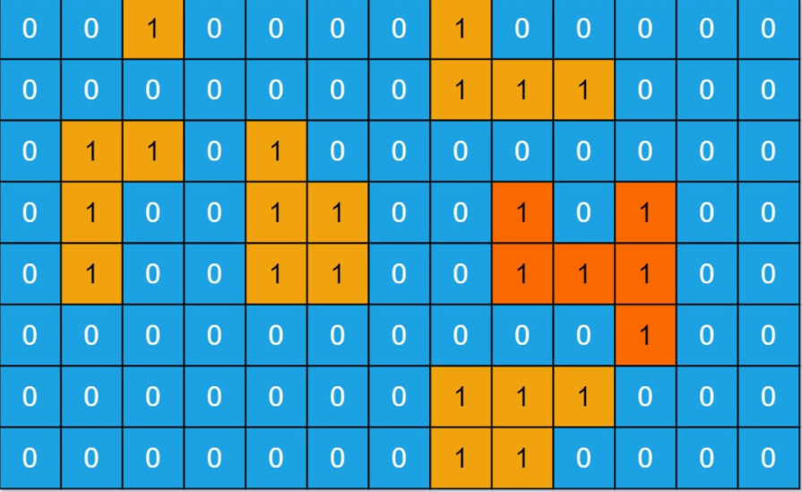

[LeetCode 695](https://leetcode-cn.com/problems/max-area-of-island/)

You are given an `m x n` binary matrix grid. An island is a group of `1`'s (representing land) connected **4-directionally** (horizontal or vertical.) You may assume all four edges of the grid are surrounded by water.

The **area** of an island is the number of cells with a value `1` in the island.

Return the **maximum area** of an island in `grid`. If there is no island, return `0`.

 

Example 1:



    Input: grid = [[0,0,1,0,0,0,0,1,0,0,0,0,0],[0,0,0,0,0,0,0,1,1,1,0,0,0],[0,1,1,0,1,0,0,0,0,0,0,0,0],[0,1,0,0,1,1,0,0,1,0,1,0,0],[0,1,0,0,1,1,0,0,1,1,1,0,0],[0,0,0,0,0,0,0,0,0,0,1,0,0],[0,0,0,0,0,0,0,1,1,1,0,0,0],[0,0,0,0,0,0,0,1,1,0,0,0,0]]
    Output: 6
    Explanation: The answer is not 11, because the island must be connected 4-directionally.


Example 2:

    Input: grid = [[0,0,0,0,0,0,0,0]]
    Output: 0


## Method 1: 深度优先搜索

计算网格中每个连通形状的面积，然后取最大值。

在一个土地上，以 `4` 个方向探索与之相连的每一个土地（以及与这些土地相连的土地），那么探索过的土地总数将是该连通形状的面积。

为了**确保每个土地访问不超过一次，我们每次经过一块土地时，将这块土地的值置为 `0`**。这样我们就不会多次访问同一土地。

```cpp
private:
    int DFS(vector<vector<int>>& grid, int cur_i, int cur_j) {  // 深度优先搜索
        if (cur_i < 0 || cur_i == grid.size() || cur_j < 0 || cur_j == grid[0].size() || grid[cur_i][cur_j] == 0) return 0;                       // cur_i cur_j 超出边界或grid[cur_i][cur_j]为0时，返回0
        grid[cur_i][cur_j] = 0; // 已经访问过的位置置0，以免重复访问
        int ans = 1;            // 岛屿面积
        const int di[4] = {-1,1,0,0};
        const int dj[4] = {0,0,-1,1};
        for (int index = 0; index < 4; index++) {
            int next_i = cur_i + di[index], next_j = cur_j + dj[index];
            ans += DFS(grid,next_i,next_j);
        }
        return ans;
    }

public:
    int maxAreaOfIsland(vector<vector<int>>& grid) {
        int ans = 0;
        for (int i = 0; i < grid.size(); i++)
            for (int j = 0; j< grid[0].size(); j++)
                ans = max(ans, DFS(grid,i,j));
        return ans;
    }
```

时间复杂度：`O(R × C)`。其中 `R` 是给定网格中的行数，`C` 是列数。访问每个网格最多一次

空间复杂度：`O(R × C)`，递归的深度最大可能是整个网格的大小，因此最大可能使用 `O(R × C)` 的栈空间


## Method 2: 深度优先搜索 + 栈


## Method 3: 广度优先搜索
把方法二中的栈改为队列，每次从队首取出土地，并将接下来想要遍历的土地放在队尾，就实现了广度优先搜索算法
```cpp
int maxAreaOfIsland(vector<vector<int>>& grid) {
    int ans = 0;
    for (int i = 0; i != grid.size(); ++i) {
        for (int j = 0; j != grid[0].size(); ++j) {
            int cur = 0;
            queue<int> queuei;
            queue<int> queuej;
            queuei.push(i);
            queuej.push(j);
            while (!queuei.empty()) {
                int cur_i = queuei.front(), cur_j = queuej.front();
                queuei.pop();
                queuej.pop();
                if (cur_i < 0 || cur_j < 0 || cur_i == grid.size() || cur_j == grid[0].size() || grid[cur_i][cur_j] != 1) {
                    continue;
                }
                ++cur;
                grid[cur_i][cur_j] = 0;
                int di[4] = {0, 0, 1, -1};
                int dj[4] = {1, -1, 0, 0};
                for (int index = 0; index != 4; ++index) {
                    int next_i = cur_i + di[index], next_j = cur_j + dj[index];
                    queuei.push(next_i);
                    queuej.push(next_j);
                }
            }
            ans = max(ans, cur);
        }
    }
}
```

时间复杂度：`O(R × C)`。其中 `R` 是给定网格中的行数，`C` 是列数，访问每个网格最多一次

空间复杂度：`O(R × C)`，队列中最多会存放所有的土地，土地的数量最多为 `R × C` 块