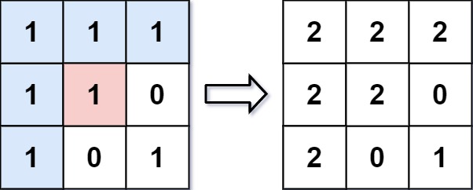

[LeetCode 733](https://leetcode-cn.com/problems/flood-fill/)

An image is represented by an `m x n` integer grid image where `image[i][j]` represents the pixel value of the image.

You are also given three integers `sr`, `sc`, and `newColor`. You should perform a flood fill on the image starting from the pixel `image[sr][sc]`.

To perform a flood fill, consider the starting pixel, plus any pixels connected **4-directionally** to the starting pixel of the same color as the starting pixel, plus any pixels connected **4-directionally** to those pixels (also with the same color), and so on. Replace the color of all of the aforementioned pixels with `newColor`.

Return the modified image after performing the flood fill.

 

**Example 1:**



    Input: image = [[1,1,1],[1,1,0],[1,0,1]], sr = 1, sc = 1, newColor = 2
    Output: [[2,2,2],[2,2,0],[2,0,1]]
    Explanation: From the center of the image with position (sr, sc) = (1, 1) (i.e., the red pixel), all pixels connected by a path of the same color as the starting pixel (i.e., the blue pixels) are colored with the new color.
    Note the bottom corner is not colored 2, because it is not 4-directionally connected to the starting pixel.


**Example 2:**

    Input: image = [[0,0,0],[0,0,0]], sr = 0, sc = 0, newColor = 2
    Output: [[2,2,2],[2,2,2]]


## Method 1: 广度优先搜索

每次搜索到一个方格时，如果其与初始位置的方格颜色相同，就将该方格加入队列，并**将该方格的颜色更新，以防止重复入队**。

注意：因为初始位置的颜色会被修改，所以我们需要保存初始位置的颜色，以便于之后的更新操作。

注意：**当目标颜色和初始颜色相同时，我们无需对原数组进行修改**。

```cpp
const int dx[4] = {1, 0, 0, -1};                // 四个方向
const int dy[4] = {0, 1, -1, 0};
vector<vector<int>> floodFill(vector<vector<int>>& image, int sr, int sc, int newColor) {
    int currColor = image[sr][sc];
    if (currColor == newColor) return image;    // 目标颜色和初始颜色相同
    int n = image.size(), m = image[0].size();
    queue<pair<int, int>> que;                  // 待搜索位置的队列
    que.emplace(sr, sc);                        // 初始化
    image[sr][sc] = newColor;
    while (!que.empty()) {
        int x = que.front().first, y = que.front().second;
        que.pop();
        for (int i = 0; i < 4; i++) {
            int mx = x + dx[i], my = y + dy[i];
            if (mx >= 0 && mx < n && my >= 0 && my < m && image[mx][my] == currColor) {
                que.emplace(mx, my);
                image[mx][my] = newColor;
            }
        }
    }
    return image;
```

时间复杂度：$O(n \times m)$，其中 `n` 和 `m` 分别是二维数组的行数和列数。最坏情况下需要遍历所有的方格一次。

空间复杂度：$O(n \times m)$，主要为队列的开销。


## Method 2: 深度优先搜索
从给定的起点开始，进行深度优先搜索。每次搜索到一个方格时，如果其与初始位置的方格颜色相同，就将该方格的颜色更新，以防止重复搜索；如果不相同，则进行回溯。

```cpp
const int dx[4] = {1, 0, 0, -1};
const int dy[4] = {0, 1, -1, 0};
void dfs(vector<vector<int>>& image, int x, int y, int color, int newColor) {
    if (image[x][y] == color) {
        image[x][y] = newColor;
        for (int i = 0; i < 4; i++) {
            int mx = x + dx[i], my = y + dy[i];
            if (mx >= 0 && mx < image.size() && my >= 0 && my < image[0].size()) {
                dfs(image, mx, my, color, newColor);    // 递归，深度优先搜索
            }
        }
    }
}

vector<vector<int>> floodFill(vector<vector<int>>& image, int sr, int sc, int newColor) {
    int currColor = image[sr][sc];
    if (currColor != newColor) {
        dfs(image, sr, sc, currColor, newColor);
    }
    return image;
}
```

时间复杂度：$O(n \times m)$，最坏情况下需要遍历所有的方格一次。

空间复杂度：$O(n \times m)$，主要为栈空间的开销。