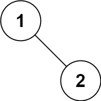

[LeetCode 94. Binary Tree Inorder Traversal](https://leetcode-cn.com/problems/binary-tree-inorder-traversal/)

Given the `root` of a binary tree, return *the inorder traversal of its nodes' values.*


**Example 1:**


    Input：root = [1,null,2,3]
    Output：[1,3,2]


**Example 2:**


    Input：root = [1,2]
    Output：[2,1]


**Example 3:**


    Input：root = [1,null,2]
    Output：[1,2]

**Constraints:**

 - The number of nodes in the tree is in the range `[0, 100]`.
 - $-100 \le$ `Node.val` $\le 100$
 

**Follow up:** Recursive solution is trivial, could you do it iteratively?


## Method 1: 递归

代码实现：

```cpp
vector<int> inorderTraversal(TreeNode* root) {
    vector<int> res;
    inorder(root,res);         // 中序遍历
    return res;
}

void inorder(TreeNode* root, vector<int> &res) {
    if (root == nullptr) return;
    inorder(root->left,res);   // 左子树
    res.push_back(root->val);  // 根节点
    inorder(root->right,res);  // 右子树
}
```

## Method 2: 迭代

[^_^]: 这部分被注释掉了
    ### Method 3: Morris遍历


[力扣官方题解：二叉树的中序遍历](https://leetcode-cn.com/problems/binary-tree-inorder-traversal/solution/er-cha-shu-de-zhong-xu-bian-li-by-leetcode-solutio/)
