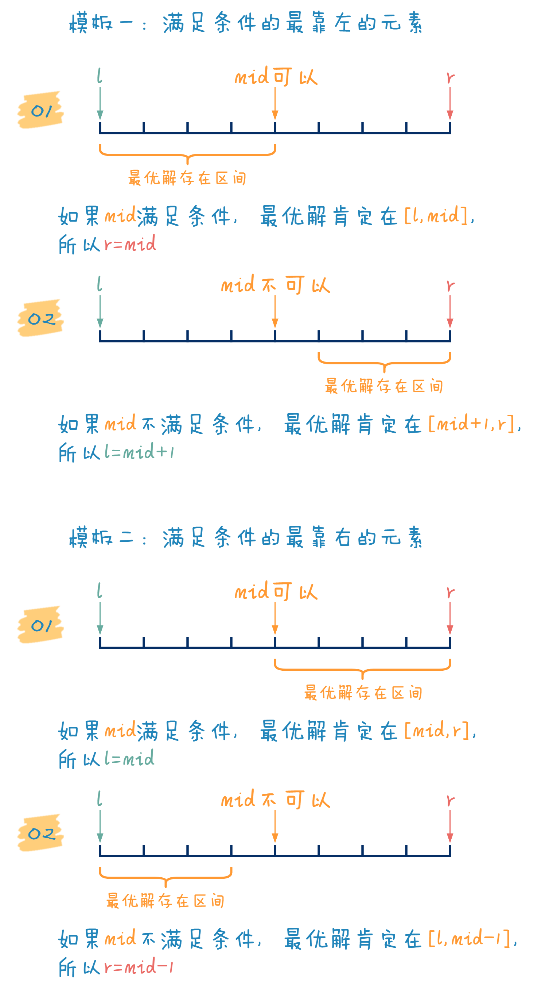

**二分查找** （binary search），也称折半搜索（half-interval search）、对数搜索（logarithmic search），是用来在一个有序数组中查找某一元素的算法

以在一个升序数组中查找一个数为例：它每次考察数组当前部分的中间元素，如果中间元素刚好是要找的，就结束搜索过程；如果中间元素小于所查找的值，那么查找右侧；如果中间元素大于所查找的值，查找左侧

时间复杂度：
 - 最优时间复杂度为 $O(1)$
 - 最坏和平均时间复杂度为 $O(\log{n})$

空间复杂度：
 - 迭代版本的二分查找算法，空间复杂度为 $O(1)$
 - 递归版本的二分查找算法，空间复杂度为 $O(\log{n})$

基本上所有可以比较的数据类型都可以进行二分查找

一些 **边界情况** ：
1. 如何处理答案不存在的情况
2. 区间内没有数字或只有一个/两个数字时，代码是否正常工作
3. 数组中有很多个重复元素时，代码是否正常工作
4. 会不会出现死循环
5. 循环结束时， `left` 与 `right` 是什么样的关系


为避免 **off-by-one** 问题造成的死循环（即，`left` 始终比 `right` 小 `1`），建议记住以下规律：
 - 如果代码用到 `left = mid` ，把 `left` 不断向右 push ，那么 `mid` 向上取整，即 `mid = left + right + 1 >> 1`
 - 如果代码用到 `right = mid` ，把 `right` 不断往左 push，那么 `mid` 向下取整，即 `mid = left + right >> 1`


参考：
 - [代码随想录：二分查找](https://www.programmercarl.com/0704.%E4%BA%8C%E5%88%86%E6%9F%A5%E6%89%BE.html#%E6%80%9D%E8%B7%AF)

 - [穿几个马甲，就认不出你是二分法？](https://mp.weixin.qq.com/s/1ExIav9uK4bvVnnf4t0H2Q)


## 示例

### Binary Search
[LeetCode 704. 二分查找](https://jiankychen.github.io/2022/03/16/leetcode704-er-fen-cha-zhao/)

### Search Insert position
[LeetCode 35. 搜索插入位置](https://jiankychen.github.io/2022/03/12/leetcode35-sou-suo-cha-ru-wei-zhi/)

### Find First and Last Position of Element in Sorted Array
[LeetCode 34. 在排序数组中查找元素的第一个和最后一个位置](https://jiankychen.github.io/2022/04/19/leetcode34-zai-pai-xu-shu-zu-zhong-cha-zhao-yuan-su-de-di-yi-ge-he-zui-hou-yi-ge-wei-zhi/)

### Find Smallest Letter Greater Than Target
[LeetCode 744. 寻找比目标字母大的最小字母](https://jiankychen.github.io/2022/04/19/leetcode744-xun-zhao-bi-mu-biao-zi-mu-da-de-zui-xiao-zi-mu/)

### 求方程的解
输出方程 $x^3 + 16 = 0$ 的解，已知这个解在 $[-10^9,10^9]$ 之间，并且函数 $f(x) = x^3 + 16$ 在定义域上单调递增

输出的答案保留 5 位小数

```cpp
double f( double x ) {
    return x * x * x + 16; // 函数f(x)
}

double solve() {
    double L = -1e9, R = 1e9; // 方程解在 [L,R] 之间，且函数在 [L,R] 上单调增
    while( R - L >= 1e-6 ) {  // 精确到 6 位小数，然后四舍五入
        double M = L + (R - L) / 2.0;
        if (f(M) == 0) return M;
        else if (f(M) < 0) L = M + 1e-6;
        else if (f(M) > 0) R = M - 1e-6;
    }
    return L;
}

int main() {
    printf( "%.5lf\n", solve() );
    return 0;
}
```

若要求精确到 10 位小数：由于 `double` 本身存在不小的精度误差，如果通过 `R - L >= 1e-10` 这种方式来控制二分的终止条件，会带来非常大的精度问题

这种时候，可以采用 `固定次数二分` 的方法
```cpp
double L = -1e9, R = 1e9;
for( int times = 0; times < 100; ++times ) { // 二分 100 次
    double mid = (L + R) / 2.0;
    // 此处省略二分内容
}
```

> 在 `double` 上二分时，尽量使用 `固定次数二分` 的方法


[^_^]:

    Reference:

    

    **Framework 1: 寻找满足条件的最左边的元素**
    ```cpp
    while (l < r) {
        int mid = l + r >> 1;
        if (mid 满足条件)
            r = mid;
        else 
            l = mid + 1；
    }
    ```

    **Framework 2: 寻找满足条件的最右边的元素**
    ```cpp
    while (l < r) {
        int mid = l + r + 1 >> 1;
        if (mid 满足条件) 
            l = mid;
        else 
            r = mid - 1；
    }
    ```

    [Kavin：34-查找元素/35-搜索插入位置](https://kavinwkp.github.io/2021/06/02/LeetCode-34-%E5%9C%A8%E6%8E%92%E5%BA%8F%E6%95%B0%E7%BB%84%E4%B8%AD%E6%9F%A5%E6%89%BE%E5%85%83%E7%B4%A0/)


## lower_bound 和 upper_bound
C++ 标准库中有两个使用二分查找的函数：`lower_bound` 和 `upper_bound`，二者均定义于头文件 `<algorithm>` 中

 - `lower_bound` ：在指定的升序排序的数组中，找到第一个大于等于 `x` 的数字

 - `upper_bound` ：在指定的升序排序的数组中，找到第一个大于 `x` 的数字

这两个函数会返回对应数字的指针（或者是迭代器）

    #include <algorithm>

    int *p = lower_bound(first, last, value);   // Returns an iterator pointing to the first element in the range [first, last) that is not less than value, or last if no such element is found.

    int *q = lower_bound(first, last, value, comp);     // given comparison function comp

巧妙地运用这两个函数，可以完成所有常见的二分查找操作：
 - 找到第一个大于等于 x 的数字
 - 找到第一个大于 x 的数字
 - 找到最后一个等于 x 的数字
 - 查找数组中是否有数字 x
 - 查询数组中有几个数字 x
 - 找到最后一个小于 x 的数字
 - ……

参考：[cppreference](https://en.cppreference.com/w/cpp/algorithm/lower_bound)