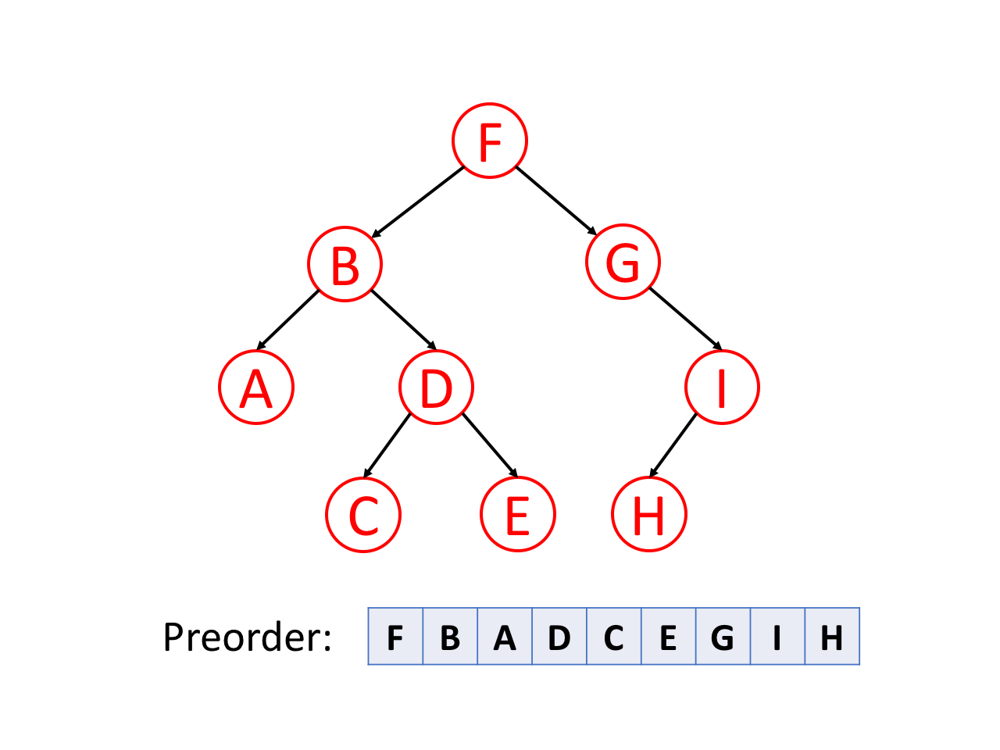
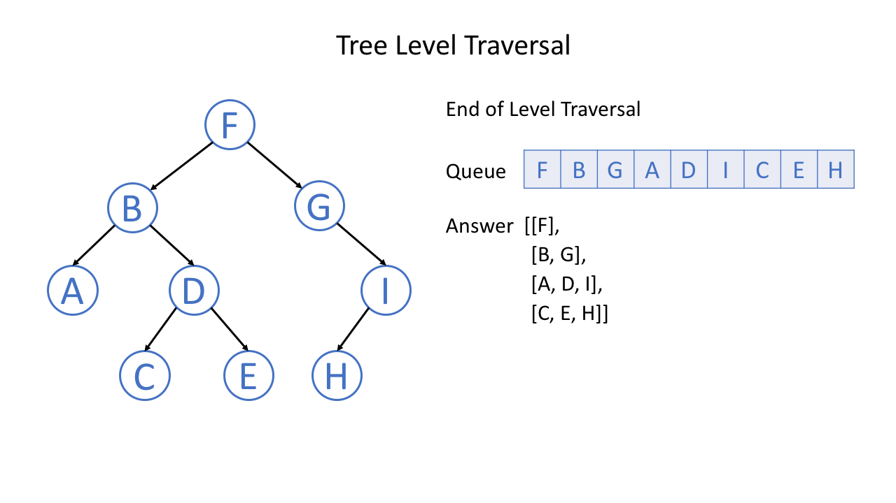

树：用来模拟具有树状结构性质的数据集合

二叉树 （Binary Tree）：每个节点 最多有两个子树 的树结构，通常子树被称作“左子树”和“右子树”

[LeetBook: 二叉树](https://leetcode-cn.com/leetbook/detail/data-structure-binary-tree/)


注意：二叉树必须严格区分左右子树。即使只有一棵子树，也要说明它是左子树还是右子树

**满二叉树** ：一棵高度为 $k$ 并具有 $2^k - 1$ 个节点的二叉树

**完全二叉树** ：在满二叉树的最底层自右至左依次（注意：不能跳过任何一个节点）去掉若干个节点得到的二叉树
 - 满二叉树一定是完全二叉树，但完全二叉树不一定是满二叉树
 - 特点：
   - 所有的叶节点都出现在最低的两层上
   - 对任一节点，如果其右子树的高度为 k ，则其左子树的高度为 $k$ 或 $k＋1$


# 二叉树的遍历

**前序遍历** ：首先访问根节点，然后遍历左子树，最后遍历右子树



**中序遍历** ：先遍历左子树，然后访问根节点，然后遍历右子树


> 中序常用来在二叉搜索树中得到递增的有序序列

**后序遍历** ：先遍历左子树，然后遍历右子树，最后访问树的根节点


删除节点的过程将按照后序遍历的顺序进行

后序可用于数学中的后缀表示法，结合栈处理表达式，每遇到一个操作符，就可以从栈中弹出栈顶的两个元素，计算并将结果返回到栈中


> 前序：根左右
> 
> 中序：左根右
> 
> 后序：左右根

> 所谓前中后序只针对于根节点，而左右子节点永远都是先左后右的顺序


## 前序遍历

[LeetCode 144. Binary Tree Preorder Traversal](https://leetcode-cn.com/problems/binary-tree-preorder-traversal/)

给定二叉树的根节点 `root` ，返回它节点值的 `前序` 遍历

**Example 1:**


    Input：root = [1,null,2,3]
    Output：[1,2,3]

**Example 2:**


    Input：root = [1,2]
    Output：[1,2]

**Example 3:**


    Input：root = [1,null,2]
    Output：[1,2]


### Method 1: 递归
按照访问根节点——左子树——右子树的方式遍历这棵树，而在访问左子树或者右子树的时候，我们按照同样的方式遍历，直到遍历完整棵树。

定义 `preorder(root)` 表示当前遍历到 `root` 节点的答案。按照定义，我们只要首先将 `root` 节点的值加入答案，然后递归调用 `preorder(root.left)` 来遍历 `root` 节点的左子树，最后递归调用 `preorder(root.right)` 来遍历 `root` 节点的右子树即可，递归终止的条件为碰到`空节点`。

```cpp
vector<int> preorderTraversal(TreeNode* root) {
    vector<int> res;
    preorder(root,res);         // 先序遍历，调用递归函数
    return res;
}

void preorder(TreeNode* root, vector<int> &res) {
    if (root == nullptr) return;
    res.push_back(root->val);   // 记录遍历的顺序
    preorder(root->left,res);   // 左子树
    preorder(root->right,res);  // 右子树
}
```

时间复杂度：$O(n)$，其中 `n` 是二叉树的节点数。每一个节点恰好被遍历一次

空间复杂度：$O(n)$，为递归过程中栈的开销，平均情况下为 $O(\log{n})$，最坏情况下树呈现链状，为 $O(n)$


### Method 2: 迭代
设计一个栈，用于存放将要被访问的树的根节点，利用栈的后进先出特性实现前序遍历

首先将把根节点入栈，然后重复以下过程，直到栈为空
 - 从栈中取出一个节点，输出节点的值
 - 把右子节点放入栈
 - 把左子节点放入栈

```cpp
vector<int> preorderTraversal(TreeNode* root) {
    vector<int> res;
    if (root == nullptr)
        return res;

    stack<TreeNode*> stk;
    TreeNode* node = root;
    while (!stk.empty() || node != nullptr) {
        while (node != nullptr) {
            res.emplace_back(node->val);
            stk.emplace(node);
            node = node->left;
        }
        node = stk.pop();
        node = node->right;
    }
    return res;
}
```

时间复杂度：$O(n)$，其中 `n` 是二叉树的节点数。每一个节点恰好被遍历一次

空间复杂度：$O(n)$，为迭代过程中显式栈的开销，平均情况下为 $O(\log{n})$，最坏情况下树呈现链状，为 $O(n)$


[^_^]: 这部分被注释掉了
    ### Method 3: Morris遍历
    J. H. Morris 在 1979 年的论文「Traversing Binary Trees Simply and Cheaply」中首次提出

    Morris 遍历的核心思想是利用树的大量空闲指针，实现空间开销的极限缩减。其前序遍历规则总结如下：
    1. 新建临时节点，令该节点为 `root`；
    2. 如果当前节点的左子节点为空，将当前节点加入答案，并遍历当前节点的右子节点；
    3. 如果当前节点的左子节点不为空，在当前节点的左子树中找到当前节点在中序遍历下的前驱节点：
        - 如果前驱节点的右子节点为空，将前驱节点的右子节点设置为当前节点。然后将当前节点加入答案，并将前驱节点的右子节点更新为当前节点。当前节点更新为当前节点的左子节点。
        - 如果前驱节点的右子节点为当前节点，将它的右子节点重新设为空。当前节点更新为当前节点的右子节点。

    4. 重复步骤 2 和步骤 3，直到遍历结束。

    ```cpp
    vector<int> preorderTraversal(TreeNode *root) {
        vector<int> res;
        if (root == nullptr) {
            return res;
        }

        TreeNode *p1 = root, *p2 = nullptr;

        while (p1 != nullptr) {
            p2 = p1->left;
            if (p2 != nullptr) {
                while (p2->right != nullptr && p2->right != p1) {
                    p2 = p2->right;
                }
                if (p2->right == nullptr) {
                    res.emplace_back(p1->val);
                    p2->right = p1;
                    p1 = p1->left;
                    continue;
                } else {
                    p2->right = nullptr;
                }
            } else {
                res.emplace_back(p1->val);
            }
            p1 = p1->right;
        }
        return res;
    }
    ```

    时间复杂度：`O(n)`，其中 `n` 是二叉树的节点数。没有左子树的节点只被访问一次，有左子树的节点被访问两次

    空间复杂度：`O(1)`。只操作已经存在的指针（树的空闲指针），因此只需要常数的额外空间

[题解：二叉树的前序遍历](https://leetcode-cn.com/problems/binary-tree-preorder-traversal/solution/er-cha-shu-de-qian-xu-bian-li-by-leetcode-solution/)


## 中序遍历

[LeetCode 94. Binary Tree Inorder Traversal](https://leetcode-cn.com/problems/binary-tree-inorder-traversal/)

给定二叉树的根节点 `root` ，返回它节点值的 `中序` 遍历

**Example 1:**


    Input：root = [1,null,2,3]
    Output：[1,3,2]


**Example 2:**


    Input：root = [1,2]
    Output：[2,1]


**Example 3:**


    Input：root = [1,null,2]
    Output：[1,2]


### Method 1: 递归
```cpp
vector<int> inorderTraversal(TreeNode* root) {
    vector<int> res;
    inorder(root,res);         // 中序遍历
    return res;
}

void inorder(TreeNode* root, vector<int> &res) {
    if (root == nullptr) return;
    inorder(root->left,res);   // 左子树
    res.push_back(root->val);  // 根节点
    inorder(root->right,res);  // 右子树
}
```

[^_^]: 这部分被注释掉了
    ### Method 2: 迭代

[^_^]: 这部分被注释掉了
    ### Method 3: Morris遍历


[题解：二叉树的中序遍历](https://leetcode-cn.com/problems/binary-tree-inorder-traversal/solution/er-cha-shu-de-zhong-xu-bian-li-by-leetcode-solutio/)


## 后序遍历

[LeetCode 145. Binary Tree Postorder Traversal](https://leetcode-cn.com/problems/binary-tree-postorder-traversal/)

给定二叉树的根节点 `root` ，返回它节点值的 `后序` 遍历

Example 1:


    Input：root = [1,null,2,3]
    Output：[3,2,1]


### Method 1: 递归
```cpp
vector<int> postorderTraversal(TreeNode* root) {
    vector<int> res;
    postorder(root,res);         // 中序遍历
    return res;
}

void postorder(TreeNode* root, vector<int> &res) {
    if (root == nullptr) return;
    postorder(root->left,res);   // 左子树
    postorder(root->right,res);  // 右子树
    res.push_back(root->val);    // 根节点
}
```

[^_^]: 这部分被注释掉了
    ### Method 2: 迭代


[^_^]: 这部分被注释掉了
    ### Method 3: Morris遍历

[题解：二叉树的后序遍历](https://leetcode-cn.com/problems/binary-tree-postorder-traversal/solution/er-cha-shu-de-hou-xu-bian-li-by-leetcode-solution/)


## 层序遍历
层序遍历就是逐层遍历树结构：从一个根节点开始，首先访问节点本身。然后遍历它的相邻节点，其次遍历它的二级邻节点、三级邻节点，以此类推


当我们在**树**中进行**广度优先搜索**时，我们**访问的节点的顺序**是按照**层序遍历**顺序的

通常，我们使用一个叫做**队列**的数据结构来帮助我们做广度优先搜索

[LeetCode 102. Binary Tree Level Order Traversal](https://leetcode-cn.com/problems/binary-tree-level-order-traversal/)

给定二叉树的根节点 `root` ，返回其节点值的 `层序遍历`。（即逐层地，从左到右访问所有节点）

**Example:**


    Input：root = [3,9,20,null,null,15,7]
    Output：[[3],[9,20],[15,7]]


### Method: 广度优先搜索
1. 首先根元素入队
2. 当队列不为空的时候
    - 求当前队列的长度 $s_i$
    - 依次从队列中取 $s_i$ 个元素进行拓展，然后进入下一次迭代

普通广度优先搜索每次只取一个元素拓展，而这里每次取 $s_i$ 个元素。第 $i$ 次迭代就得到了二叉树的第 $i$ 层的 $s_i$ 个元素

```cpp
vector<vector<int>> levelOrder(TreeNode* root) {
    vector <vector <int>> ret;
    if (!root) {
        return ret;
    }

    queue <TreeNode*> q;
    q.push(root);
    while (!q.empty()) {
        int currentLevelSize = q.size();
        ret.push_back(vector <int> ());
        for (int i = 1; i <= currentLevelSize; ++i) {
            auto node = q.front(); q.pop();
            ret.back().push_back(node->val);
            if (node->left) q.push(node->left);
            if (node->right) q.push(node->right);
        }
    }
    
    return ret;
}
```

时间复杂度：每个点进队出队各一次，故渐进时间复杂度为 $O(n)$，$n$ 为树的所有节点的个数

空间复杂度：队列中元素的个数不超过 $n$ 个，故渐进空间复杂度为 $O(n)$


# 二叉树的定义

已知二叉树的前序遍历序列和中序遍历序列，可以确定一棵二叉树

 - 根据前序遍历序列找出根节点，再根据中序遍历序列区分左右子树
 - 分别找出左右子树的前序、中序遍历序列
 - 分别对左右子树重复这个过程

例：

前序序列：A B D E F C
中序序列：D B E F A C

根据前序序列确定二叉树的根节点为 A ，在中序序列中找到 A ，此时，中序序列中 A 左边的 D B E F 即为 A 的左子树，A 右边的 C 为 A 的右子树
 - 针对 A 的左子树，一共包含 D B E F 四个节点，其对应的前序遍历为 B D E F ，中序遍历为 D B E F 。因此， A 的左子树的根节点为 B ，节点 B 的左子树为 D ，右子树为 E F
   - 针对 B 的右子树，一共包含 E F 两个节点，其前序遍历为 E F ，中序遍历为 E F
     - 根节点为 E ，右子树为 F
 - 针对 B 的右子树，前序遍历和中序遍历均为 C，故 C 为叶节点


已知二叉树的中序遍历序列和后序遍历序列，可以确定一棵二叉树
 - 根据后序遍历确定根节点，根据中序遍历确定其左右子树

已知二叉树的前序遍历序列和后序遍历序列，无法唯一确定一棵二叉树
 - 可以根据前序遍历序列确定根节点，但无法分清其左子树和右子树


# 二叉树的性质

1. 一棵非空二叉树的第 $i$ 层上最多有 $2^{i - 1}$ 个节点 $(i \ge 1)$

2. 一棵高度为 $k$ 的二叉树，最多具有 $2^k - 1$ 个节点

3. 一棵非空二叉树，如果叶节点数为 $n_0$ ，度数为 2 的节点数为 $n_2$ ，则有 $n_0 = n_2 + 1$ 成立
    - 二叉树所有节点的度数均小于或等于2，所以有 $n = n_0 + n_1 + n_2$
    - 除根节点外，每个节点都有唯一的一个树枝（父节点与子节点之间的线段）进入本节点，则二叉树的树枝总数 $B = n - 1$
    - 度为 1 的节点发出一个树枝，度为 2 的节点发出两个树枝，所以 $B = n_1 + 2 n_2$
    - 联立以上三式，得 $n_0 = n_2 + 1$


4. 具有 $n$ 个节点的完全二叉树的高度 $ k = \lfloor \log_2{n} \rfloor + 1$
    - 高度为 $k$ 的完全二叉树，其节点总数满足 $2^{k-1} - 1 < n \le 2^k - 1$ ，化简得 $k - 1 \le \log_2{n} < k$ ，由于 $k$ 是整数，所以有 $k = \lfloor \log_2{n} \rfloor + 1$

5. **完全二叉树的按层编号**：对一棵有 $n$ 个节点的完全二叉树中的节点按层自上而下（从第 1 层到第 $\lfloor \log_2{n} \rfloor + 1$ 层）、每一层层按自左至右依次编号，若设根节点的编号为 $1$ ，则对任一编号为 $i$ 的节点，有：
     - 若 $i = 1$ ，则节点为二叉树的根节点；若 $i > 1$ ，则其父节点的编号为 $\lfloor i/2 \rfloor$
     - 若 $2 i > n$，则编号为 $i$ 的节点为叶节点，没有子节点；否则，其左子节点编号为 $2 i$
     - 若 $2 i + 1 > n$，则编号为 $i$ 的节点无右子节点；否则，其右子节点编号为 $2 i + 1$


# 二叉树的存储

## 顺序存储

### 完全二叉树的顺序存储

按层编号，把节点的层次关系映射到线性关系

并且，根据 完全二叉树的按层编号 性质，可以得知各节点的父节点和子节点

例如：


### 非完全二叉树的顺序存储

将非完全二叉树修补成完全二叉树
 - 用特殊标记 （对应于类定义中的 `flag` ）表示虚拟节点

然后按层编号

例如：


非完全二叉树顺序存储的特点：浪费空间
 - 极端情况：只有右子节点的高为 3 的二叉树，其需要 7 个节点的存储空间，但是有效的节点只有 3 个

因此，一般只用于一些特殊的场合，如静态的并且节点个数已知的完全二叉树或接近完全二叉树的二叉树

## 链接存储

### 二叉链表

指明子节点，类似于单链表

每个节点存储 数据元素、指向左子节点的指针、指向右子节点的指针

例如：


### 三叉链表：

同时指明父节点和子节点，类似于双链表

每个节点存储 数据元素、指向左子节点的指针、指向右子节点的指针、指向父节点的指针


由于在二叉树中很少通过子节点找父节点，因此，我们常使用二叉链表进行存储，二叉链表也被称作二叉树的标准存储方式


[^_^]: 被注释掉了


    # 二叉链表类设计


    ## 数据成员设计

    由两个类组成

    节点类：
    - 数据成员：数据、左右子节点的指针
    - 成员函数：构造和析构

    二叉树类：
    - 数据成员：指向根节点的指针

    二叉链表类的用户无需知道该类的存在，因此，节点类是树类的私有内嵌类


    ## 成员函数设计

    须实现抽象类规定的所有函数

    二叉树是递归定义，操作可用递归实现
    - 递归函数必须有一个控制递归终止的参数
    - 每个需要递归实现的公有成员函数对应一个私有的、带递归参数的成员函数
    - 公有函数调用私有函数完成相应的功能

    有些操作需要先找到某个节点的地址
    - 增设一个私有成员函数 `find`


    ## 类定义

    ```cpp
    template<class T>
    class binaryTree : public bTree<T> {
        friend void printTree(const binaryTree &t, T flag);

    // 数据成员
    private:
        struct Node { //二叉树的节点类
            Node  *left, *right ;               
            T data;                         
            Node() : left(NULL), right(NULL) { }
            Node(T item, Node *L = NULL, Node * R =NULL ) : data(item), left(L), right(R) { }
            ~Node() {} 
        };
        Node *root;

    // 公有成员函数
    public:
        binaryTree() : root(NULL) {}
        binaryTree(T x) { root = new Node(x); }
        ~binaryTree()  { clear() ; }
        void clear() ;
        bool isEmpty() const{return root == NULL;}
        int size() const;
        T Root(T flag) const;
        T lchild(T x, T flag) const;
        T rchild(T x, T flag) const; 
        void delLeft(T x) ;
        void delRight(T x);
        void preOrder() const;
        void midOrder() const;
        void postOrder() const;
        void levelOrder() const;
        void createTree(T flag);

    // 私有成员函数
    private:
        Node *find(T x, Node *t ) const; // find 函数（返回以 t 为根节点的二叉树中 值为 x 的节点指针
        void clear(Node *&t) ;
        int size(Node *t) const ; 
        void preOrder(Node *t)  const;   // 前序遍历，递归实现
        void midOrder(Node *t) const;    // 中序遍历，递归实现
        void postOrder(Node *t)  const;  // 后序遍历，递归实现

    }; 
    ```

    ## 成员函数的实现

    ### `root` 函数
    - 返回 `root` 指向的节点的数据部分。如果二叉树是空树，则返回一个特殊的标记

    ```cpp
    template <class T>
    T binaryTree<T>::Root(T flag) const
    {
        if (root == NULL)
            return flag;
        else
            return root->data;
    }
    ```


    ### `size` 函数
    - 树的节点数 = 左子树节点数 + 右子树节点数 + 1
    - 计算左右子树的节点数需要递归调用本函数

    ```cpp
    // 私有成员函数
    template<class T>
    int binaryTree<T>::size(binaryTree<T>::Node *t) const
    {
        if (t == NULL)
            return  0;
        else
            return size(t->left)  + size(t->right) + 1;
    }

    // 公有成员函数
    template<class T>
    int binaryTree<T>::size() const
    {
        return size(root);
    } 
    ```


    ### `clear` 函数
    -  删除一棵树 = 删除左子树 + 删除右子树 + 删除根节点
    -  删除左右子树需要递归调用本函数

    ```cpp
    // 私有成员函数
    template<class T>
    void binaryTree<T>::clear(binaryTree<T>::Node *&t) // 引用传递
    {
        if (t == NULL)
            return;
        clear(t->left);
        clear(t->right);
        delete t;
        t = NULL;
    }

    // 公有成员函数
    template<class T>
    void binaryTree<T>::clear()
    {
        clear(root);
    } 
    ```


    ### 前序遍历
    ```cpp
    template<class T>
    void binaryTree<T>::preOrder(binaryTree<T>::Node *t)  const
    { 
        if (t == NULL) return;
        cout << t->data << ' ';
        preOrder(t->left);
        preOrder(t->right);
    }
    
    template<class T>
    void binaryTree<T>::preOrder()  const
    { 
        cout << "\n前序遍历：";
        preOrder(root);
    }
    ```

    ### 中序遍历
    ```cpp
    template<class T>
    void binaryTree<T>::midOrder (binaryTree<T>::Node *t) const
    {
        if (t == NULL) return;
        midOrder(t->left);
        cout << t->data << ‘ ’;
        midOrder(t->right);
    }


    template<class T>
    void binaryTree<T>::midOrder() const
    {  
        cout << "\n中序遍历：";
        midOrder(root);
    } 
    ```

    ### 后序遍历
    ```cpp
    template<class T>
    void binaryTree<T>::postOrder (binaryTree<T>::Node *t)  const
    {
        if (t == NULL) return;
        postOrder(t->left);	
        postOrder(t->right);
        cout << t->data << ' ';
    }

    template<class T>
    void binaryTree<T>::postOrder()  const
    {  
        cout << "\n后序遍历：";
        postOrder(root);	
    }
    ```

    ### 层序遍历
    - 使用队列存储可以访问的节点（广义优先搜索）
    - 工作过程：根节点入队，`while`（队列非空） { 出队并访问，将子节点入队 }
    ```cpp
    template<class T>
    void binaryTree<T>::levelOrder() const
    {
        linkQueue< Node * > que;
        Node *tmp;
        
        cout << “\n层次遍历：”;
        que.enQueue(root);	
        while (!que.isEmpty()) {
            tmp = que.deQueue();
            cout << tmp->data << ' ';
            if (tmp->left)
                que.enQueue(tmp->left);
            if (tmp->right)
                que.enQueue(tmp->right);
        }
    }
    ```

    ### 函数 `lchild` , `rchild` , `delLeft` , `delRight`
    - `lchild(x)` ：返回节点 `x` 的 `left` 值
    - `rchild(x)` ：返回节点 `x` 的 `right` 值
    - `delLeft(x)` ：对左子树调用 `clear` 函数删除左子树，然后将节点 `x` 的 `left` 置为 `NULL`
    - `delRight(x)` ：对右子树调用 `clear` 函数删除右子树，然后将节点 `x` 的 `right` 置为 `NULL`

    这 4 个函数都必须先找到存储 `x` 的节点，这是由私有函数 `find` 完成

    私有函数 `find`
    - 遍历，寻找节点 `x` （以前序遍历为例）

    ```cpp
    binaryTree<T>::Node *binaryTree<T>::
        find(T x, binaryTree<T>::Node *t) const
    {
            Node *tmp;
            if (t == NULL) return NULL;
            if (t->data == x) return t;   
            if (tmp = find(x, t->left) ) return tmp;
            else return find(x, t->right);
    }
    ```

    `lchild` 函数
    ```cpp
    template <class T>
    T binaryTree<T>::lchild(T x, T flag) const
    {
        Node * tmp = find(x, root);

        if (tmp == NULL || tmp->left == NULL)
            return flag;
        
        return tmp->left->data;
    }
    ```

    `rchild` 函数
    ```cpp
    template <class T>
    T binaryTree<T>::rchild(T x, T flag) const
    {
        Node * tmp = find(x, root);

        if (tmp == NULL || tmp->right == NULL)
            return flag;

        return tmp->right->data;
    }
    ```

    `delLeft` 函数
    ```cpp
    template <class T>
    void binaryTree<T>::delLeft(T x)
    {
        Node *tmp = find(x, root);

        if (tmp == NULL) return;
        clear(tmp->left);
    }
    ```

    `delRight` 函数
    ```cpp
    template <class T>
    void binaryTree<T>::delLeft(T x)
    {
        Node *tmp = find(x, root);

        if (tmp == NULL) return;
        clear(tmp->left);
    }
    ```

    ### `createTree` 函数

    创建一棵树

    创建过程

    - 按层次遍历输入节点（以广义优先搜索为例）
    - 先输入根节点；对已输入的每个节点，依次输入它的两个子节点的值。如果没有子节点，则输入一个特定值

    ```cpp
    template <class Type>
    void BinaryTree<Type>::createTree(Type flag)
    { 
        linkQueue< Node * > que;
        Node *tmp;
        Type x, ldata, rdata;

        cout << "\n输入根节点：";
        cin >> x;
        root = new Node(x);
        que.enQueue(root);
        while (!que.isEmpty()) {
            tmp = que.deQueue();
            cout << "\n输入" << tmp->data   << "的两个子节点(" << flag   << "表示空节点)：";
            cin >> ldata >> rdata;
            if (ldata != flag)
                que.enQueue(tmp->left = new Node(ldata));
            if (rdata != flag)   
                que.enQueue(tmp->right = new Node(rdata));
        }
        cout << "create completed!\n";
    } 
    ```


    ## 友元函数 `printTree`

    以层次遍历的顺序输出每个节点和它的左右子节点

    ```cpp
    template <class T>
    void printTree(const binaryTree<T> &t, T flag)
    {
        linkQueue<T> q;

        q.enQueue(t.root->data);
        cout << endl;
        while (!q.isEmpty()) {
                char p, l, r;
                    p = q.deQueue();
                    l = t.lchild(p,  flag);
                    r = t.rchild(p,  flag);
                    cout << p << "  " << l  << "  " << r << endl;
                    if (l != flag) q.enQueue(l);
                    if (r != flag) q.enQueue(r);
            }
    } 
    ```