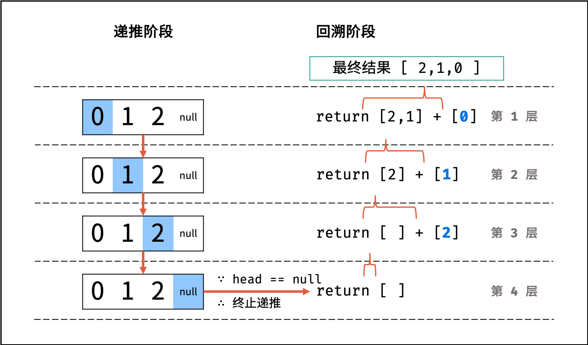

输入一个链表的头节点，从尾到头反过来返回每个节点的值（用数组返回）

示例 1：

    输入：head = [1,3,2]
    输出：[2,3,1]


## Method 1: 遍历添加

链表长度未知

先统计链表节点的个数 `count` ，然后定义一个数组，逆序记录链表各节点的值

```cpp
vector<int> reversePrint(ListNode* head) {
    // 统计链表的节点数
    int count = 0;
    ListNode *node = head;
    while (node != nullptr) {
        count++;
        node = node->next;
    }
    // 创建数组
    vector<int> nums(count,0);
    // 逆序记录链表节点的值
    node = head;
    for (int i = count - 1; node != nullptr; i--) {
        nums[i] = node->val;
        node = node->next;
    }
    return nums;
}
```

时间复杂度：$O(N)$，$N$ 为链表长度，遍历统计、遍历修改皆使用 $O(N)$ 时间

空间复杂度：$O(N)$，新建了一个 `vector` 容器


## Method 2: 递归
利用递归，先递推至链表末端；回溯时，依次将节点值加入数组，即可实现链表值的逆序输出

算法流程：

1. 终止条件：当 `head == nullptr` 时，代表越过了链表尾节点，则返回空列表

2. 递推工作：访问下一节点 `head->next`

3. 回溯阶段：将当前节点值 `head->val` 加入数组 `res`

代码实现：
```cpp
class Solution {
public:
    vector<int> reversePrint(ListNode* head) {
        recur(head);
        return res;
    }

private:
    vector<int> res;
    void recur(ListNode *head) {
        if(head == nullptr) return;
        recur(head->next);
        res.push_back(head->val);
    }
};
```

时间复杂度：$O(N)$，遍历链表，递归 $N$ 次

空间复杂度：$O(N)$，递归需要使用 $O(N)$ 的栈空间



注：图解是以 Python 代码为例


## Method 3: 栈

链表只能 从前至后 访问每个节点，而这里要求 **逆序输出** 各节点值，这种 **先入后出** 的需求可以借助 **栈** 来实现

算法流程：

1. 入栈：遍历链表，将各节点值 `push` 入栈

2. 出栈：将各节点值 `pop` 出栈，存储于数组并返回

代码实现：
```cpp
vector<int> reversePrint(ListNode* head) {
    stack<int> stk;
    while(head != nullptr) {
        stk.push(head->val);        // 入栈，在栈顶增加元素
        head = head->next;
    }
    vector<int> res;
    while(!stk.empty()) {           // 判断堆栈是否为空
        res.push_back(stk.top());   // top() 函数返回栈顶元素
        stk.pop();                  // 出栈，移除栈顶元素
    }
    return res;
}
```

时间复杂度：$O(N)$，一共有 $N$ 次的入栈和出栈
空间复杂度：$O(N)$，辅助栈 `stack` 和数组 `res` 各使用 $O(N)$ 的额外空间