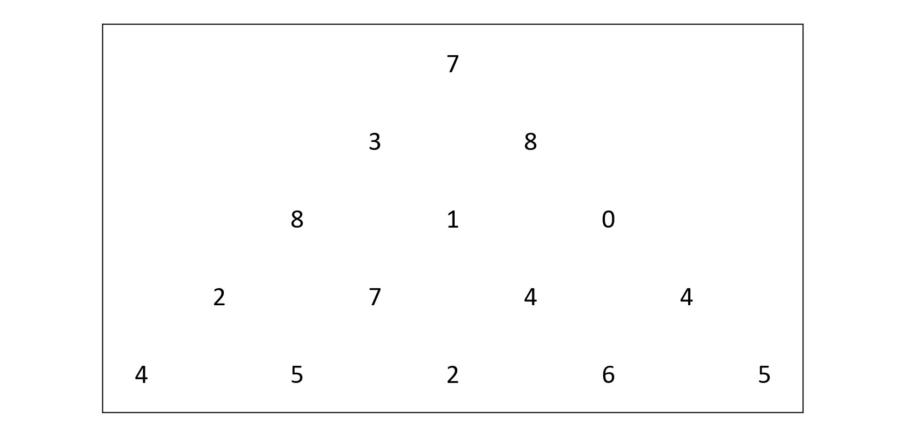
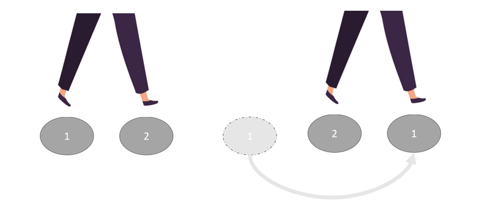

动态规划（Dynamic Programming，DP），一种解决某种最优化问题的方法

动态规划的基本思想：把原问题分解为相对简单的子问题
 - 将原问题分成若干 **阶段** ，每个阶段对应若干个子问题，提取这些子问题的特征（**状态**）
 - 寻找各状态间的相互转移方式（**状态转移方程**）
 - 按顺序求解每一个阶段的问题

> 动态规划中每一个状态一定是由上一个状态推导出来的
> 
> 贪心算法没有状态推导，而是从局部直接选最优的

用动态规划解决问题的三个条件（了解即可）：最优子结构、无后效性、子问题重叠
 - 最优子结构：原问题的最优解，必然是通过子问题的最优解得到的（最优子结构保证了我们能够通过选取子问题的最优解最终拼成原问题的解）
 - 无后效性：前面状态的决策不会限制到后面的决策 （旅行商问题就是有后效性的场景，因为每个城市只能访问一次）
 - 重复子问题：一个子问题可以被重复利用到多个父亲状态中

动态规划解题思路：
1. 明确 **状态** ：确定 dp 数组以及下标的含义
2. 确定 **状态转移方程** ：用于描述不同状态之间的关系
3. dp 数组如何 **初始化** ：即，初始状态
4. 确定 **转移方向** ：转移方向描述的是推导出不同状态的解的先后关系
5. 举例推导 dp 数组

> 动规不仅仅只有状态转移方程，也需要弄清楚 dp 数组应该如何初始化，以及正确的转移方向
> 
> 初始状态描述的是整个转移方程推导的开始，是不需要经由别的状态就知道结果的状态
> 
> 之所以要明确转移方向，是因为我们不希望 "已知 B 状态只能由 A 状态推导过来，但是当我们想推导 B 时，发现 A 状态的结果我们还不知道” 类似事情发生

解动规题的一个很不好的习惯：不清楚 dp 数组的含义，不懂为什么这么初始化，递推公式背下来了，遍历顺序靠习惯就是这么写的，然后一鼓作气写出代码，如果代码能通过万事大吉，通过不了的话就凭感觉改一改

**做动规的题目，写代码之前一定要把状态转移在 dp 数组上的具体情况模拟一遍，确定最后推出的是想要的结果，然后再写代码**

写动规题目，代码出问题很正常，**找问题的最好方式就是把 dp 数组打印出来，看看究竟是不是按照自己思路推导的**
 - 如果打印出来和自己预先模拟推导是一样的，那么就是自己的递归公式、初始化或者遍历顺序有问题了
 - 如果和自己预先模拟推导的不一样，那么就是代码实现细节有问题

这样才是一个完整的思考过程，而不是一旦代码出问题，就毫无头绪的东改改西改改

[代码随想录：动态规划理论基础](https://www.programmercarl.com/%E5%8A%A8%E6%80%81%E8%A7%84%E5%88%92%E7%90%86%E8%AE%BA%E5%9F%BA%E7%A1%80.html#%E4%BB%80%E4%B9%88%E6%98%AF%E5%8A%A8%E6%80%81%E8%A7%84%E5%88%92)


### 数字金字塔



给定一个 $n$ 层的金字塔，求一条从最高点到底层任意点的路径，使得路径上数字之和最大。其中，每一步可以从当前点走到其左下方的点，也可以走到其右下方的点

比如，在上面的样例中，从 7 $\to$ 3 $\to$ 8 $\to$ 7 $\to$ 5 的路径经过数字的和最大

#### 动态规划求解
基本思想：分别求出到达每个点的最大路径，然后在所有点里面取最大值即可

动态规划解题思路：

1. **状态** 设计：用 `a[i][j]` 存储数字金字塔第 `i` 行第 `j` 列的数字，用 **`dp[i][j]`** 表示 **从顶点到达第 `i` 行第 `j` 列的最大数字和**，`i` 和 `j` 均从 `0` 开始

2. **状态转移方程** ：到达 `(i, j)` 的路径只可能从 `(i - 1, j - 1)` 或者 `(i - 1, j)` 走过来（如果在三角形的最左边或者最右边，那么它的上一个节点就只有一种情况），从中选择能使数字和最大的

        dp[i][j] = dp[i - 1][j] + a[i][j]；                         // i >= 1, j == 0
        dp[i][j] = dp[i - 1][j - 1] + a[i][j]；                     // i >= 1, j == i
        dp[i][j] = max(dp[i - 1][j - 1], dp[i - 1][j]) + a[i][j]；  // i >= 1, j > 0 && j < i

3. **初始化** `dp` 数组：`f[0][0] = a[0][0]`
    - 根据状态转移方程可知，`dp[i][j]` 由 `dp[i - 1][j - 1]` 和 `dp[i - 1][j]` 推出，只要初始化顶点的状态，令 `dp[0][0] = a[0][0]` 即可

4. 确定 **转移方向** ：按照 `i` 从小到大，`j` 从小到大的顺序推导
   - 根据状态转移方程知，`i` 层节点的状态依赖于 `i - 1` 层节点的状态，所以 `i` 从小到大遍历
   - `j` 按照 从小到大的顺序 或者 从大到小的顺序 均可
   
最后，找出底层节点状态的最大值即可

代码实现：
```cpp
#include <iostream>
#include <vector>
using namespace std;

int Tower(vector<vector<int>> a) { // 动态规划求解数字金字塔问题
    int n = a.size();   // 金字塔的层数
    if (n <= 0)
        return -1;

    // 定义及初始化 dp 数组
    vector<vector<int>> dp(n, vector<int> (n, 0)); // 定义 dp 数组
    dp[0][0] = a[0][0]; // 初始状态

    // 根据状态转移方程进行遍历
    for (int i = 1; i < n; i++) {
        dp[i][0] = dp[i - 1][0] + a[i][0];
        for (int j = 1; j < i; j++)
            dp[i][j] = max(dp[i - 1][j - 1], dp[i - 1][j]) + a[i][j];
        dp[i][i] = dp[i - 1][i - 1] + a[i][i]; // 等价于 dp[i][i] = max(dp[i - 1][i - 1], dp[i - 1][i]) + a[i][i]; 
                                               // 因为 dp[i - 1][i] = 0
    }

    // // 打印 dp 数组
    // cout << "The dp result is : " << endl;
    // for (int i = 0; i < n; i++) {
    //     for (int j = 0; j <= i; j++)
    //         cout << dp[i][j] << " ";
    //     cout << endl;
    // }

    // 找最大值
    int ans = 0;
    for (int i = 0; i < n; i++)
        ans = max(ans, dp[n - 1][i]);
    return ans;
}

int main() {
    // 输入
    int n = 0;
    cin >> n;
    vector<vector<int>> a(n, vector<int> (n, 0));
    for (int i = 0; i < n; i++)
        for (int j = 0; j <= i; j++)
            cin >> a[i][j];

    // 输出数字金字塔问题的结果
    cout << Tower(a) << endl;

    return 0;
}
```

时间复杂度：$O(n^2)$

空间复杂度：$O(n^2)$

[青舟智学：动态规划](https://www.boyuai.com/learn/courses/149/lessons/2633/steps/0?from=qz)


事实上，我们可以采用 **滚动数组** 优化该动态规划算法，从而降低空间复杂度


#### 滚动数组优化

**滚动数组** 的基本思想：在 dp 数组中，用新的数据不断覆盖旧的数据，从而降低 dp 数组的维度

类似于 “踩石头过河” ：如果只有两块石头，可以一边走一边挪动石头，这样就可以顺利过河



在数字金字塔问题中，第 `i` 层状态仅仅依赖于第 `i - 1` 层状态，因此可以用一个大小为 $2 \times n$ 的 `dp` 数组来记录状态
 - 奇数行的节点状态填入 `dp[1]`
 - 偶数行的节点状态填入 `dp[0]`


#### 优化到一维数组

进一步，可以发现 `(i, j)` 的状态仅依赖于 `(i - 1, j - 1)` 和 `(i - 1, j)` 的状态，所以，我们可以仅用一个维数组 `dp` 来记录状态，并按照从右到左的顺序更新数组即可

以 `i = 5` 为例，说明一维数组的状态转移方式：
 - 由于数字金字塔的特殊性，`(5, 5)` 节点的状态取决于 `(4, 4)`，故而 `dp[5] = dp[4] + a[4]`
 - `(5, 4)` 节点的状态取决于 `(4, 3)` 和 `(4, 4)` ，故 `dp[4] = max(dp[3], dp[4]) + a[5][4]`
 - ...
 - `(5, 1)` 节点的状态取决于 `(4, 0)` 和 `(4, 1)` ，故 `dp[1] = max(dp[0], dp[1]) + a[5][1]`
 - 金字塔最左边一列的 `(5, 0)` 节点的状态取决于 `(4, 0)`，故而 `dp[0] = dp[0] + a[5][0]`

