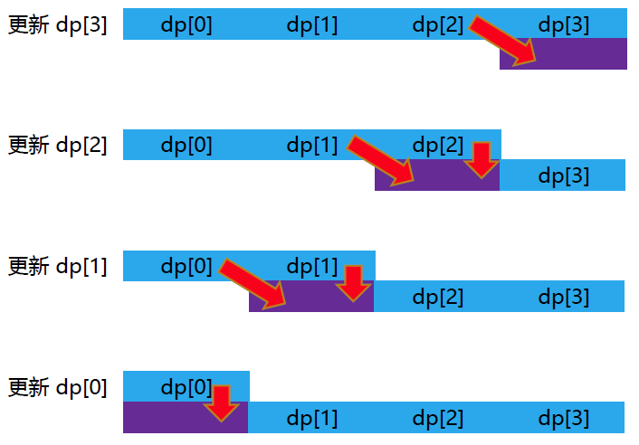

## 动态规划
动态规划（Dynamic Programming，DP），一种解决某种最优化问题的方法

动态规划的基本思想：把原问题分解为相对简单的子问题
 - 将原问题分成若干 **阶段** ，每个阶段对应若干个子问题，提取这些子问题的特征（**状态**）
 - 寻找各状态间的相互转移方式（**状态转移方程**）
 - 按顺序求解每一个阶段的问题

> 动态规划中每一个状态一定是由上一个状态推导出来的
> 
> 贪心算法没有状态推导，而是从局部直接选最优的

用动态规划解决问题的三个条件（了解即可）：最优子结构、无后效性、子问题重叠
 - 最优子结构：原问题的最优解，必然是通过子问题的最优解得到的（最优子结构保证了我们能够通过选取子问题的最优解最终拼成原问题的解）
 - 无后效性：前面状态的决策不会限制到后面的决策 （旅行商问题就是有后效性的场景，因为每个城市只能访问一次）
 - 重复子问题：一个子问题可以被重复利用到多个父亲状态中

动态规划解题思路：
1. 明确 **状态** ：确定 dp 数组以及下标的含义
2. 确定 **状态转移方程** ：用于描述不同状态之间的关系
3. dp 数组如何 **初始化** ：即，初始状态
4. 确定 **转移方向** ：转移方向描述的是推导出不同状态的解的先后关系
5. 举例推导 dp 数组

> 动规不仅仅只有状态转移方程，也需要弄清楚 dp 数组应该如何初始化，以及正确的转移方向
> 
> 初始状态描述的是整个转移方程推导的开始，是不需要经由别的状态就知道结果的状态
> 
> 之所以要明确转移方向，是因为我们不希望 "已知 B 状态只能由 A 状态推导过来，但是当我们想推导 B 时，发现 A 状态的结果我们还不知道” 类似事情发生

解动规题的一个很不好的习惯：不清楚 dp 数组的含义，不懂为什么这么初始化，递推公式背下来了，遍历顺序靠习惯就是这么写的，然后一鼓作气写出代码，如果代码能通过万事大吉，通过不了的话就凭感觉改一改

**做动规的题目，写代码之前一定要把状态转移在 dp 数组上的具体情况模拟一遍，确定最后推出的是想要的结果，然后再写代码**

写动规题目，代码出问题很正常，**找问题的最好方式就是把 dp 数组打印出来，看看究竟是不是按照自己思路推导的**
 - 如果打印出来和自己预先模拟推导是一样的，那么就是自己的递归公式、初始化或者遍历顺序有问题了
 - 如果和自己预先模拟推导的不一样，那么就是代码实现细节有问题

这样才是一个完整的思考过程，而不是一旦代码出问题，就毫无头绪的东改改西改改

[代码随想录：动态规划理论基础](https://www.programmercarl.com/%E5%8A%A8%E6%80%81%E8%A7%84%E5%88%92%E7%90%86%E8%AE%BA%E5%9F%BA%E7%A1%80.html#%E4%BB%80%E4%B9%88%E6%98%AF%E5%8A%A8%E6%80%81%E8%A7%84%E5%88%92)


### 数字金字塔

给定一个 $n$ 层的金字塔，求一条从最高点到底层任意点的路径，使得路径上数字之和最大。其中，每一步可以从当前点走到其左下方的点，也可以走到其右下方的点


比如，在上面的样例中，从 7 $\to$ 3 $\to$ 8 $\to$ 7 $\to$ 5 的路径经过数字的和最大

#### 二维数组求解
基本思想：分别求出到达每个点的最大路径，然后在所有点里面取最大值即可

动态规划解题思路：

1. **状态** 设计：用 `a[i][j]` 存储数字金字塔第 `i` 行第 `j` 列的数字，用 **`dp[i][j]`** 表示 **从顶点到达第 `i` 行第 `j` 列的最大数字和**，`i` 和 `j` 均从 `0` 开始

2. **状态转移方程** ：到达 `(i, j)` 的路径只可能从 `(i - 1, j - 1)` 或者 `(i - 1, j)` 走过来（如果在三角形的最左边或者最右边，那么它的上一个节点就只有一种情况），从中选择能使数字和最大的

        dp[i][j] = dp[i - 1][j] + a[i][j]； // i >= 1, j = 0
        dp[i][j] = dp[i - 1][j - 1] + a[i][j]；// i >= 1, j = i
        dp[i][j] = max(dp[i - 1][j - 1], dp[i - 1][j]) + a[i][j]；// i >= 1, 0 < j < i

3. **初始化** `dp` 数组：`f[0][0] = a[0][0]`
    - 根据状态转移方程可知，`dp[i][j]` 由 `dp[i - 1][j - 1]` 和 `dp[i - 1][j]` 推出，只要初始化顶点的状态，令 `dp[0][0] = a[0][0]` 即可

4. 确定 **转移方向** ：按照 `i` 从小到大，`j` 从小到大的顺序推导
   - 根据状态转移方程知，`i` 层节点的状态依赖于 `i - 1` 层节点的状态，所以 `i` 从小到大遍历
   - `j` 按照 从小到大的顺序 或者 从大到小的顺序 均可
   
5. 举例推导 `dp` 数组

最后，找出底层节点状态的最大值即可

代码实现：
```cpp
#include <iostream>
#include <vector>
using namespace std;

int Tower(vector<vector<int>> a) { // 动态规划求解数字金字塔问题
    int n = a.size();   // 金字塔的层数
    if (n <= 0)
        return -1;

    // 定义及初始化 dp 数组
    vector<vector<int>> dp(n, vector<int> (n, 0)); // 定义 dp 数组
    dp[0][0] = a[0][0]; // 初始状态

    // 根据状态转移方程进行遍历
    for (int i = 1; i < n; i++) {
        dp[i][0] = dp[i - 1][0] + a[i][0];
        for (int j = 1; j < i; j++)
            dp[i][j] = max(dp[i - 1][j - 1], dp[i - 1][j]) + a[i][j];
        dp[i][i] = dp[i - 1][i - 1] + a[i][i]; // 等价于 dp[i][i] = max(dp[i - 1][i - 1], dp[i - 1][i]) + a[i][i]; // 因为 dp[i - 1][i] = 0
    }

    // // 打印 dp 数组
    // cout << "The dp result is : " << endl;
    // for (int i = 0; i < n; i++) {
    //     for (int j = 0; j <= i; j++)
    //         cout << dp[i][j] << " ";
    //     cout << endl;
    // }

    // 找最大值
    int ans = 0;
    for (int i = 0; i < n; i++)
        ans = max(ans, dp[n - 1][i]);
    return ans;
}

int main() {
    // 输入
    int n = 0;
    cin >> n;
    vector<vector<int>> a(n, vector<int> (n, 0));
    for (int i = 0; i < n; i++)
        for (int j = 0; j <= i; j++)
            cin >> a[i][j];

    // 输出数字金字塔问题的结果
    cout << Tower(a) << endl;

    return 0;
}
```

时间复杂度：$O(n^2)$

空间复杂度：$O(n^2)$

[青舟智学：动态规划](https://www.boyuai.com/learn/courses/149/lessons/2633/steps/0?from=qz)


事实上，我们可以采用 **滚动数组** 优化上述动态规划算法，从而降低空间复杂度

#### 滚动数组解法

**滚动数组** 的基本思想：在 dp 数组中，用新的数据不断覆盖旧的数据，从而降低 dp 数组的维度

类似于 “踩石头过河” ：如果只有两块石头，可以一边走一边挪动石头，这样就可以顺利过河


在数字金字塔问题中，第 `i` 层状态仅仅依赖于第 `i - 1` 层状态，因此可以用一个大小为 $2 \times n$ 的二维数组 `dp` 来记录状态
 - 通过计算 `i & 1` 来判断 `i` 的奇偶性
 - 奇数行的节点状态填入 `dp[1]`
 - 偶数行的节点状态填入 `dp[0]`

代码实现：
```cpp
int Tower(vector<vector<int>> a) { // 滚动数组优化
    int n = a.size();
    if (n <= 0)
        return -1;

    // 定义及初始化 dp 数组
    vector<vector<int>> dp(2, vector<int> (n, 0));
    dp[0][0] = a[0][0]; // 初始状态

    // // 打印 dp 数组
    // cout << " The dp result is : " << endl;
    // cout << dp[0][0] << endl;

    // 根据状态转移方程进行遍历
    for (int i = 1; i < n; i++) {
        dp[i & 1][0] = dp[(i - 1) & 1][0] + a[i][0]; // // i & 1 是为了取 i 的奇偶性
        for (int j = 1; j < i; j++)
            dp[i & 1][j] = max(dp[(i - 1) & 1][j - 1], dp[(i - 1) & 1][j]) + a[i][j];
        dp[i & 1][i] = dp[(i - 1) & 1][i - 1] + a[i][i];

        // // 打印 dp 数组
        // for (int j = 0; j <= i; j++)
        //     cout << dp[i & 1][j] << " ";
        // cout << endl;
    }

    // 找最大值
    int ans = 0;
    for (int i = 0; i < n; i++)
        ans = max(ans, dp[(n - 1) & 1][i]);
    return ans;
}
```

时间复杂度：$O(n^2)$

空间复杂度：$O(n)$


#### 一维数组解法

进一步，可以发现 `(i, j)` 的状态仅依赖于 `(i - 1, j - 1)` 和 `(i - 1, j)` 的状态，所以，我们可以仅用一个大小为 `n` 的一维数组 `dp` 来记录状态，并按照 **从右到左** 的顺序更新数组即可
 - 状态设计：在计算 `(i, j)` 节点的状态前，`dp[j]` 表示从顶点到 `(i - 1, j)` 节点的最大数字和；按状态转移方程更新后，`dp[j]` 表示从顶点到 `(i, j)` 节点的最大数字和
 - 状态转移方程：

        dp[j] = dp[j - 1] + a[i][j]; // j = i
        dp[j] = max(dp[j - 1], dp[j]) + a[i][j]; // 0 < j < i
        dp[j] = dp[j] + a[i][j];    // j = 0

 - 初始化 `dp` 数组：所有元素均初始化为 `0`
 - 转移方向：`i` 从小到大，`j` 从大到小


以 `i = 3` 为例：

[^_^]: 具体转移过程的文字说明被注释掉了

     - `(3, 3)` 节点的状态取决于 `(2, 2)`，故而 `dp[3] = dp[2] + a[3][3]`
     - `(3, 2)` 节点的状态取决于 `(2, 1)` 和 `(2, 2)` ，故 `dp[2] = max(dp[1], dp[2]) + a[3][2]`
     - `(3, 1)` 节点的状态取决于 `(2, 0)` 和 `(2, 1)` ，故 `dp[1] = max(dp[0], dp[1]) + a[3][1]`
     - 最左边的 `(3, 0)` 节点的状态取决于 `(2, 0)`，故而 `dp[0] = dp[0] + a[3][0]`




代码实现：

```cpp
int Tower(vector<vector<int>> a) { // 动规：一维 dp 数组解法
    int n = a.size();
    if (n <= 0)
        return -1;

    // 定义及初始化 dp 数组
    vector<int> dp(n, 0);   // 长度为 n ，所有元素值为 0
   dp[0] = a[0][0];

    // // 打印 dp 数组
    // cout << " The dp result is : " << endl;
    // cout << dp[0] << endl;

    // 根据状态转移方程进行遍历
    for (int i = 1; i < n; i++) { // i 从小到大
        dp[i] = dp[i - 1] + a[i][i];
        for (int j = i - 1; j >= 1; j--) // j 从大到小
            dp[j] = max(dp[j - 1], dp[j]) + a[i][j];
        dp[0] = dp[0] + a[i][0];

        // // 打印 dp 数组
        // for (int j = 0; j <= i; j++)
        //     cout << dp[j] << " ";
        // cout << endl;
    }

    // 找最大值
    int ans = 0;
    for (int j = 0; j < n; j++)
        ans = max(ans, dp[j]);
    return ans;
}
```

时间复杂度：$O(n^2)$

空间复杂度：$O(n)$


## 0-1 背包
给定 $n$ 件物品和一个容量为 $V$ 的背包，第 $i$ 个物品的体积为 $v[i]$ ，价值为 $p[i]$ 。每件物品只能用一次。如何选择装入背包的物品，使得获得的总价值最大？

### 动态规划求解

考虑到每一件物品只有两个状态，选或者不选，以第 $i$ 个物品为例
 - 不选取第 $i$ 个物品，原问题变成 “从余下的 $n - 1$ 件物品中选择，放入容量为 $V$ 的背包”
 - 选取第 $i$ 个物品，原问题变成 “从余下的 $n - 1$ 件物品中选择，放入容量为 $V - v[i]$ 的背包”

原问题的解可以由子问题的最优解拼接得到，故而可以采用动态规划算法求解

解题思路：

1. **状态** 设计：定义一个二维数组 `dp` ，`dp[i][j]` 表示：**在前 `i` 个物品中选择物品，放进容量为 `j` 的背包内，其最大价值为 `dp[i][j]`** ，其中，`i` 和 `j` 均从 `0` 开始索引

2. 确定 **状态转移方程** ：`dp[i][j] = max(dp[i - 1][j], dp[i - 1][j - v[i]] + p[i])`
    - 若不放物品 `i` ：选择前 `i - 1` 件物品时的可用容量为 `j`，其最大价值为 `dp[i - 1][j]` ，所以 `dp[i][j] = dp[i - 1][j]`
    - 若放物品 `i` ：选择前 `i - 1` 件物品时的可用容量为 `j - v[i]` ，其最大价值为 `dp[i - 1][j - 1]` ，所以，总价值为 `dp[i][j] = dp[i - 1][j - v[i]] + p[i]`
    - 综合两种情况，从中选择总价值更大的，即，`dp[i][j] = max(dp[i - 1][j], dp[i - 1][j - v[i]] + p[i])`

3. **初始化** `dp` 数组：
    - 若背包容量 `j` 为 `0` ，则背包总价值一定为 `0` ，即 `dp[i][0] = 0`
    - 根据状态转移方程知，`i` 由 `i - 1` 推导出，故而需要初始化 `i = 0` 的情况，即，初始化所有的 `dp[0][j]` ：若 `j < v[0]` ，编号为 `0` 的物品的体积超出背包可用容量，总价值为 `0` ，即，`dp[0][j] = 0` ；若 `j >= v[0]` ，编号为 `0` 的物品可以放进背包，此时背包最大价值一定为 `p[0]` ，即， `dp[0][j] = p[0]`

    ```cpp
    // 定义及初始化 dp 数组
    vector<vector<int>> dp(n, vector<int>(V + 1, 0)); // 所有元素均初始化为 0
    for (int j = v[0]; j <= V; j++) {   // 处理 j >= v[0] 时的 dp[0][j]
        dp[0][j] = p[0];
    }
    ```

4. 确定 **遍历顺序** ：有两个遍历的维度，物品 和 背包容量 。那么，外层的遍历是遍历 物品 还是 背包容量 呢？在本例中，外层遍历 物品 或 背包容量 均可
     - 根据状态转移方程，`dp[i][j]` 由 `dp[i-1][j]` 和 `dp[i - 1][j - weight[i]]` 推导出来，而这两者都在 `dp[i][j]` 的左上角方向（包括正上方向），所以外层遍历 `i` 或者 `j` 都不影响 `dp[i][j]` 的递推

    ```cpp
    // 外层遍历 物品
    for (int i = 1; i < n; i++) { // 遍历物品（物品 0 已经在初始化 dp 数组时处理过）
        for (int j = 0; j <= V; j++) { // 遍历背包容量
            if (j < v[i])   // 容量不足以放下物品 i
                dp[i][j] = d[i - 1][j];
            else
                dp[i][j] = max(dp[i - 1][j], dp[i - 1][j - v[i]] + p[i]);
        }
    }

    // 外层遍历 背包容量
    for (int j = 0; j <= V; j++) { // 遍历背包容量
        for (int i = 1; i < n; i++) { // 遍历物品
            if (j < v[i])
                dp[i][j] = dp[i - 1][j];
            else
                dp[i][j] = max(dp[i - 1][j], dp[i - 1][j - v[i]] + p[i]);
        }
    }
    ```

5. 举例推导 `dp` 数组

最后所求结果为 `dp[n - 1][V]`

>  `dp` 数组的初始化，一定要和 `dp` 数组的定义吻合
> 
> 理清背包问题的遍历顺序，关键在于根据状态转移方程确定递推方向

代码实现：
```cpp
int Package(int n, int V, vector<int> v, vector<int> p){  // 二维数组解法

    // 定义 dp 数组及其初始化
    vector<vector<int>> dp(n, vector<int>(V + 1, 0));
    for (int j = v[0]; j <= V; j++) {
        dp[0][j] = p[0];
    }

    // 动态规划的遍历
    for (int i = 1; i < n; i++) { // 遍历物品（物品 0 已经在初始化 dp 数组时处理过）
        for (int j = 0; j <= V; j++) { // 遍历背包容量
            if (j < v[i])   // 容量不足以放下物品 i
                dp[i][j] = dp[i - 1][j];
            else
                dp[i][j] = max(dp[i - 1][j], dp[i - 1][j - v[i]] + p[i]);
        }
    }

    return dp[n - 1][V];

}
```

时间复杂度：$O(n V)$，$n$ 为物品数量，$V$ 为背包最大容量

空间复杂度：$O(n V)$

[代码随想录：0-1背包的二维数组解法](https://www.programmercarl.com/%E8%83%8C%E5%8C%85%E7%90%86%E8%AE%BA%E5%9F%BA%E7%A1%8001%E8%83%8C%E5%8C%85-1.html)

类似地，可以采用 **滚动数组** 对该动态规划算法进行优化


### 滚动数组解法

类似于此前的数字金字塔问题，这里不再赘述

### 一维数组解法

将 dp 数组定义为一维数组，降低空间复杂度

解题思路：

1. 定义一维数组 `dp` ：`dp[j]` 表示 容量为 `j` 的背包的最大价值，`0 <= j <= V`

2. 递推公式：`dp[j] = max(dp[j], dp[j - v[i]] + p[i])` 
    - 不选物品 `i` ：`dp[j]` 维持不变，等价于二维数组解法中的 `dp[i][j] = dp[i - 1][j]`
    - 选物品 `i` ：更新 `dp[j] = dp[j - v[i]] + p[i]`，等价于二维数组解法中的 `dp[i][j] = dp[i - 1][j - v[i]] + p[i]`
    - 二者相比取最大

3. 初始化 `dp` 数组：所有元素均初始化为 `0`

4. 一维 `dp` 数组遍历顺序：
    - **外层遍历 物品 ，内层遍历 背包容量** （不可交换）
    - **物品** 按 **从小到大** 的顺序遍历，**背包容量** 按 **从大到小** 的顺序遍历

5. 举例推导 `dp` 数组

代码实现：
```cpp
int Package(int n, int V, vector<int> v, vector<int> p){ // 一维数组解法

    // 定义 dp 数组及其初始化
    vector<int> dp(V + 1, 0);

    // 遍历
    for (int i = 1; i < n; i++) // 遍历物品
        for (int j = V; j >= v[i]; j--) // 遍历背包容量（ j 逆序遍历至 v[i] 即可，因为 j < v[i] 时，dp[j] 不会更新）
            dp[j] = max(dp[j], dp[j - v[i]] + p[i]);

    // 返回结果
    return dp[V];
}
```

时间复杂度：$O(n V)$，$n$ 为物品数量，$V$ 为背包最大容量

空间复杂度：$O(V)$


> 当遍历顺序为 “外层遍历背包容量 `j` ，内层遍历物品 `i`” 时：
>  - 若按从大到小顺序遍历 `j` ：由 `dp[j] = max(dp[j], dp[j - v[i]] + p[i])` 知，每个 `dp[j]` 对应的背包只会放置一个物品。因为在更新 `dp[j]` 时，对任意物品 `i`，状态 `d[j - v[i]]` 始终为 `0` （自初始化之后 `d[j - v[i]]` 尚未被更新过），所以只会选择（在容量允许范围内）价值最大的一件物品
>  - 若按从小到大顺序遍历 `j` ：由 `dp[j] = max(dp[j], dp[j - v[i]] + p[i])` 知，物品会被多次放入背包。例如，令 `v[] = {1, 2, 3}` ，`p[] = {15, 20, 30}` ，则：更新 `dp[1]` 时，会将物品 `0` 放入背包；更新 `dp[2]` 时，执行 `dp[2] = max(dp[2], dp[2 - v[0]] + p[0])` 时会再次将物品 `0` 放入背包，即，物品 `0` 被多次加入背包
>
> 当遍历顺序为 “外层遍历遍历物品 `i`，内层遍历背包容量 `j`”，但如果按照 从小到大顺序 遍历 `j` ：物品同样会被多次放入背包
> 
> 上述结论是通过 "模拟 `dp` 数组更新过程" 得出的，究其本质，都是由状态转移方程所决定的

> 因此，在用一维 `dp` 数组解 0-1 背包问题时，需要注意其遍历顺序与二维数组解法具有很大差异。所以最好是先根据实际数据，模拟一遍 `dp` 数组的更新


[代码随想录：0-1背包的一维数组解法](https://www.programmercarl.com/%E8%83%8C%E5%8C%85%E7%90%86%E8%AE%BA%E5%9F%BA%E7%A1%8001%E8%83%8C%E5%8C%85-2.html#%E4%B8%80%E7%BB%B4dp%E6%95%B0%E7%BB%84-%E6%BB%9A%E5%8A%A8%E6%95%B0%E7%BB%84)

## 完全背包

[代码随想录：完全背包](https://www.programmercarl.com/%E8%83%8C%E5%8C%85%E9%97%AE%E9%A2%98%E7%90%86%E8%AE%BA%E5%9F%BA%E7%A1%80%E5%AE%8C%E5%85%A8%E8%83%8C%E5%8C%85.html#%E5%AE%8C%E5%85%A8%E8%83%8C%E5%8C%85)