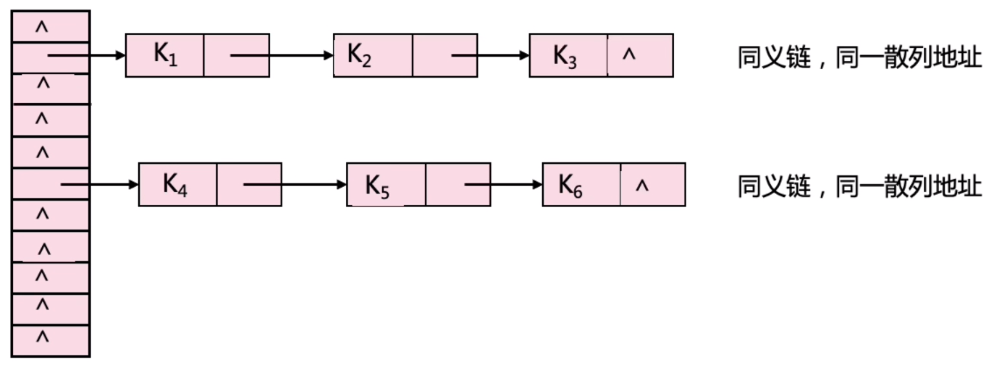

哈希表（Hash table ，也被称为散列表）是根据关键码的值而直接进行访问的数据结构

以 "key-value" 形式存储数据：任意的键值 `key` 都唯一对应到内存中的某个位置，只需要输入查找的键值，就可以快速地找到其对应的 `value`

哈希表可以近似理解成数组，哈希表中的关键码就是数组的索引下标，通过下标可以直接访问数组的元素

**一般哈希表都是用来快速判断一个元素是否出现集合当中**

哈希表 **以空间换时间** ，因为需要额外的 `数组` 、`set` 或 `map` 来存放数据，才能实现快速查找

## 哈希函数

哈希函数（hash function）将关键码映射为哈希表的索引

构造哈希函数的要求：
 - 定义域必须包含全部需要存储的关键码，而值域的范围则依赖于散列表的大小或地址范围。
 - 函数计算出来的地址应该能等概率、均匀地分布在整个地址空间中，从而减少冲突的发生
 - 函数应尽量简单，能够在较短的时间内计算出任一关键码对应的散列地址

常用的哈希函数
 - 直接地址法
   - 直接将关键码值作为地址 `H(key) = key` 或 做一个简单的线性映射 `H(key) = a × key + b`
 - 除留取余法
   - 最常用的一种哈希函数
   - 保证函数值是一个合法的下标
   - `H(key) = key MOD p` ，其中 `p` 是数组的大小，`p` 最好为质数，这样可以使得函数值分布更均匀
 - 数字分析法
   - 适用于关键码值范围比较大的情况（并非每一位都有区分意义）
   - 对所有关键码，分析每一位上的数字分布。取数字分布均匀的位作为地址的组成部分
 - 平方取中法
   - 适用于关键码中各位的分布都比较均匀，但关键码的值域比数组规模大（每一位都有区分意义）
   - 将关键码平方后，取其结果的中间各位作为散列函数值
   - 由于中间各位和每一位数字都有关系，因此均匀分布的可能性较大
   - 中间部分究竟要选取几位，依赖于哈希表的单元总数
 - 折叠法
   - 如果关键字相当长，以至于和哈希表的单元总数相比大得多时，可采用此法
   - 选取一个长度后，将关键码按此长度分组相加

## 哈希碰撞

哈希碰撞是指：不同的关键码映射到同一个地址
 - 也称之为 冲突

两类解决方案：

1. 闭散列表：利用当前散列表中的空余单元
    - 线性探测法：$H_i = (H_{i-1} + 1) \text{ mod size}$
      - $H_{i-1}$ 是最近计算到的探测点（ $H_0$ 是原始的散列位置），$H_i$ 是要计算的新的探测点
    - 二次探测法：$H_i = (H_0 + i^2) \text{ mod size}$
    - 再次散列法：$H_i = (H_0 + i * \text{hash}^2(x)) \text{ mod size}$
2. 开散列表：将散列到同一地址的节点组织成一个单链表，存储散列表的数组中保存的是每个单链表的起始地址


[^_^]: 被注释掉了

    ### 线性探测法

    当散列发生冲突时，探测下一个单元，直到发现一个空单元，于是元素将存储在该空单元

    当需要查找元素时：

        计算 addr = H(key)
        从 addr 开始遍历数组
            if (找到)  返回 true
            if (内容为空)  返回 false 
            ++addr
        返回 false


    当需要删除元素时：采用迟删除方式，即，先找到该元素，做一个删除标记，告知程序 “该地址曾经有内容”
    - 若直接删除，后续查找到该地址时，会发现内容为空而直接返回 `false` ，但实际上所查找元素可能位于该地址之后，故造成查找错误

    #### 类定义

    数据成员：一个动态数组、指向函数的指针
    - 数组元素类型：存储数据及存储单元的状态

    成员函数：插入、查找和删除以及构造析构、一个缺省的关键码转换函数

    当关键码不都是整数时，由用户提供将关键码转成整数的函数

    如果关键码本身就是整数，不需要用户提供这个函数：为指向函数的指针成员提供一个缺省值

    类定义的实现代码：

    ```cpp
    template <class KEY, class OTHER>
    class closeHashTable:public dynamicSearchTable<KEY, OTHER>  {
    private:
        struct node {                 // 哈希表的节点类
                SET <KEY, OTHER>  data;
                int   state;            // 0 -- empty   1 -- active   2 -- deleted
            node() {state = 0;}
        };
        node *array;
        int  size;
        int (*key)(const KEY &x);
        static int defaultKey(const int &x) {return x;} 
    public: 
        closeHashTable(int length = 101, int (*f)(const KEY &x) = defaultKey) ;
        ~closeHashTable() {delete [] array;}
        SET<KEY, OTHER> *find(const KEY &x) const;
        void insert(const SET<KEY, OTHER> &x);
        void remove(const KEY &x) ;
    };
    ```

    构造函数：构造一个空的哈希表
    ```cpp
    template <class Type>
    closeHashTable<Type>::closeHashTable (int length, int (*f)(const Type  &x)) {
        size = length;
        array = new node[size];
        key = f;
    } 
    ```

    `insert` 函数：从哈希函数的映射地址开始寻找一个空单元或被删单元，哈希函数采用除留余数法
    ```cpp
    template <class KEY, class OTHER>
    void closeHashTable<KEY, OTHER>::insert(const SET<KEY, OTHER> &x) {
        int initPos, pos ;

        initPos = pos = key(x.key) % size;
        do {  
            if (array[pos].state != 1) { // 找到空单元或被删单元
                array[pos].data = x; 
                array[pos].state = 1; 
                return;
            }
            pos = (pos + 1) % size;
        } while (pos != initPos);
    }
    ```

    `find` 函数：从散列地址开始寻找被查元素，直到找到该元素或空单元
    ```cpp
    template <class KEY, class OTHER>
    SET<KEY, OTHER> *closeHashTable<KEY, OTHER>::find(const KEY &x) const {
        int initPos, pos ;

        initPos = pos = key(x) % size;
        do {
            if (array[pos].state == 0) return NULL;                 // 没有找到
            if (array[pos].state == 1 && array[pos].data.key == x)  // 找到
                return (SET<KEY,OTHER> *)&array[pos];
            pos = (pos + 1) % size;
        } while (pos != initPos);
        return NULL;
    }
    ```

    `remove` 函数：从散列地址开始寻找被删元素，找到后做删除标志
    ```cpp
    template <class KEY, class OTHER>
    void closeHashTable<KEY, OTHER>::remove(const KEY &x) {
        int initPos, pos ;

        initPos = pos = key(x) % size;
        do {
            if (array[pos].state == 0) return;
            if (array[pos].state == 1 && array[pos].data.key == x) {     // 找到，删除
                array[pos].state = 2;
                return;
            }
            pos = (pos+1) % size;
        } while (pos != initPos);
    }
    ```

    以上所定义的线性探测法类的缺陷：

    1. 没有保证表长为素数
        - 在构造函数中增加素数检测。如果实际参数的表长不是素数，则将大于等于表长的最小素数作为表长
    2. 运行一段时间以后，所有数组元素都成为 active 或 deleted ，所有操作的时间性能都是 $O(N)$
        - 可以增加一个整理散列表的功能，将被删元素真正删去
        - 可以增加一个数据成员记录 deleted 的单元数，自动调用整理函数


    ### 二次探测法

    ### 开散列表

    特点：

    - 将散列到同一地址的结点组织成一个单链表

    - 存储散列表的数组中保存的是每个单链表的起始地址

    开散列表的示意图：

    

    开散列表类：

    ```cpp
    template <class KEY, class OTHER>
    class openHashTable:public dynamicSearchTable<KEY, OTHER> {
    private:
        struct node {    // 开散列表中链表的节点类
            SET<KEY, OTHER>  data;
            node             *next; 
            node (const SET<KEY, OTHER> &d, node *n = NULL)    { data = d;  next = n;}
            node () {next = NULL;}
        };
        node **array;                          // 指针数组
        int  size;
        int (*key)(const KEY &x);
        static int defaultKey(const int &x) { return x;}
    public: 
        openHashTable(int length = 101,   int (*f)(const KEY &x) = defaultKey);
        ~openHashTable();
        SET<KEY, OTHER> *find(const KEY &x) const;
        void insert(const SET<KEY, OTHER> &x);
        void remove(const KEY &x);
    };
    ```

    构造函数：申请一动态指针数组，并设所有元素值为空指针

    ```cpp
    template <class KEY, class OTHER>
    openHashTable<KEY, OTHER>::openHashTable (int length,  int (*f)(const KEY  &x)) {
        size = length;
        array = new node*[size];
        key = f;
        for (int i = 0; i < size; ++i)
            array[i] = NULL;
    }
    ```

    析构函数：析构函数不仅要释放存放散列表的数组的空间，还要释放每个单链表中所有结点的空间

    ```cpp
    template <class KEY, class OTHER>
    openHashTable<KEY, OTHER>::~openHashTable() {
        node *p, *q;
        for (int i = 0; i< size; ++i) {           
            p = array[i]; 
            while (p != NULL) { 
                q= p->next; 
                delete p;
                p = q; 
            }
        }
        delete [] array;
    } 
    ```

    `insert` 函数：找到哈希地址，在相应的链表头上插入元素

    ```cpp
    template <class KEY, class OTHER>
    void openHashTable<KEY, OTHER>::insert(const SET<KEY, OTHER> &x) {
        int pos ;
        node *p;
        pos = key(x.key) % size;
        array[pos] = new node(x, array[pos]);
    }
    ```

    `remove` 函数：找到哈希地址，在相应的链表寻找并删除元素
    ```cpp
    template <class KEY, class OTHER>
    void openHashTable<KEY, OTHER>:: remove(const KEY &x) {
        int pos = key(x) % size;
        node * p = array[pos];, *q;
        if (array[pos] == NULL) return;
        if (array[pos]->data.key == x) {    
            array[pos] = p->next;
            delete p;   
            return;	   
        }
        while (p->next != NULL   && !(p->next->data.key == x) )    p = p->next;
        if (p->next != NULL) {
            q = p->next;  
            p->next = q->next;  
            delete q;    
        }
    }
    ```

    `find` 函数：找到哈希地址，在相应的链表寻找元素
    ```cpp
    template <class KEY, class OTHER>
    SET<KEY, OTHER> *openHashTable<KEY, OTHER> ::find(const KEY &x) const
    {
        int pos;
        node *p;

        pos = key(x) % size;
        p = array[pos];

        while (p != NULL && !(p->data.key == x) )
            p = p->next;

        if (p == NULL) return NULL;
        else return (SET<KEY, OTHER> *)p;
    }
    ```


    [青舟智学：哈希表](https://www.boyuai.com/learn/courses/152/lessons/2371/steps/0?from=qz)

[CodeSheep：哈希表详解](https://mp.weixin.qq.com/s/UanDueZi3MwlcKYGMNQPGg)

理想情况下，哈希查找的时间复杂度是 $O(1)$


## 常见的哈希结构

三种哈希结构
 - 数组
 - set （集合）
 - map （映射）

### 集合 `set`

C++ 的 set 实现：
 - `std::set` ：底层实现为红黑树，`key` 值是有序的
 - `std::multiset` ：底层实现是红黑树，`key` 有序
 - `std::unordered_set` ：底层实现是哈希表，`key` 无序

| set | 底层实现 | `key` 是否有序 | `key` 是否可以重复 | 能否更改 `key` | 查询效率 | 增删效率
| :-: | :-: | :-: | :-: | :-: | :-: | :-: | :-: |
| `std::set` | 红黑树 | 有序 | 否 | 否 | $O(\log {n})$ | $O(\log {n})$ |
| `std::multiset` | 红黑树 | 有序 | 是 | 否 | $O(\log{n})$ | $O(\log{n})$ |
| `std::unordered_set` | 哈希表 | 无序 | 否 | 否 | $O(1)$ | $O(1)$ |

> **红黑树** 是一种平衡二叉搜索树，所以 `key` 值是有序的，但 `key` 不可以修改，改动 `key` 值会导致整棵树的错乱，所以只能删除和增加


1. 若要使用集合来解决哈希问题，优先使用 `unordered_set` ，因为它的查询和增删效率是最优的

2. 如果需要集合是有序的，那就用 `set` 

3. 如果不仅要求有序还要有重复数据，那么就用 `multiset`

### 映射 `map`

C++ 的 map 实现：
 - `std::map` ：底层实现是红黑树，`key` 有序
 - `std::multimap` ：底层实现是红黑树，`key` 有序
 - `std::unordered_map` ： 底层实现为哈希表，`key` 无序

| map | 底层实现 | `key` 是否有序 | `key` 是否可以重复 | 能否更改 `key` | 查询效率 | 增删效率
| :-: | :-: | :-: | :-: | :-: | :-: | :-: | :-: |
| `std::map` | 红黑树 | 有序 | 否 | 否 | $O(\log {n})$ | $O(\log {n})$ |
| `std::multimap` | 红黑树 | 有序 | 是 | 否 | $O(\log {n})$ | $O(\log {n})$ |
| `std::unordered_map` | 哈希表 | 无序 | 否 | 否 | $O(1)$ | $O(1)$ |


虽然 `std::set` 、`std::multiset` 的底层实现是红黑树，不是哈希表，但是 `std::set`、`std::multiset` 依然使用哈希函数来做映射，只不过底层的符号表使用了红黑树来存储数据，所以使用这些数据结构来解决映射问题的方法，我们依然称之为哈希法。`map` 也是一样的道理


另，`hash_set` 、`hash_map`  和 `unordered_set` 、`unordered_map` 功能一致，区别在于是否被引入标准库
 - `unordered_set` 和 `unordered_map` 被引入了  C++ 11 标准库
 - `hash_set` 和 `hash_map` 并未被引入 C++ 11 标准库


[代码随想录：哈希表理论基础](https://www.programmercarl.com/%E5%93%88%E5%B8%8C%E8%A1%A8%E7%90%86%E8%AE%BA%E5%9F%BA%E7%A1%80.html#%E5%B8%B8%E8%A7%81%E7%9A%84%E4%B8%89%E7%A7%8D%E5%93%88%E5%B8%8C%E7%BB%93%E6%9E%84)