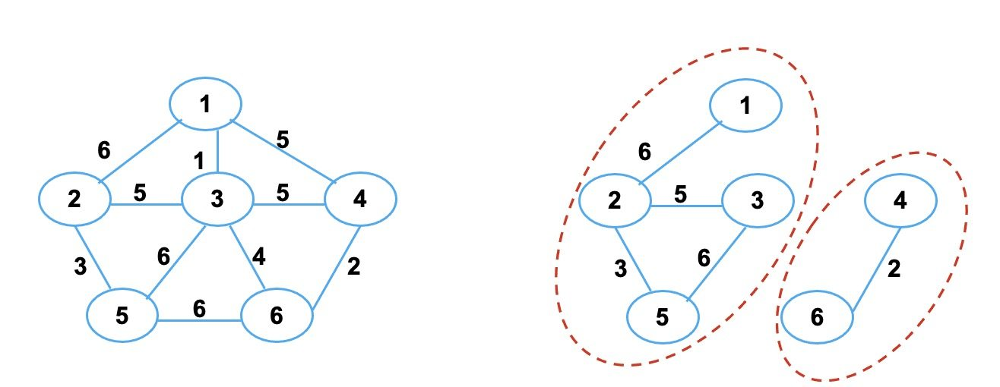
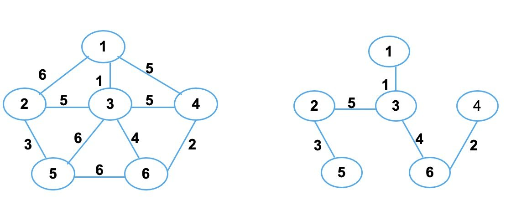

图 由 顶点集 和 边集 组成，即，$G = (V, E)$
 - $V$ 是顶点的集合，顶点代表数据元素
 - $E$ 是连接顶点的边的集合，边代表元素间的关系

根据边的方向性，可将图分为 有向图 和 无向图
 - 有向图：边有方向，边用 `<>` 表示，例如，`<A, B>` 表示从 A 出发到 B 的一条边
 - 无向图：边无方向，用 `()` 表示，例如，`(A, B)` 表示顶点 A 和 B 之间有一条边

另外，可以根据顶点之间的关系为边设置权重
 - 加权图：边被赋予一个权值 `W`
 - 加权有向图：边表示为 `<A, B, W>`
 - 加权无向图：边表示为 `(A, B, W)`


## 图的操作

基本操作：
 - 构造一个由若干个节点、0 条边组成的图
 - 判断两个节点之间是否有边存在
 - 在图中添加或删除一条边
 - 返回图中的节点数或边数
 - 按某种规则遍历图中的所有节点

一些与应用密切关联的操作
 - 拓扑排序
 - 关键路径
 - 找最小生成树
 - 找最短路径等

## 图的抽象类

以加权有向图为例

```cpp
template <class TypeOfVer, class TypeOfEdge> // 数据元素的类型 TypeOfVer ，边的权值的类型 TypeOfEdge
class graph {
    public:
        virtual void insert(TypeOfVer x, TypeOfVer y, TypeOfEdge w) = 0;
        virtual void remove(TypeOfVer x, TypeOfVer y) = 0;
        virtual bool exist(TypeOfVer x, TypeOfVer y) const = 0;
        virtual ~graph() {}
        int numOfVer() const {return Vers;}
        int numOfEdge() const {return Edges;}

    protected:
        int Vers, Edges;
};
```


## 图的术语

度：图中连接于某一节点的边的总数
 - 入度：有向图中进入某一节点的边数
 - 出度：有向图中离开某一节点的边数


子图：设 $G = (V, E)$ 和 $G' = (V', E')$ ，若 $V' \subset V$ 且 $E' \subset E$ ，则称 $G'$ 是 $G$ 的子图

路径：顶点的序列
 - 简单路径：如果一条路径上的所有节点，除了起始节点和终止节点可能相同外，其余的节点都不相同
 - 环：环是一条简单路径，其起始节点和终止节点相同，且路径长度至少为 1

路径长度
 - 非加权的路径长度：组成路径的边数
 - 加权路径长度：路径上所有边的权值之和

连通性：两点之间存在路径
 - 无向图
   - 连通：顶点 $v$ 至 $v'$ 之间有路径存在
   - 连通图：任意两点之间都连通的无向图，例如，左下图是一个连通图，右下图不是
   - 连通分量：非连通图中的极大连通子图，例如，右下图的两个红圈就是连通分量

  

 - 有向图
   - 强连通图：顶点 $v$ 至 $v'$ 之间有路径存在，例如，左下图是一个强连通图，右下图不是
   - 强连通分量：非强连通图中的极大连通子图，例如，右下图的三个红圈就是连通分量

   - 弱连通图：如有向图 $G$ 不是强连通的，但如果把它看成是无向图时是连通的，则它是一个弱连通图，例如右下图


完全图
 - 无向完全图：任意两个节点之间都有边的无向图，例如左下图
 - 有向完全图：任意两个节点之间都有弧的有向图，例如右下图


生成树：连通图的极小连通子图，如下图中右侧两图就是左图的生成树
 - 包含图的所有 $n$ 个节点和 $n - 1$ 条边
 - 在生成树中添加一条边之后，必定会形成回路或环


最小生成树：加权无向图的所有生成树中 边的权值和最小的生成树 ，如下图中右图就是左图的最小生成树




## 图的存储

图的顶点集合 $V$ 存储在一个数组或者链表中

边的集合的表示方式通常有两种
 - 邻接矩阵
 - 邻接表

### 邻接矩阵


边的集合 $E$ 用一个 $n \times n$ 的矩阵表示

对于有向图，如果 $i$ 至 $j$ 存在有向边，$A[i, j] = 1$ ；如果不存在有向边，$A[i, j] = 0$
 - 节点 $i$ 的出度：第 $i$ 行元素之和
 - 节点 $j$ 的入度：第 $j$ 列元素之和


对于无向图，如果 $i$ 至 $j$ 存在一条边，$A[i, j] = 1$ ；如果不存在一条边，$A[i, j] = 0$
 - 矩阵 $A$ 是一个对称矩阵
 - 节点 $i$ 的度：第 $i$ 行 或者 第 $i$ 列 元素之和


对于加权图，如果 $i$ 至 $j$ 有一条边并且权值为 $a$ ，则 $A[i, j] = 1$ ；如果 $i$ 至 $j$ 没有边，则 $A[i, j]$ 为空或其他标志（例如，定义为 正无穷 $+ \infty$ ）


性能分析

 - 优点：基本操作都是 $O(1)$ 的时间复杂度，不仅能找到出发的边，也能找到到达的边

 - 缺点：即使边的数量远小于 $n^2$ ，也需 $n^2$ 个单元的内存 （大多数的图的边数都远小于 $n^2$ ）

[^_^]: 被注释掉了

    #### 邻接矩阵类

    类定义：

    ```cpp
    template <class TypeOfVer, class TypeOfEdge>
    class adjMatrixGraph::public graph<TypeOfVer, TypeOfEdge> {
    public:
        adjMatrixGraph(int vSize, const TypeOfVer d[],  const TypeOfEdge noEdgeFlag);
        void insert(TypeOfVer x, TypeOfVer y, TypeOfEdge w);
        void remove(TypeOfVer x, TypeOfVer y);
        bool exist(TypeOfVer x, TypeOfVer y) const;
        ~adjMatrixGraph() ；
    
    private:
        TypeOfEdge **edge;                   // 指向邻接矩阵的指针
        TypeOfVer *ver;                      // 指向顶点数组的指针
        TypeOfEdge noEdge;                   // 邻接矩阵中 不存在边 的标志
        int find(TypeOfVer v) const {        // 查找顶点在数组中的索引下标
            for (int i = 0; i < Vers; ++i)
                if (ver[i] == v) return i;
        }  
    };
    ```

    构造函数

    ```cpp
    template <class TypeOfVer, class TypeOfEdge>
    adjMatrixGraph<TypeOfVer, TypeOfEdge>::adjMatrixGraph (int vSize, const TypeOfVer d[], TypeOfEdge noEdgeFlag) {
        int i, j;
        // 节点数和边数存储到父类的成员变量中
        Vers = vSize;   
        Edges = 0;
        noEdge = noEdgeFlag;

        ver = new TypeOfVer[vSize];
        for (i = 0; i < vSize; ++i)
            ver[i] = d[i];  

        edge = new TypeOfEdge*[vSize];
        for (i = 0; i < vSize; ++i) {
            edge[i] = new TypeOfEdge[vSize];
            for (j = 0; j < vSize; ++j)
                edge[i][j] = noEdge;
        }
    }
    ```

    析构函数
    ```cpp
    template <class TypeOfVer, class TypeOfEdge>
    adjMatrixGraph<TypeOfVer, TypeOfEdge>::~adjMatrixGraph() {
        delete [] ver;
        for (int i = 0; i < Vers; ++i) 
            delete [] edge[i];
        delete [] edge;
    }
    ```

    `insert` 函数
    ```cpp
    template <class TypeOfVer, class TypeOfEdge>
    void adjMatrixGraph<TypeOfVer, TypeOfEdge> ::insert(TypeOfVer x, TypeOfVer y, TypeOfEdge w) { 
        int u = find(x), v = find(y); 
        edge[u][v] = w;
        ++Edges;
    }
    ```

    `remove` 函数
    ```cpp
    template <class TypeOfVer, class TypeOfEdge>
    void adjMatrixGraph<TypeOfVer, TypeOfEdge>::remove(TypeOfVer x, TypeOfVer y) { 
        int u = find(x),  v = find(y); 
        edge[u][v] = noEdge;
        --Edges;
    }
    ```


### 邻接表

邻接表是图的标准存储方式

顶点集合 $V$ ：用数组或单链表的形式存放所有的节点值，如果节点数 $n$ 固定，则采用数组形式，否则可采用单链表的形式

边集合 $E$ ：同一个节点出发的所有边组成一个单链表
 - 如果是加权图，单链表的每个节点中还要保存权值


优点：
 - 内存 = 节点数 + 边数
 - 处理时间：节点数 + 边数，即，$O(\vert V \vert + \vert E \vert )$

缺点：
 - 确定从 $i$ 到 $j$ 是否有边，最坏需要 $O(n)$ 的时间复杂度
 - 有向图中寻找进入某节点的边，非常困难
 - 无向图同一条边表示两次，边表空间浪费一倍


[^_^]: 被注释掉了

    #### 邻接表类

    类定义

    ```cpp
    template <class TypeOfVer, class TypeOfEdge>
    class adjListGraph::public graph<TypeOfVer, TypeOfEdge> {
    public:      
        adjListGraph(int vSize, const TypeOfVer d[]);
        void insert(TypeOfVer x, TypeOfVer y, TypeOfEdge w);
        void remove(TypeOfVer x, TypeOfVer y);
        bool exist(TypeOfVer x, TypeOfVer y) const;
        ~adjListGraph();
        
    private:    
        struct edgeNode {                   
            int end;                          
            TypeOfEdge weight;                
            edgeNode *next;
            edgeNode(int e, TypeOfEdge w, edgeNode *n = NULL) { end = e; weight = w; next = n;}
        };
        
        struct verNode{                     
            TypeOfVer ver;                   
            edgeNode *head;                 
            verNode( edgeNode *h = NULL) { head = h;}
        };

        verNode *verList;
        int find(TypeOfVer v) const { 
            for (int i = 0; i < Vers; ++i)
                if (verList[i].ver == v) return i; 
        } 
    };
    ```

    构造函数：假设所有单链表用的都是不带头节点的单链表，我们需要构造一个数组存放顶点，每个顶点中的 `edgeNode` 都是空的

    ```cpp
    template <class TypeOfVer, class TypeOfEdge>
    adjListGraph<TypeOfVer, TypeOfEdge> ::adjListGraph(int vSize, const TypeOfVer d[]) {
        Vers = vSize; 
        Edges = 0;
    
        verList = new verNode[vSize];
        for (int i = 0; i < Vers; ++i) 
            verList[i].ver = d[i];
    }
    ```

    析构函数

    ```cpp
    template <class TypeOfVer, class TypeOfEdge>
    adjListGraph<TypeOfVer, TypeOfEdge>::~adjListGraph() { 
        int i;
        edgeNode *p;
        
        for (i = 0; i < Vers; ++i) 
            while ((p = verList[i].head) != NULL) {
                verList[i].head = p->next;
                delete p;
            }

        delete [] verList;
    }
    ```

    `insert` 函数

    ```cpp
    template <class TypeOfVer, class TypeOfEdge>
    void adjListGraph<TypeOfVer, TypeOfEdge>:: insert(TypeOfVer x, TypeOfVer y, TypeOfEdge w) {
        int u = find(x),  v = find(y);
        verList[u].head = new edgeNode(v, w, verList[u].head);
        ++Edges;
    }
    ```


    `remove` 函数

    ```cpp
    template <class TypeOfVer, class TypeOfEdge>
    void adjListGraph<TypeOfVer,TypeOfEdge>::remove(TypeOfVer x,TypeOfVer y) {  
        int u = find(x), v = find(y);
        edgeNode *p = verList[u].head, *q; 

        if (p == NULL) return;  
        if (p->end == v) {       
            verList[u].head = p->next; 
            delete p;
            --Edges;
            return;
        } 
        while (p->next !=NULL && p->next->end != v) p = p->next;        
        if (p->next != NULL) {               
            q = p->next;        
            p->next = q->next;         
            delete q;       
            --Edges;  
        }
    }
    ```

    `exist` 函数

    ```cpp
    template <class TypeOfVer, class TypeOfEdge>
    bool adjListGraph<TypeOfVer, TypeOfEdge>::exist(TypeOfVer x, TypeOfVer y) const {
        int u = find(x),  v = find(y);
        edgeNode *p = verList[u].head;
    
        while (p !=NULL && p->end != v) 
            p = p->next;
        if (p == NULL) 
            return false; 
        else return true;
    }
    ```

### 其他方法

1. 逆邻接表：将进入同一节点的边组织成一个单链表


2. 十字链表：既记录前驱又记录后继，而且每条边只存储一次


3. 邻接多重表：解决无向图中边存储两次的问题。每个边的链表节点中存储与这条边相关的两个顶点，以及分别依附于这两个顶点下一条的边


参考：[青舟智学：图的定义与存储](https://www.boyuai.com/learn/courses/152/lessons/2375/steps/0?from=qz)


## 图的遍历


### 深度优先遍历


### 广度优先遍历


### 欧拉回路