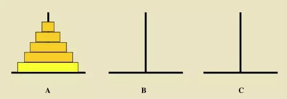

## 递推
递推的基本思想：根据已有信息推出未知信息

递推解题思路：
1. 数学建模
2. 找出递推式与初始条件

### 青蛙跳台阶

[剑指 Offer 10- II. 青蛙跳台阶问题](https://leetcode-cn.com/problems/qing-wa-tiao-tai-jie-wen-ti-lcof/)

一只青蛙一次可以跳上 1 级台阶，也可以跳上 2 级台阶。求该青蛙跳上一个 `n` 级的台阶总共有多少种跳法。结果须对 `1000000007` 取模

递推解题思路：

1. 假设 `f[n]` 表示 青蛙从第一个石头跳到第 `n` 个石头一共有 `f[n]` 种方案

2. 递推式：`f[n] = f[n - 1] + f[n - 2]`
    - 从 `n - 1` 台阶，一次跳 1 级到 `n`
    - 从 `n - 2` 台阶，一次跳 2 级到 `n`

3. 初始条件：`f[0] = 1` , `f[1] = 1` , `f[2] = 2`

代码实现：
```cpp
// 青蛙跳台阶问题
int numWays(int n) {
    if (n <= 1)
        return 1;
    const int MOD = 1000000007;
    vector<int> f(n + 1, 0);
    f[0] = f[1] = 1;
    for (int i = 2; i <= n; i++)
        f[i] = (f[i - 1] + f[i - 2]) % MOD; // 取模 1e9+7
    return f[n];
}
```

时间复杂度：$O(n)$

空间复杂度：$O(n)$

另，本题本质上等价于 **斐波那契数列** 问题，唯一差异在于起始数字不同
- 青蛙跳台阶问题：`f(0) = 1` , `f(1) = 1` , `f(2) = 2`
- 斐波那契数列问题：`f(0) = 0` , `f(1) = 1` , `f(2) = 1`


### 卡特兰数

由 `n` 对括号组成的括号序列，有多少种是合法的括号序列？其中，合法的括号序列是指：任何一个左括号都必须有与之对应的右括号，任何一个右括号都必须有与之对应的左括号。答案对 `998244353` 取模

递推解题思路：

1. `f[n]` 表示 `n` 对括号能够组成 `f[n]` 种合法的括号序列

2. 递推式：$f(n) = \sum\limits_{k = 0}^{n - 1} {f(k) \times f(n - k - 1)}$
     - 括号序列可以表示为 `A(B)` ，其中，`A` 和 `B` 都是合法括号序列（ `A` 和 `B` 可以是空序列）
     - `f(k)` 表示包含 `k` 对括号的合法序列 `A` 的种类数
     - `f(n - k - 1)` 表示包含 `n - k - 1` 对括号的合法序列 `B` 的种类数

3. 初始条件：`f[0] = 1`
    - `0` 对括号能组成一种括号序列（空序列）

代码实现：

```cpp
// 计算卡特兰数
int CatalanNumber(int n) {
    if (n <= 0)
        return 1;
    const int MOD = 998244353;
    vector<int> f(n + 1, 0);
    f[0] = 1; // 初始条件
    for (int i = 1; i <= n; i++) { // 求f[i]的值
        for (int k = 0; k < i; k++) {
            f[i] += int((long long) f[k] * f[i - k - 1] % MOD); // 递推式
            // 注意，两个 int 相乘的结果可能爆 int ，因此乘法的过程要转换成 long long 以避免整数溢出
            f[i] %= MOD; // 取模
        }
    }
    return f[n];
}
```

时间复杂度：$O(n^2)$

空间复杂度：$O(n)$


### 错位排列
有 `n` 个信封和 `n` 个信件，第 `i` 个信件属于第 `i` 个信封，我们想知道，有多少种不同的方法，使得没有任何一个信件被装入正确的信封中？答案对 `998244353` 取模

解题思路：

1. 令 `f[i]` 表示信件和信封数量为 `i` 时的总方案数

2. 递推式：`f[n] = (n - 1) * (f[n - 1] + f[n - 2])`
    - 考虑 1 号信件，它不能被装入 1 号信封，不妨假设它被装入了 x 号信封，那么 x 号信件可以装入哪个信封呢？
    - 第一种情况：x 号信件装入了 1 号信封。此时可以去掉 1 号和 x 号，原问题简化成：`n - 2` 个信件和信封的错位排列问题，一共有 `f[n - 2]` 种方案
    - 第二种情况：x 号信件没有装入 1 号信封。即，x 号信件应与 1 号信封错位，此时原问题等价于一个大小为 `n - 1` 的错位排列问题，一共有 `f[n - 1]` 种方案
    - 并且，x 的选择有 `n - 1` 种（除了 1 号都可以）

3. 初始条件：`f[1] = 0` , `f[2] = 1`
    - 只有 1 个信件和信封时，无法错位排列
    - 有 2 个信件和信封时，只有一种排列方案

代码实现：
```cpp
int SolutionNumber(int n) {
    if (n == 0)
        return -1;
    vector<int> f(n + 1, 0);
    const int MOD = 998244353;
    f[1] = 0;           // 初始条件
    f[2] = 1;
    for (int i = 3; i <= n; i++) {
        f[i] = ((long long) (i - 1) * (f[i - 1] + f[i - 2])) % MOD;
    }
}
```

时间复杂度：$O(n)$

空间复杂度：$O(n)$


### 杨辉三角（二维递推）
给定 `k` ，你需要输出一个 `(k + 1) * (k + 1)` 的矩阵，其中，第 `i` 行第 `j` 列元素表示：从 `i` 个不同的物品中选出 `j` 个的方案数（行和列的标号从 0 开始）。所有答案对 `998244353` 取模

比如，当 k = 4 时，输出如下矩阵：

    1 0 0 0 0
    1 1 0 0 0
    1 2 1 0 0
    1 3 3 1 0
    1 4 6 4 1

解题思路：
1. 二维数组的元素 `f[i][j]` 表示从 `i` 个物品中选 `j` 个的方案数

2. 递推式：`f[i][j] = f[i - 1][j - 1] + f[i - 1][j]`
    - 考虑 1 号物品：选，或者不选
    - 选 1 号物品：那么接下来还需要从剩下的 `i - 1` 个物品中选出 `j - 1` 个，方案数为 `f[i - 1][j - 1]`
    - 不选 1 号物品：那么需要从 `i - 1` 个物品中选出 `j` 个，方案数为 `f[i - 1][j]`

3. 边界条件：`f[i][0] = f[i][i] = 1`
    - 所有 `j = 0` 的位置和 `j = i` 的位置都是 `1` ， 分别对应 所有物品都不选 和 所有物品都选取
    - 所有 `j > i` 的位置都是 `0` ，因为选出物品不可能多于 `i`

注意，二维递推不同于一维递推，二维的数据可能存在莫名其妙的依赖关系，因此我们在写二维递推的时候，需要特别注意二维 **递推的顺序**

在此例中，`f[i]` 这一行的值全部由 `f[i - 1]` 这一行的值推出，因此,只需要按照行数从小到大的顺序递推即可

代码实现：
```cpp
void Triangle(int k) {
    if (k == 0)
        return -1;
    const int MOD = 998244353;
    int f[k + 1][k + 1] = {0};  // 初始化二维数组
    for (int i = 0; i <= k; i++) {
        f[i][0] = f[i][i] = 1;          // 边界条件
        for (int j = 1; j < i; j++) {
            f[i][j] = (f[i - 1][j - 1] + f[i - 1][j]) % MOD;    // 递推式，需要取模
        }
        for (int j = 0; j <= k; j++) {
            cout << f[i][j] << ' ';     // 输出这一整行
        }
        cout << endl;
    }
}
```


时间复杂度：$O(n^2)$

空间复杂度：$O(n^2)$


[青舟智学：递推与递推思想的应用](https://www.boyuai.com/learn/courses/149/lessons/2537/steps/0?from=qz)


## 递归

递归（Recursion）的基本思想：某个函数直接或者间接地调用自身

递归有两个显著的特征:
 - 自身调用：原问题可以分解为 **具有相同解决思路** 的 **子问题** ，即都是调用自身的同一个函数
 - 终止条件：递归必须有一个 **终止条件** ，而不能无限循环地调用本身

因此，首先需要根据以上两个特点来判断题目是否可以用递归算法

递归的经典应用场景：
 - 阶乘问题
 - 二叉树深度
 - 汉诺塔问题
 - 斐波那契数列
 - 快速排序、归并排序（分治算法体现递归）
 - 遍历文件，解析 xml 文件

递归解题思路：
1. 定义函数，明确函数的功能：确认并牢记这个递归函数的功能，不要让一个函数干两件事情！
2. 寻找原问题与子问题的关系：即，确定递推公式
3. 确定递归终止条件：发现递推关系后，要寻找 **不可再分解的子问题的解** ，即，临界条件，确保子问题不会无限分解下去
4. 推导时间复杂度，如果发现递归时间复杂度不可接受，则需 **转换思路对其进行改造**

> 只需要关注如何把原问题划分成符合条件的子问题，而不需要过分关注这个子问题是如何被解决的
> 
> 千万不要尝试研究这个递归的过程是什么样的！


递归算法的时间复杂度：**`递归时间复杂度 = 解决一个子问题的时间 * 子问题的个数`**
 - 可以将递归过程抽象成一棵 “递归树”，树中每一个节点都是一次递归，所以该递归算法的时间复杂度为 `节点数 * 每个节点的时间复杂度`

递归算法的空间复杂度：**`递归算法的空间复杂度 = 每次递归的空间复杂度 * 递归深度`**
 - 每次递归所需的空间都被压到调用栈里，调用栈的最大长度就是递归的深度

[代码随想录：通过一道面试题目，讲一讲递归算法的时间复杂度！](https://www.programmercarl.com/%E5%89%8D%E5%BA%8F/%E9%80%9A%E8%BF%87%E4%B8%80%E9%81%93%E9%9D%A2%E8%AF%95%E9%A2%98%E7%9B%AE%EF%BC%8C%E8%AE%B2%E4%B8%80%E8%AE%B2%E9%80%92%E5%BD%92%E7%AE%97%E6%B3%95%E7%9A%84%E6%97%B6%E9%97%B4%E5%A4%8D%E6%9D%82%E5%BA%A6%EF%BC%81.html)

递归存在的问题：
1. **栈溢出**
     - 递归是利用堆栈来实现的。每当进入一个函数调用，栈就会增加一层栈帧，每次函数返回，栈就会减少一层栈帧。若递归调用层级太多，就会超出栈的容量
     - 解决方案：减少递归调用次数；改用其他算法
2. **重复计算**
    - 递归过程中可能会重复求解某些子问题，导致效率低下
    - 解决方案：记录已经遍历过的状态（记忆化递归）；改用其他算法（例如，迭代算法）

[代码随想录：递归求斐波那契数列的性能分析](https://www.programmercarl.com/%E5%89%8D%E5%BA%8F/%E9%80%92%E5%BD%92%E7%AE%97%E6%B3%95%E7%9A%84%E6%97%B6%E9%97%B4%E4%B8%8E%E7%A9%BA%E9%97%B4%E5%A4%8D%E6%9D%82%E5%BA%A6%E5%88%86%E6%9E%90.html#%E9%80%92%E5%BD%92%E6%B1%82%E6%96%90%E6%B3%A2%E9%82%A3%E5%A5%91%E6%95%B0%E5%88%97%E7%9A%84%E6%80%A7%E8%83%BD%E5%88%86%E6%9E%90)


### 阶乘

```cpp
// 递推写法
int factorial(int n) { // n 不小于 0
    if (n <= 1)
        return 1;
    int ans = 1;
    for (int i = 2; i <= n; i++)
        ans = i * ans;
    return ans;
}

// 递归写法
int recursion(int n) {  // 计算 n 的阶乘
    if (n < = 1)        // 递归终止条件
        return 1;
    return n * recursion(n - 1);    // 递推公式
}
```

递推算法
 - 时间复杂度：$O(n)$
 - 空间复杂度：$O(1)$

递归算法
 - 时间复杂度：$O(n)$，递归 $n$ 次
 - 空间复杂度：$O(n)$，调用栈深度为 $n$

### 青蛙跳台阶

递归的简单实现：
```cpp
// 非记忆化递归
int f(int n) { // 计算青蛙跳到 n 级台阶的方案数
    if (n < 0)
        return -1;
    if (n <= 1)
        return 1;
    return f(n - 1) + f(n - 2);
}
```

时间复杂度：$O(2^n)$
 - 将递归过程抽象成一颗深度为 `n` 的 “递归树”（每一个节点都是一次递归），最多有 $2^n - 1$ 个节点，每次递归的时间复杂度均为 $O(1)$，所以该递归算法的时间复杂度为 $O(2^n)$

空间复杂度：$O(n)$
 - 每次递归的空间复杂度是 $O(1)$，递归的深度为 $n$

分析发现，在递归过程中，`f(n - 1) + f(n - 2)` 存在大量的重复计算，因此，可以考虑将已经计算过的结果保存起来，即，带备忘录的递归解法，实现 **以空间换时间**

一般使用一个数组充当这个「备忘录」，当然也可以使用「哈希表」

```cpp
// 数组充当备忘录
int fib(int N) {
    if (N < 0)
        return -1;
    vector<int> memo(N + 1, 0);       // 备忘录全初始化为 0
    
    return helper(memo, N);
}

int helper(vector<int>& memo, int n) {
    if (n == 0 || n == 1)
        return 1;       // base case 
    if (memo[n] != 0)
        return memo[n]; // 已经计算过
    memo[n] = helper(memo, n - 1) + helper(memo, n - 2);
    return memo[n];
}


// 哈希表充当备忘录
int f(int n) {
    if (n < 0)
        return -1;
    if (n <= 1)
        return 1;
    // map 即保存中间态的键值对， key 为 n，value 即 f(n)
    if (map.get(n)) {
        return map.get(n);
    }
    return f(n - 1) + f(n - 2);
}
```

带备忘录的递归解法的时间复杂度：$O(n)$，“递归树” 一共 $n$ 个节点

带备忘录的递归解法的空间复杂度：$O(n)$，递归深度为 $n$，且用了一个键值对来保存中间的计算结果

另一种优化方案：用 `first` 和 `second` 来记录递推公式中相加的两个数值，此时就不用两次递归，从而减少了递归的调用次数

```cpp
int f(int first, int second, int n) {
    if (n < 0)
        return -1;
    if (n <= 1)
        return 1;
    else if (n == 2)
        return first + second;
    else
        return f(second, first + second, n - 1);
}
```

时间复杂度：$O(n)$，递归 $n$ 次

空间复杂度：$O(n)$，递归深度为 $n$


### 汉诺塔

如下图所示的汉诺塔问题，从左到右有 A、B、C 三根柱子，其中 A 柱子上面有从小叠到大的 `n` 个圆盘，现要求将 A 柱子上的圆盘移到 C 柱子上去，期间只有一个原则：一次只能移到一个盘子且大盘子不能在小盘子上面，求移动的步骤



递归求解思路：

1. 定义问题的递归函数：函数的功能为 把 A 上面的 `n` 个圆盘经由 B 移到 C

2. 查找问题与子问题的关系
    - 将 A 最上面的 `n - 1` 个圆盘视为一个整体

    - 递归函数的实现步骤为：1） 将 A 上面的 `n - 1` 个圆盘经由 C 移到 B ；2）将 A 最底下的圆盘移到 C ；3）将 B 上的 `n - 1` 个圆盘经由 A 移到 C 上

3. 递归终止条件：A 上不再有圆盘（所有圆盘已经移到 C 上）

> 这里不需要深究 “具体怎么把 `n - 1` 个圆盘从 A 移到 B ”，只需明白其可以通过递归实现即可
> 
> 在确定原问题与子问题的关系时，切忌把子问题层层展开，只要找到一层问题与子问题的关系得出可以用递归表示即可


代码实现：
```cpp
// 将 n 个圆盘从 a 经由 b 移动到 c 上
void move(int n, char a, char b, char c) {
    if (n <= 0)
        return;
    move(n - 1, a, c, b);    // 将 a 上面的 n - 1 个圆盘经由 c 移到 b
    cout << a << " -> " << b << endl; // 将 a 底下的那块最大的圆盘移到 c
    move(n - 1, b, a, c);    // 再将 b 上的 n-1 个圆盘经由 a 移到 c上
}

// 求解汉诺塔问题
void Hanoi(int n) {
    if (n <= 0)
        return;
    move(n, 'A', 'B', 'C');
}
```

> 明确函数的功能非常重要，按着函数的功能来理清/解释算法思路

时间复杂度：$O(2^n)$

空间复杂度：$O(n)$

参考资料：
 - [CodeSheep：一文彻底学会递归思路解题](https://mp.weixin.qq.com/s/JLbjzCdVlJ_de2uGgBsUzw)
 - [CodeSheep：死磕程序员必备算法：递归！](https://mp.weixin.qq.com/s/tqGKHZzSyDBgEp-oWsOztQ)